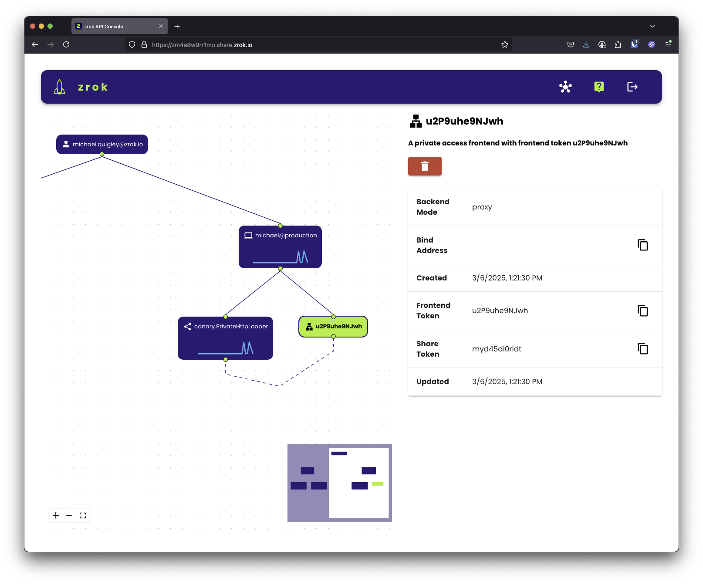

# zrok - Secure Internet Sharing Made Simple


**Share anything, anywhere, instantly. Enterprise reliability. No firewall changes. No port forwarding. No hassle.**

`zrok` lets you securely share web services, files, and network resources with anyone—whether they're across the internet or your private network. Built on zero-trust networking, it works through firewalls and NAT without requiring any network configuration changes.

## Quick Start

Get sharing in under 2 minutes:

1. **[Install zrok](https://docs.zrok.io/docs/guides/install/)** for your platform
2. **Get an account**: `zrok invite` (use the free [zrok.io service](https://docs.zrok.io/docs/getting-started/))
3. **Enable sharing**: `zrok enable`

That's it! Now you can share anything:

```bash
# Share a web service publicly
$ zrok share public localhost:8080

# Share files as a network drive  
$ zrok share public --backend-mode drive ~/Documents

# Share privately with other zrok users
$ zrok share private localhost:3000
```



## What You Can Share

### Web Services
Instantly make local web apps accessible over the internet:

```bash
$ zrok share public localhost:8080
```


### Files & Directories  
Turn any folder into a shareable network drive:

```bash
$ zrok share public --backend-mode drive ~/Repos/zrok
```


### Private Resources
Share TCP/UDP services securely with other zrok users—no public internet exposure.

## Key Features

- **Zero Configuration**: Works through firewalls, NAT, and corporate networks
- **Secure by Default**: End-to-end encryption with zero-trust architecture  
- **Public & Private Sharing**: Share with anyone or just specific users
- **Multiple Protocols**: HTTP/HTTPS, TCP, UDP, and file sharing
- **Cross-Platform**: Windows, macOS, Linux, and Raspberry Pi
- **Self-Hostable**: Run your own zrok service instance

## How It Works

`zrok` is built on [OpenZiti](https://docs.openziti.io/docs/learn/introduction/), a programmable zero-trust network overlay. This means:

- **No inbound connectivity required**: Works from behind firewalls and NAT
- **End-to-end encryption**: All traffic is encrypted, even from zrok servers
- **Peer-to-peer connections**: Direct connections between users when possible
- **Identity-based access**: Share with specific users, not IP addresses

## Developer SDK

Embed `zrok` sharing into your applications with our Go SDK:

```go
// Create a share
shr, err := sdk.CreateShare(root, &sdk.ShareRequest{
    BackendMode: sdk.TcpTunnelBackendMode,
    ShareMode:   sdk.PrivateShareMode,
})

// Accept connections
listener, err := sdk.NewListener(shr.Token, root)
```

[Read the SDK guide](https://blog.openziti.io/the-zrok-sdk) for complete examples.

## Self-Hosting

Run your own `zrok` service—from Raspberry Pi to enterprise scale:

- Single binary contains everything you need
- Scales from small personal instances to large public services  
- Built on the same codebase as the public `zrok.io` service

[Self-Hosting Guide](https://docs.zrok.io/docs/guides/self-hosting/self_hosting_guide/)

## Resources

- **[Documentation](https://docs.zrok.io/)**
- **[Office Hours Videos](https://www.youtube.com/watch?v=Edqv7yRmXb0&list=PLMUj_5fklasLuM6XiCNqwAFBuZD1t2lO2)**
- **[Building from Source](./BUILD.md)**
- **[Contributing](./CONTRIBUTING.md)**

---

*Ready to start sharing? [Get started with zrok →](https://docs.zrok.io/docs/getting-started)*
