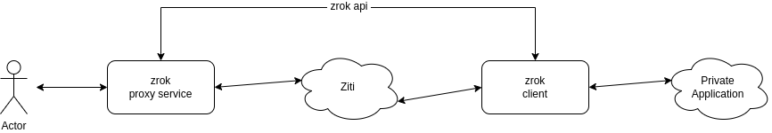

# zrok

`zrok` is a utility for quickly proving public access to dark, private applications. 

`zrok` is designed with the following properties:

## Easiest Possible On-ramp

`zrok` is the fastest, simplest path for exposing dark, private applications onto the public internet using Ziti.

### Simple Registration

Registering for access to `zrok` should provide the user with a single identity, which can be used from any shell environment to quickly enable access to private applications.

### Single-Executable Deployment

A registered user should only need a single executable (`zrok`), along with their identity, to enable `zrok` capabilities in any shell environment.

## Expand into Ziti

The `zrok` implementation should (ideally) be such that `zrok` usage patterns can co-exist with larger, more featureful Ziti implementations. Ideally, a developer who started with `zrok` should have patterns that allow them to incrementally expand their usage.

## Self-hosting Capable

The `zrok` implementation should support self-hosting, such that existing Ziti users can easily add `zrok` capabilities to their existing networks.