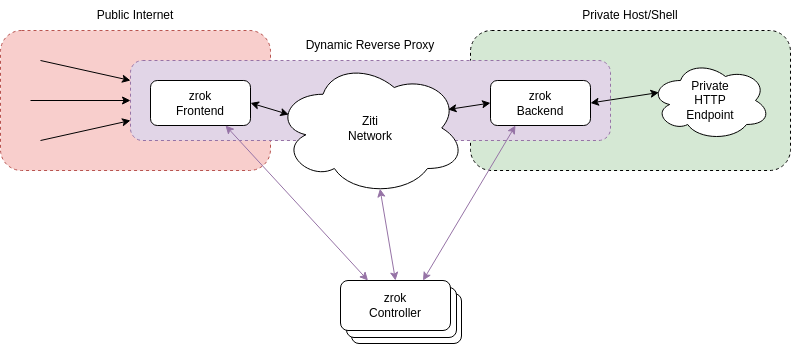

# zrok

`zrok` is a service designed to provide frictionless access to ephemeral, geo-scale reverse proxy capabilities.

## Concepts

`zrok` is conceptually structured like this:

### zrok Frontend, zrok Backend

The `zrok` reverse proxy is broken into two halves, a _frontend_ and a _backend_. These two components connect over an OpenZiti network. Together the frontend and the backend work together to implement a reverse proxy.

The frontend is designed to be sited on an accessible network (typically the public internet). This allows traffic from that accessible network to ingress into the `zrok` frontend, across the dynamic reverse proxy.

The backend is designed to be sited in a private environment, such as a private development server, or a serverless environment, or a container sidecar. The backend only needs outbound connectivity to reach the OpenZiti network and the `zrok` controller.

The controller is a lightweight control plane component, which orchestrates connectivity between frontend and backend components.

## Characteristics

`zrok` has the following characteristics:

### Frictionless

`zrok` is designed to provide a "frictionless" experience. A single binary and a single command are all that is required to take advantage of all of the power of `zrok`.

`zrok` works in a large number environments: developer shells, container sidecars, serverless environments, webhooks.

### Expand with OpenZiti

`zrok` is built on top of OpenZiti, a next-generation solution for secure application connectivity. `zrok` is a fantastic way to start working with OpenZiti. Start with simple `zrok` ephemeral connectivity, and then layer on additional capabilities provided by the underlying OpenZiti network.

Bring `zrok` into your existing OpenZiti deployment to provide rapid, ephemeral connectivity for a number of important HTTP scenarios.

### World-Scale

`zrok` is the software that powers the `zrok.io` world-scale service. `zrok` can scale as large as you need.

### Multiple Isolated Tenants

A single `zrok` instance can support any number of isolated tenants, allowing them to coexist on top of the same OpenZiti deployment in a secure manner.

### Self-hosting Capable

Install `zrok` on top of your own OpenZiti network. `zrok` is simple to operate and scale.
