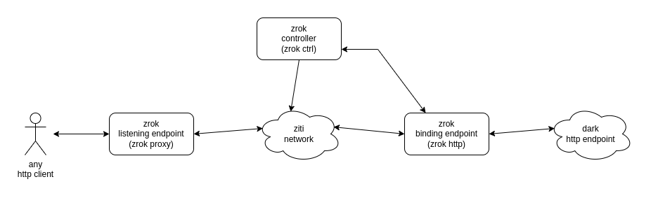

# What is `zrok`

## Overview

`zrok` is a super-lightweight tool for providing on-demand access to dark, unreachable resources. 
The super-power of `zrok` is providing a single-step solution to creating ephemeral network connectivity. From an end-user perspective, `zrok` is a tool packaged as a single executable, which can be used as a "shim" to quickly create public endpoints for dark resources.

`zrok` is also a service (which can be self-hosted) and runs on top of any OpenZiti network. The service provides one or more listening endpoints (typically on the public internet), that are designed to dynamically expose endpoints (HTTP(S)-only, as of v0.1.x), as requested by the end-user `zrok` tooling.

`zrok` listening endpoints, and `zrok` terminating endpoints are typically used together to create the streamlined, ephemeral connectivity solution for dark services. But listening endpoints and the terminating endpoints can be used orthogonally, interoperating with other OpenZiti SDK clients.

### The Primary Use Case

The primary use case for `zrok` is exposing dark resources across the public internet, for a multiplicity of reasons. Consider a developer, who is building a web application and wants to share work in progress with third parties for review. The developer already has signed up for a `zrok` account and has been issued a secret token.

The developer will have enabled `zrok` capabilities for their shell environment using the `zrok enable` command:

```
$ zrok enable <secret-token>
```

After enabling their environment, the developer can quickly create a publicly available URL for their application like this:

```
$ zrok http http://localhost:3000
```

`zrok` will then give them a public URL, like this:

```
http://d9121e7cdfd2dd2f.zrok.io/
```

This URL can be shared with anyone, anywhere, allowing access to the developer's application as long as the developer is running the `zrok http` command. Simply ending that process will destroy all of the public access, and clean up the associated resources in the underlying OpenZiti environment.

## How Does `zrok` Work?

At a high level, the `zrok` stack looks like this:



Let's discuss a couple of the flows through the above use case and talk about what's happening.


### The `zrok enable` Flow

When a new `zrok` user signs up for an account, they are issued a "secret token". This secret token is used to enable shell access to `zrok http` from the command line.

When the user runs `zrok enable` from their shell, here's what happens:

1. The `zrok enable` client reaches out with an enable request to the `zrok` controller.
2. The `zrok` controller creates a new OpenZiti identity for the environment and enrolls it.
3. The `zrok` controller creates an edge router policy associating the new OpenZiti identity with `#all` edge routers.
4. The `zrok` controller returns the entire SDK configuration back to the `zrok enable` client.
5. The `zrok enable` client then stores the OpenZiti identity along with a few other housekeeping details in the user's `~/.zrok` folder.
6. With the OpenZiti identity and configuration details stored in the user's `environment`, the user is then able to create any number of binding endpoints using the `zrok http` command.


### The `zrok http` Flow

When a `zrok` user issues a `zrok http` command for an endpoint, here's what happens:

1. The `zrok http` client gathers the necessary identity details from the `environment` (this was all staged during `zrok enable`).
2. The `zrok http` client reaches out to the `zrok` controller with an authenticated `tunnel` request, asking to have a new endpoint binding created.
3. The `zrok` controller allocates a new "service name" for the binding.
4. The `zrok` controller creates a `zrok.proxy.v1` configuration describing the user's requested authentication details (currently: `none` or `basic`).
5. The `zrok` controller creates a new service, associating the service with the configuration.
6. The `zrok` controller creates a bind service policy for the user's environment identity and the newly created OpenZiti service.
7. The `zrok` controller creates a dial service policy allowing the configured listening endpoints (ingress proxies) to dial the newly created service.
8. The `zrok` controller creates a service edge router policy associating the newly created service with `#all` edge routers.
9. The URL for the new `zrok` service is constructed and returned to the `zrok http` client.
10. The `zrok http` client then binds the OpenZiti service with an SDK client, and begins reverse-proxying traffic received from OpenZiti across to the dark service.

When the user terminates the `zrok http` client, these resources are removed from the OpenZiti network.


### `zrok proxy` and HTTP Clients

When `zrok http` exposes a service and returns a URL, that URL is designed to be sent to a `zrok` listening endpoint (`zrok proxy`, currently). The `zrok proxy` is a stateless SDK client with an HTTP(S) listener exposed to the public internet.

When an HTTP request arrives as the `zrok proxy` listener, this happens:

1. The `zrok proxy` parses the `Host` header provided by the client, extracting the `zrok` service name from the URL.
2. The service is refreshed (if necessary) and retrieved. The `zrok.proxy.v1` configuration details are retrieved.
3. The `zrok.proxy.v1` configuration is used to do authentication processing. If authentication is required, such a response is returned to the client.
4. The `zrok proxy` then dials the OpenZiti service, and the dialed service is used to reverse proxy the request from the end user across OpenZiti to the binding endpoint, and then dark service.

The `zrok proxy` does not require any communication with the `zrok` controller, and is stateless. They can be pooled behind a load balancer. It is currently a goal is to maintain this lightweight nature.