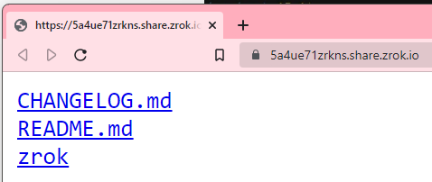

# Sharing Websites and Files

With `zrok` it is possible to share files quickly and easily as well. To share files using `zrok` use
the `--backend-mode web`, for example: `zrok share private . --backend-mode web`.

Running with this mode will make it trivially easy to share files from the directory which the command
was run from.

For example if you have a directory with a structure like this:
```shell
-rwxrwxrwx 1 cd cd     2506 Jan 26 11:57 README.md
-rwxrwxrwx 1 cd cd     2971 Jan 26 11:57 CHANGELOG.md
-rwxrwxrwx 1 cd cd 41544024 Jan 26 12:00 zrok
```

The files can be shared using a command such as: 
```shell
zrok share public . --backend-mode web
```

Then the files can be access with a `private` or `public` share, for example as shown:

