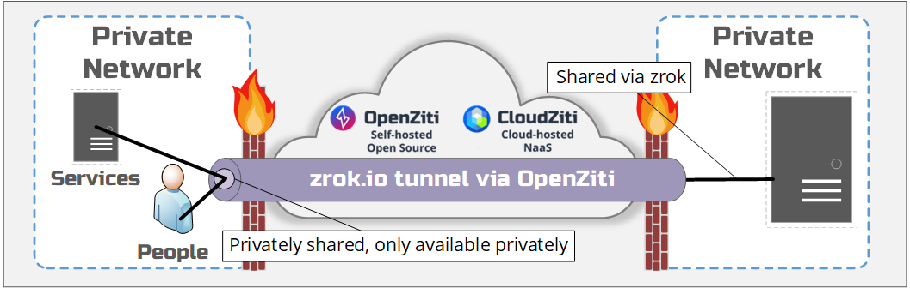

# Shares - Private

`zrok` was built to share and access digital resources. A `private` share allows a resource to be 
shared through a __privately__ available endpoint. Sharing a resource with `private` is __a differentiating__
feature of `zrok`.

# Peer to Peer

A `private` share will require `zrok` to access the share and will also require a special shared 
secret token. This access token, combined with the `zrok access` command will be how the private share is accessed.

Sharing something with `private` is similar to sharing something publicly. The main difference is
obvious, the shared resource is `private` and the share is __not__ open to the public. With `zrok`, you
can share resources on a private network without needing to expose the service to the internet. The share is not 
through an obfuscated, difficult to guess url. Instead the sharing is accomplished using a secure, zero trust overlay
network provided by [OpenZiti](https://docs.openziti.io/docs/learn/introduction/). With this private, peer to peer 
sharing model, there will never an attack surface available to the open internet.

The shared resource can be a development web server to share with friends and colleagues or perhaps,
it could be a webhook from a server running in the cloud which has `zrok` running and has been instructed
to `access` the private resource. What matters is that the access to the shared resource __should not__
be done in a public way, for more secure access.

Using `private` shares is easy and is accomplished using the `zrok share private` command. Run `zrok share private`
to see the usage output and to further learn how to use the command. 

Unlike public shares, `private` shares do not need to be [reserved](./sharing-reserved.md) to be predictable. When sharing a
resource with `private`, the resource is shared at a known location. Resources shared with `private` do not
need to be `reserved`.