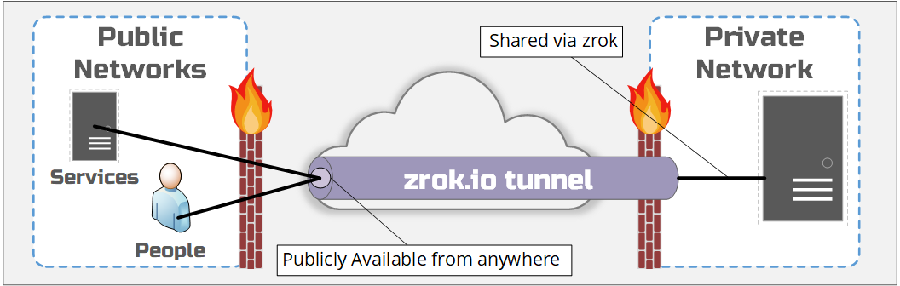

# Shares - Public

`zrok` was built to share and access digital resources. a `public` share allows something to be shared through 
a publicly available endpoint.

Sharing something with `public` is useful when the person or service accessing the thing being shared doesn't
have `zrok` running locally and can't make use of the `private` sharing mode built into `zrok`. This could be
a development web server to share with friends and colleagues, or perhaps a webhook from a
server running in the cloud which can't have `zrok` installed onto it. What matters is that the access to the
shared resource needs to be done in a public way, generally for easy access.

Using `public` shares is easy and is accomplished using the `zrok share public` command. Run `zrok share public`
to see the usage output and to further learn how to use the command. 

Unless `reserved` (see [Sharing - Reserved](./sharing-reserved.md), all 'public' shares are ephemeral. When the
sharing is stopped, the shared url will be reclaimed.