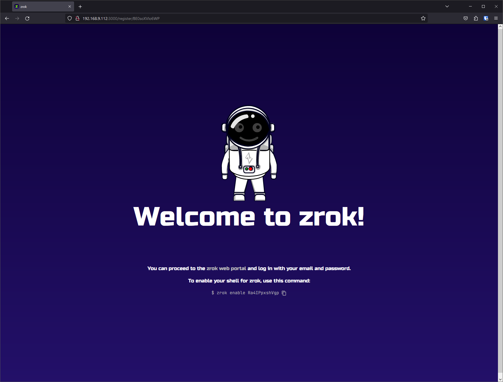
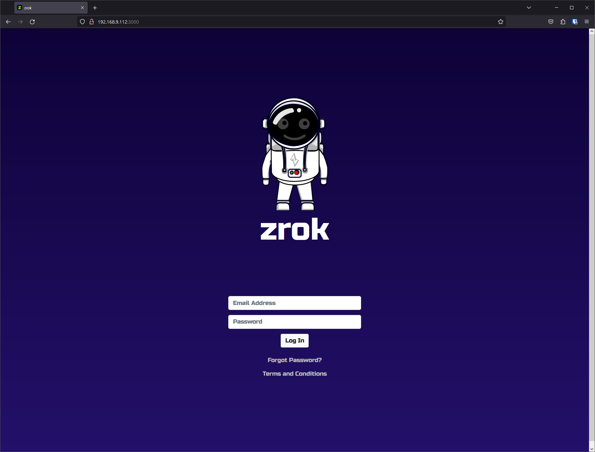
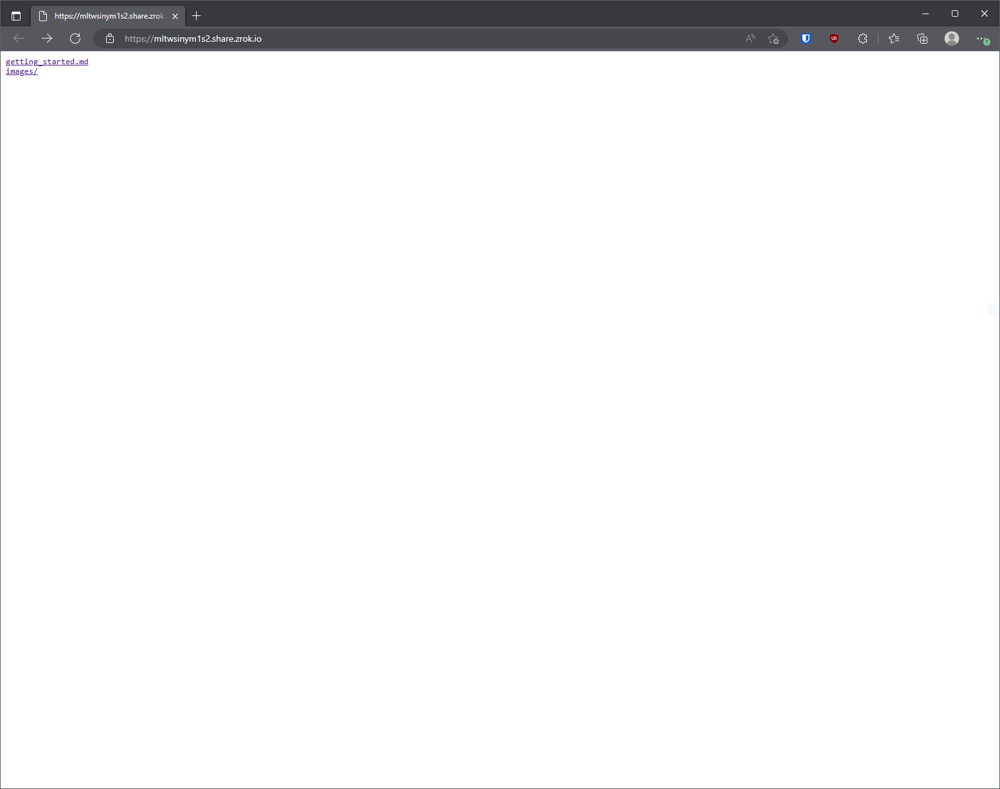

# Getting Started with zrok

`zrok` is an open source, Apache v2 licensed sharing platform, built on top of [OpenZiti](https://docs.openziti.io/docs/learn/introduction/), 
a programmable zero trust network overlay. `zrok` is an _OpenZiti Native Application_. You can choose to self-host `zrok`
or leverage the free, managed offering provided by NetFoundry: https://zrok.io

As of version `v0.3.0`, `zrok` provides the ability to:

* share resources [publicly](./core-features/sharing-public.md), similar to other distributed reverse proxies.
* share [privately](./core-features/sharing-private.md). It does this by leveraging
  [OpenZiti](https://docs.openziti.io/docs/learn/introduction/) to support zero trust, peer to peer connections without
  the need for any open ports on the internet.
* use `web` sharing; easily share files with others using a single `zrok` command

Let's take a look at how to get started with `zrok`.

:::note `zrok` moves fast!

`zrok` is currently in a closed-beta phase and requires an invitation token. If you would like to try `zrok` and provide
feedback, please send an email to invite@zrok.io. `zrok` is an open source project and is in its early development
phases. We're doing our development publicly. See the [roadmap](https://github.com/orgs/openziti/projects/16) for details
about the project. We are highly interested in feedback as we continue to iterate quickly. Please provide feedback in
[Discourse](https://openziti.discourse.group/), raise [GitHub Issues](https://github.com/openziti/zrok/issues), or reach
out directly.

:::

## Downloading zrok

Releases are also available from the `zrok` project repository on GitHub at https://github.com/openziti/zrok/releases/latest. If you're a Linux user and you're not sure which download to use then check out the hints on [the Downloads page](./downloads.md).

### Extract zrok Distribution

Move the downloaded `zrok` distribution into a directory on your system. In my case, I've placed it in my home directory:

```
$ ls -lF zrok*
-rwxr-xr-x 1 michael michael 12724747 Jan 17 12:57 zrok_0.3.0-rc1_linux_amd64.tar.gz*
```

Create a directory where the extracted distribution will sit:

```
$ mkdir zrok
$ cd zrok/
```

Extract the `zrok` distribution:

```
$ tar zxvf ../zrok_0.3.0-rc1_linux_amd64.tar.gz
CHANGELOG.md
README.md
zrok
```

> NOTE: On Windows platforms the distribution is shipped as a `zip` archive. Windows Explorer includes support for extracting `zip` archives natively.

Add `zrok` to your shell's environment.

For Linux or macos:

```
$ export PATH=`pwd`:$PATH
```

For Windows (using Command Prompt):

```
> set PATH=%CD%;%PATH%
```

For Windows (using PowerShell):

```
$env:path += ";"+$pwd.Path
```

With the `zrok` executable in your path, you can then execute the `zrok` command from your shell:

```
$ zrok version
               _    
 _____ __ ___ | | __
|_  / '__/ _ \| |/ /
 / /| | | (_) |   < 
/___|_|  \___/|_|\_\

v0.3.0-rc1 [0d43b55]
```

## Configure Your zrok Service Instance

:::note
Most users can safely skip this section and proceed to "Generating an Invitation" below.

This section is relevant if you want to use the `zrok` CLI with an alternate service instance (in the case of self-hosting, etc.).
:::

`zrok` is both an installable utility that you interact with from your local computer, and also a _service_ that exists on the network. NetFoundry operates the public _service instance_ that is available at `api.zrok.io`, but because `zrok` is open source and self-hostable, you're free to create your own `zrok` service instance.

The `zrok` executable defaults to using the `zrok` service instance at `api.zrok.io`. Should you need to change the endpoint to use a different service instance, you can do that with the following command:

```
$ zrok config set apiEndpoint https://zrok.mydomain.com
[WARNING]: unable to open zrokdir metadata; ignoring

zrok configuration updated
```

:::note
The `WARNING` about `zrokdir metadata` is ignorable. Running the `zrok config set` command writes a small piece of metadata into a `.zrok` folder inside your home directory. This allows `zrok` to identify the version of its settings, providing a mechanism to upgrade your installation as new versions are released. This `WARNING` is letting you know that your current environment has not been initialized by `zrok`.
:::

You can use the `zrok status` command to inspect the state of your local _environment_. `zrok` refers to each shell where you install and `enable` a copy of `zrok` as as an _environment_.

```
$ zrok status

Config:

 CONFIG       VALUE                      SOURCE 
 apiEndpoint  https://zrok.mydomain.com  config 

[WARNING]: Unable to load your local environment!

To create a local environment use the zrok enable command.
```

:::note
The `WARNING` about being `unable to load your local environment` will go away once you've successfully enabled (`zrok enable`) for your shell (we'll get to that below). For now, this warning is ignorable.
:::

The `zrok status` command shows the configured API service that your environment is using, as well as the `SOURCE` where the setting was retrieved. In this case, `config` means that the setting was set into the environment using the `zrok config` command.

## Generating an Invitation

In order to create an account with the `zrok` service instance, you will need to create an invitation. 

:::note
Some environments take advantage of _invitation tokens_, which limit who is able to request an invitation on the service instance. If your service uses invitation tokens, the administrator of your instance will include details about how to use your token to generate your invitation.
:::

We generate an invitation with the `zrok invite` command:

```
$ zrok invite

enter and confirm your email address...

> user@domain.com
> user@domain.com

[ Submit ]

invitation sent to 'user@domain.com'!
```

The `zrok invite` command presents a small form that allows you to enter (and then confirm) your email address. Tabbing to the `[ Submit ]` button will send the request to your configured `zrok` service.

Next, check the email where you sent the invite. You should receive a message asking you to click a link to create your `zrok` account. When you click that link, you will be brought to a web page that will allow you to set a password for your new account:


Enter a password and it's confirmation, and click the `Register Account` button. You'll see the following:



For now, we'll ignore the "enable your shell for zrok" section. Just click the `zrok web portal` link:



After clicking the `Log In` button, you'll be brought into the `zrok` _web console_:


Congratulations! Your `zrok` account is ready to go!

## Enabling Your zrok Environment

When your `zrok` account was created, the service generated a _secret token_ that identifies and authenticates in a single step. Protect your secret token as if it were a password, or an important account number; it's a _secret_, protect it.

When we left off you had downloaded, extracted, and configured your `zrok` environment. In order to use that environment with your account, you'll need to `enable` it. Enabling an environment generates a secure identity and the necessary underlying security policies with the OpenZiti network hosting the `zrok` service.

From the web console, click on your email address in the upper right corner of the header. That drop down menu contains an `Enable Your Environment` link. Click that link and a modal dialog will be shown like this:


This dialog box shows you the `zrok enable` command that you can use to enable any shell to work with your `zrok` account with a single command.

Let's copy that command and paste it into your shell:

```
$ zrok enable klFEoIi0QAg7 
⣻  contacting the zrok service...
```

After a few seconds, the message will change and indicate that the enable operation suceeded:

```
$ zrok enable klFEoIi0QAg7 
⣻  the zrok environment was successfully enabled...
```

Now, if we run a `zrok status` command, you will see the details of your environment:

```
$ zrok status

Config:

 CONFIG       VALUE                SOURCE 
 apiEndpoint  https://api.zrok.io  env    

Environment:

 PROPERTY       VALUE        
 Secret Token   klFEoIi0QAg7 
 Ziti Identity  FTpvelYD6h   
```

Excellent... our environment is now fully enabled.

If we return to the _web console_, we'll now see the new environment reflected in the explorer view:


In my case, the environment is named `michael@ziti-lx`, which is the username of my shell and the hostname of the system the shell is running on.

:::note
Should you want to use a non-default name for your environment, you can pass the `-d` option to the `zrok enable` command. See `zrok enable --help` for details.
:::

If you click on the environment node in the explorer in the _web console_, the details panel shown at the bottom of the page will change:


The explorer supports clicking, dragging, mouse wheel zooming, and selecting the nodes in the graph for more information (and available actions) for the selected node. If you ever get lost in the explorer, click the  _zoom to fit_ icon in the lower right corner of the explorer.

If we click on the `Detail` tab for our environment, we'll see something like:


:::note
With your `zrok` account you can `zrok enable` multiple environments. This will allow you to run `zrok share` in one environment, and `zrok access` in other environments.
:::

Your environment is fully ready to go. Now we can move on to the fun stuff...

## Sharing

`zrok` is designed to make sharing resources as effortless as possible, while providing a high degree of security and control.

### Ephemeral by Default

Shared resources are _ephemeral_ by default; as soon as you terminate the `zrok share` command, the entire share is removed and is no longer available to any users. Identifiers for shared resources are randomly allocated when the share is created.

### Public Shares and Frontends

Resources that are shared _publicly_ are exposed to any users on the internet who have access to the `zrok` service instance's "frontend".

A frontend is an HTTPS listener exposed to the internet, that lets any user with your ephemeral share token access your publicly shared resources.

For example, I might create a public share using the `zrok share public` command, which results in my `zrok` service instance exposing the following URL to access my resources:

https://h0fz2ts9c84t.share.zrok.io

In this case my share was given the "share token" of `h0fz2ts9c84t`. That URL can be given to any user, allowing them to immediately access the shared resources directly from my local environment, all without exposing any access to my private, secure environment. The physical network location of my environment is not exposed to anonymous consumers of my resources.

:::note
Here is the `--help` output from `zrok share public`:

```
$ zrok share public
Error: accepts 1 arg(s), received 0
Usage:
  zrok share public <target> [flags]

Flags:
      --backend-mode string      The backend mode {proxy, web} (default "proxy")
      --basic-auth stringArray   Basic authentication users (<username:password>,...)
      --frontends stringArray    Selected frontends to use for the share (default [public])
      --headless                 Disable TUI and run headless
  -h, --help                     help for public
      --insecure                 Enable insecure TLS certificate validation for <target>

Global Flags:
  -p, --panic     Panic instead of showing pretty errors
  -v, --verbose   Enable verbose logging

[ERROR]: an error occurred (accepts 1 arg(s), received 0)
```

`<target>` defines the path to the local resource that you intend to share. The form of `<target>` depends on the `--backend-mode` that you're using. 

In the case of `--backend-mode proxy`, `<target>` should be a URL to an HTTP endpoint.

In the case of `--backend-mode web`, `<target>` is the path to a file on disk that serves as the "root" of the file tree to be shared.
:::

If we return to the web console, we see our share in the explorer:


If we click on our new share in the explorer, we can see the share details:


If we click on the _frontend endpoint_ a new browser tab opens and we see the content of our share:


If we click on the environment in the explorer, we're shown all of the shares for that environment (including our new share), along with a spark line that shows the activity:


And as soon as I terminate the `zrok share` client, the resources are removed from the `zrok` environment.

If we try to reload the frontend endpoint in our web browser, we'll see:


### Private Shares

`zrok` also provides a powerful _private_ sharing model. If I execute the following command:

```
$ zrok share private http://localhost:8080
```

The `zrok` service will respond with the following:

```
access your share with: zrok access private wvszln4dyz9q
```

Rather than allowing access to your service through a public frontend, a _private_ share is only exposed to the underlying OpenZiti network, and can only be accessed using the `zrok access` command.

The `zrok access private wvszln4dyz9q` command can be run by any `zrok` user, allowing them to create and bind a local HTTP listener, that allows for private access to your shared resources.

### Proxy Backend Mode

Without specifying a _backend mode_, the `zrok share` command will assume that you're trying to share a `proxy` resource. A `proxy` resource is usually some private HTTP/HTTPS endpoint (like a development server, or a private application) running in your local environment. Usually such an endpoint would have no inbound connectivity except for however it is reachable from your local environment. It might be running on `localhost`, or only listening on a private LAN segment behind a firewall. 

For these services a `proxy` share will allow those endpoints to be reached, either _publicly_ or _privately_ through the `zrok` service.

### Web Backend Mode

The `zrok share` command accepts a `--backend-mode` option. Besides `proxy`, the current `v0.3` release (as of this writing) also supports a `web` mode. The `web` mode allows you to specify a local folder on your filesystem, and instantly turns your `zrok` client into a web server, exposing your web content either _publicly_ or _privately_ without having to a configure a web server.

### Reserved Shares

`zrok` shares are _ephemeral_ unless you specifically create a "reserved" share.

A reserved share can be re-used multiple times; it will survive termination of the `zrok share` command, allowing for longer-lasting semi-permanent access to shared resources.

The first step is to create the reserved share:

```
$ zrok reserve public --backend-mode web v0.3_getting_started
[   0.275]    INFO main.(*reserveCommand).run: your reserved share token is 'mltwsinym1s2'
[   0.275]    INFO main.(*reserveCommand).run: reserved frontend endpoint: https://mltwsinym1s2.share.zrok.io
```

I'm asking the `zrok` service to reserve a share with a `web` backend mode, pointing at my local `docs` folder.

You'll want to remember the share token (`mltwsinym1s2` in this case), and the frontend endpoint URL. If this were a _private_ reserved share, there would not be a frontend URL.

If we do nothing else, and then point a web browser at the frontend endpoint, we get:


This is the `404` error message returned by the `zrok` frontend. We're getting this because we haven't yet started up a `zrok share` for the service. Let's do that:

This command:

```
$ zrok share reserved mltwsinym1s2
```

...results in a new share backend starting up and connecting to the existing reserved share:


And now if we refresh the frontend endpoint URL in the web browser, we'll see an index of the `docs` directory:



With the reserved share, we're free to stop and restart the `zrok share reserved` command as many times as we want, without losing the token for our share.

When we're done with the reserved share, we can _release_ it using this command:

```
$ zrok release mltwsinym1s2
[   0.230]    INFO main.(*releaseCommand).run: reserved share 'mltwsinym1s2' released
```

## Concepts Review

In summary, `zrok` lets you easily and securely share resources with both general internet users (through _public_ sharing) and also with other `zrok` users (through _private_ sharing).

Here's a quick review of the `zrok` mental model and the vocabulary.

### Service Instance and Account

You create an _account_ with a `zrok` _service instance_. Your account is identified by a username and a password, which you use to log into the _web console_. Your account also has a _secret token_, which you will use to authenticate from the `zrok` command-line to interact with the _service instance_.

You create a new _account_ with a `zrok` _service instance_ through the `zrok invite` command.

### Environment

Using your _secret token_ you use the `zrok` command-line interface to create an _environment_. An _environment_ corresponds to a single command-line user on a specific _host system_. 

You create a new _environment_ by using the `zrok enable` command.

### Shares

Once you've enabled an _environment_, you then create one or more _shares_. Shares have either a _public_ or _private_ _sharing mode_. _Shares_ share a specific type of resource using a _backend mode_. As of this writing `zrok` supports a `proxy` _backend mode_ to share local HTTP resources as a _reverse proxy_. `zrok` also supports a `web` _backend mode_ to share local file and HTML resources by enabling a basic HTTP server.

Every _share_ is identified by a _share token_. _Public shares_ can be accessed through either a _frontend_ instance offered through the `zrok` _service instance_, or through the `zrok access` command. _Private shares_ can only be accessed through the `zrok access` command.

You use the `zrok share` command to create and enable _ephemeral shares_.

### Reserved Shares

`zrok` supports creating _shares_ that have a consistent _share token_ that survives restarts of the `zrok share` command. These are considered _non-ephemeral_, and is callled a _reserved share_.

You use the `zrok reserve` command to create _reserved shares_. Reserved shares last until you use the `zrok release` command to delete them.

## Self-Hosting a Service Instance

Interested in self-hosting your own `zrok` service instance? See the [self-hosting guide](./guides/self-hosting/self_hosting_guide.md) for details.

[openziti]: https://docs.openziti.io/docs/learn/introduction/	"OpenZiti"
[ zrok-download]: https://zrok.io "Zrok Download"
