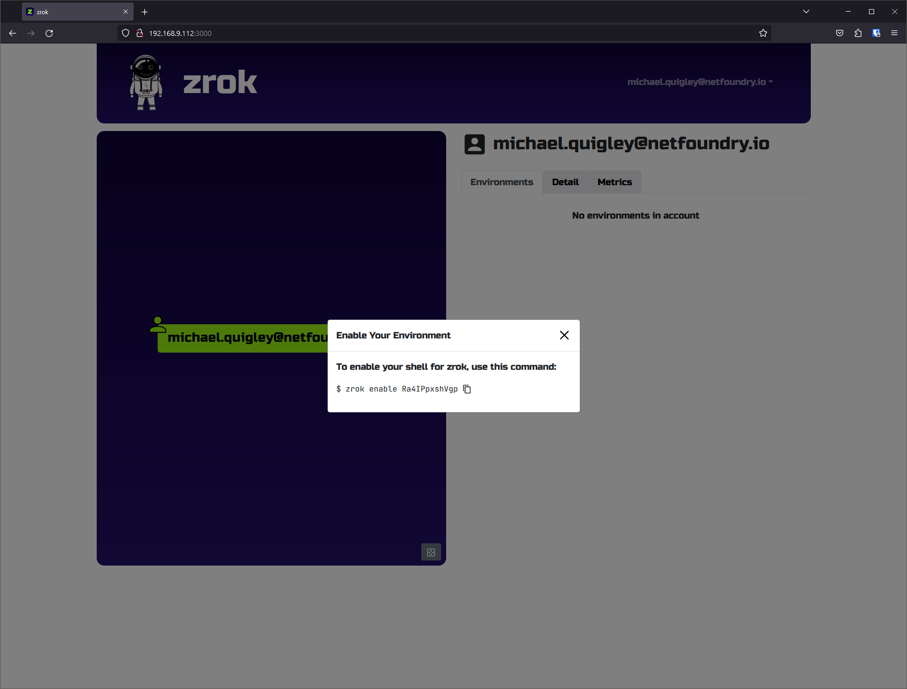
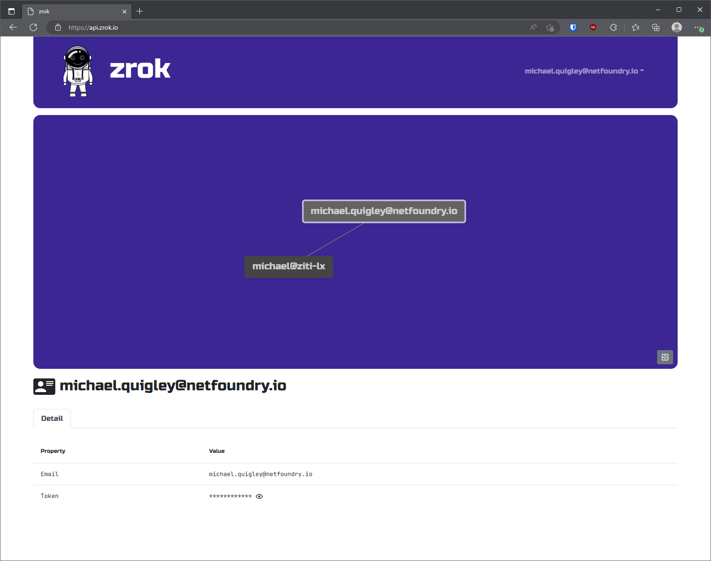
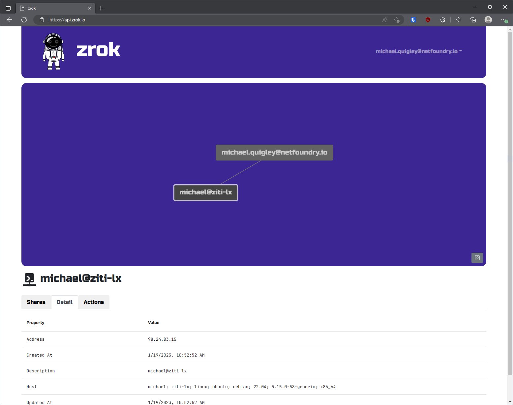
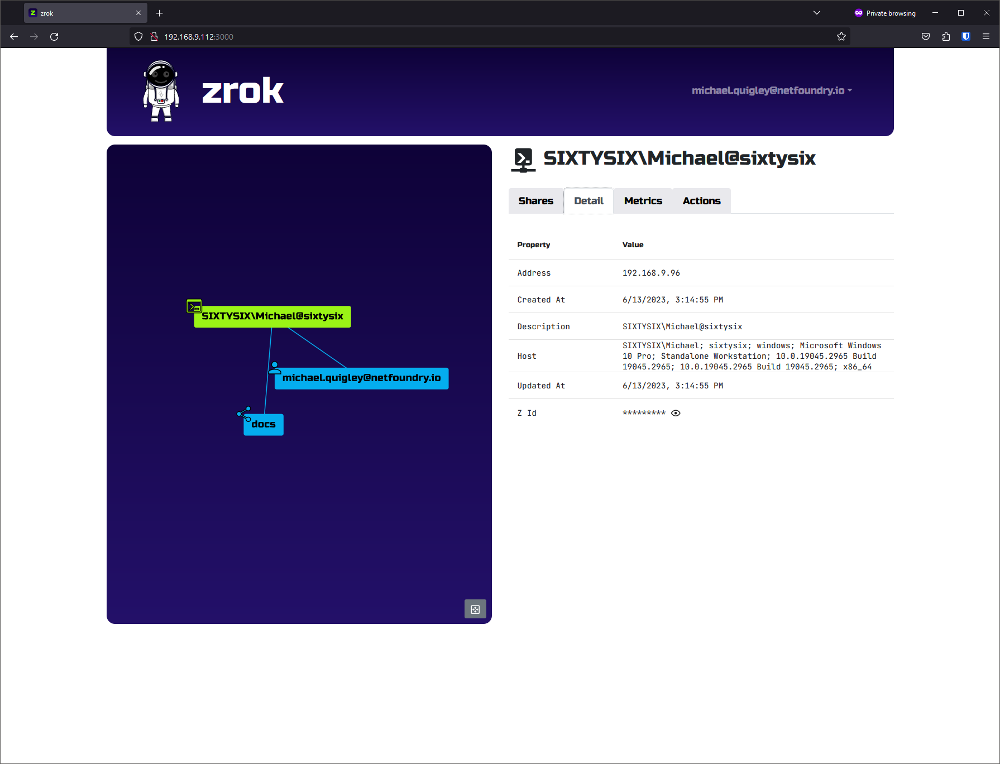
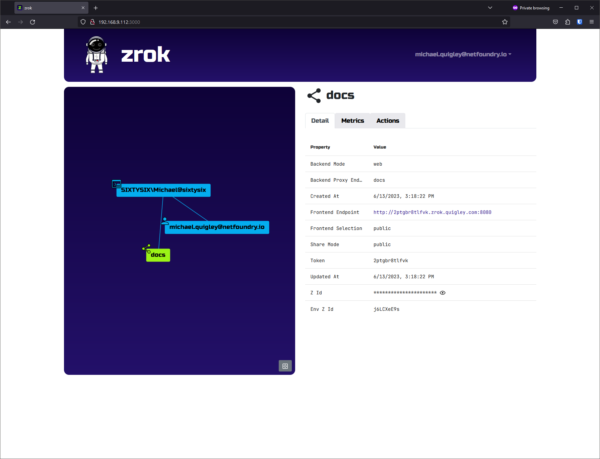

import { AssetsProvider } from '@site/src/components/assets-context';
import DownloadCard from '@site/src/components/download-card';
import DownloadCardStyles from '@site/src/css/download-card.module.css';
import InstallCards from '/../docs/guides/install/_install_cards.mdx';

## Your Secure Internet Sharing Perimeter

`zrok` (*/ziːɹɒk/ ZEE-rock*) is a secure, open-source, self-hostable sharing platform that simplifies shielding and sharing network services or files.
There's a hardened zrok-as-a-service offering available at [myzrok.io](https://myzrok.io) with a generous free tier.

### Your First Share

1. Get an account token
<Columns className='text--center getting-started-cards' style={{marginLeft: 1}}>
    <Column style={{paddingBottom: 20}}>
        <Card shadow='tl'>
            <CardHeader>
                <h3>Hosted zrok</h3>
            </CardHeader>
            <CardBody>
                Use NetFoundry's public zrok instance.
            </CardBody>
            <CardFooter>
                <a href="https://myzrok.io/">
                    <button className='button button--secondary button--block'>Get an Account</button>
                </a>
            </CardFooter>
        </Card>
    </Column>
    <Column style={{paddingBottom: 20}}>
        <Card shadow='tl'>
            <CardHeader>
                <h3>Self-Hosted zrok</h3>
            </CardHeader>
            <CardBody>
                Run a zrok instance on Linux, Docker, or Kubernetes.
            </CardBody>
            <CardFooter>
                <a href="/docs/category/self-hosting/">
                    <button className='button button--secondary button--block'>Guides</button>
                </a>
            </CardFooter>
        </Card>
    </Column>
</Columns>

2. [Download the zrok binary](#installing-the-zrok-command)
3. Enable zrok for your [user environment](#enabling-your-zrok-environment)

    ```bash
    zrok enable <your_account_token>
    ```

4. Share `http://localhost:8080`

    ```bash
    zrok share public 8080
    ```

5. Visit the public URL displayed in your terminal

    

## Share Backend Modes

zrok shares can be public or private, with different options for backend modes, including:

* [Public shares](./concepts/sharing-public.mdx) for [web services](./concepts/http.md) or [files](./concepts/files.md)
* [Private shares for web services or files](./concepts/sharing-private.mdx)
* [TCP Tunnels](./concepts/tunnels.md)
* [UDP Tunnels](./concepts/tunnels.md)
* [File Drives](./guides/drives.mdx)
* [VPN](./guides/vpn/vpn.md)


## Open Source

`zrok` is licensed under Apache 2.0.

Check [the roadmap](https://github.com/orgs/openziti/projects/16) if you're thinking about the future. We would love to hear your ideas for `zrok`!

The best ways to engage are [Discourse](https://openziti.discourse.group/) for questions and [GitHub Issues](https://github.com/openziti/zrok/issues) for documenting problems.

[Read more about zrok open source](/concepts/opensource.md).

### Ziti native

`zrok` is a _Ziti Native Application_, built on the [OpenZiti](https://openziti.io) platform, and supported by the OpenZiti community and NetFoundry team.

## What's it for?

Use `zrok` to share a running service, like a web server or a network socket, or to share a directory of static files.

If [sharing publicly](./concepts/sharing-public.mdx), you can reserve a subdomain, enable authentication options, or both. Public shares proxy HTTPS to your service or files.

If [sharing privately](./concepts/sharing-private.mdx), only users with the share token can access your share. In addition to what you can share publicly, private shares can include TCP and UDP services.

## Installing the zrok Command

<InstallCards />

## Enabling Your zrok Environment

After you have [an account](#your-first-share), you can enable your `zrok` environment.

A zrok environment usually refers to an enabled device where shares and accesses can be created, .e.g., `~/.zrok` on a Unix machine. It can be a specific user's environment or a system-wide agent's environment owned by the administrator.

When your `zrok` account was created, the service generated a _secret token_ that identifies and authenticates in a single step. Protect your secret token as if it were a password, or an important account number; it's a _secret_, protect it.

When we left off you had downloaded, extracted, and configured your `zrok` environment. In order to use that environment with your account, you'll need to `enable` it. Enabling an environment generates a secure identity and the necessary underlying security policies with the OpenZiti network hosting the `zrok` service.

From the web console, click on your email address in the upper right corner of the header. That drop down menu contains an `Enable Your Environment` link. Click that link and a modal dialog will be shown like this:



This dialog box shows you the `zrok enable` command that you can use to enable any shell to work with your `zrok` account with a single command.

Let's copy that command and paste it into your shell:

```buttonless title="Example"
$ zrok enable klFEoIi0QAg7 
⣻  contacting the zrok service...
```

After a few seconds, the message will change and indicate that the enable operation succeeded:

```buttonless title="Example"
$ zrok enable klFEoIi0QAg7 
⣻  the zrok environment was successfully enabled...
```

Now, if we run a `zrok status` command, you will see the details of your environment:

```txt
zrok status
```

```buttonless title="Output"
Config:

 CONFIG       VALUE                        SOURCE
 apiEndpoint  https://api.staging.zrok.io  env

Environment:

 PROPERTY       VALUE
 Secret Token   <<SET>>
 Ziti Identity  <<SET>>
```

Excellent... our environment is now fully enabled.

If we return to the _web console_, we'll now see the new environment reflected in the explorer view:



In my case, the environment is named `michael@ziti-lx`, which is the username of my shell and the hostname of the system the shell is running on.

:::note
Should you want to use a non-default name for your environment, you can pass the `-d` option to the `zrok enable` command. See `zrok enable --help` for details.
:::

If you click on the environment node in the explorer in the _web console_, the details panel shown at the bottom of the page will change:


The explorer supports clicking, dragging, mouse wheel zooming, and selecting the nodes in the graph for more information (and available actions) for the selected node. If you ever get lost in the explorer, click the  _zoom to fit_ icon in the lower right corner of the explorer.

If we click on the `Detail` tab for our environment, we'll see something like:



:::note
With your `zrok` account you can `zrok enable` multiple environments. This will allow you to run `zrok share` in one environment, and `zrok access` in other environments.
:::

Your environment is fully ready to go. Now we can move on to the fun stuff...

## Sharing

`zrok` is designed to make sharing resources as effortless as possible, while providing a high degree of security and control.

### Ephemeral by Default

Shared resources are _ephemeral_ by default; as soon as you terminate the `zrok share` command, the entire share is removed and is no longer available to any users. Identifiers for shared resources are randomly allocated when the share is created.

### Public Shares and Frontends

Resources that are shared _publicly_ are exposed to any users on the internet who have access to the `zrok` instance's "frontend".

A frontend is an HTTPS listener exposed to the internet, that lets any user with your ephemeral share token access your publicly shared resources.

For example, I might create a public share using the `zrok share public` command, which results in my `zrok` instance exposing a URL like `https://2ptgbr8tlfvk.share.zrok.io` to access my resources.

In this case, my share was given the "share token" of `2ptgbr8tlfvk`. That URL can be given to any user, allowing them to immediately access the shared resources directly from my local environment, all without exposing any access to my private, secure environment. The physical network location of my environment is not exposed to anonymous consumers of my resources.

:::note
Here is the `--help` output from `zrok share public`:

```text
zrok share public
```

```buttonless title="Output"
Error: accepts 1 arg(s), received 0
Usage:
  zrok share public <target> [flags]

Flags:
      --backend-mode string      The backend mode {proxy, web, caddy, drive} (default "proxy")
      --basic-auth stringArray   Basic authentication users (<username:password>,...)
      --frontends stringArray    Selected frontends to use for the share (default [public])
      --headless                 Disable TUI and run headless
  -h, --help                     help for public
      --insecure                 Enable insecure TLS certificate validation for <target>

Global Flags:
  -p, --panic     Panic instead of showing pretty errors
  -v, --verbose   Enable verbose logging

[ERROR]: an error occurred (accepts 1 arg(s), received 0)
```

`<target>` defines the path to the local resource that you intend to share. The form of `<target>` depends on the `--backend-mode` that you're using. 

In the case of `--backend-mode proxy`, `<target>` should be a URL to an HTTP endpoint.

In the case of `--backend-mode web`, `<target>` is the path to a file on disk that serves as the "root" of the file tree to be shared.
:::

If we return to the web console, we see our share in the explorer:



If we click on our new share in the explorer, we can see the share details:


If we click on the _frontend endpoint_ a new browser tab opens and we see the content of our share:


If we click on the environment in the explorer, we're shown all of the shares for that environment (including our new share), along with a spark line that shows the activity:


And as soon as I terminate the `zrok share` client, the resources are removed from the `zrok` environment.

If we try to reload the frontend endpoint in our web browser, we'll see:


[More about public shares](/concepts/sharing-public.mdx)

### Private Shares

`zrok` also provides a powerful _private_ sharing model. If I execute the following command:

```buttonless title="Example"
$ zrok share private http://localhost:8080
```

The `zrok` service will respond with the following:

```buttonless title="Output"
access your share with: zrok access private wvszln4dyz9q
```

Rather than allowing access to your service through a public frontend, a _private_ share is only exposed to the underlying OpenZiti network, and can only be accessed using the `zrok access` command.

The `zrok access private wvszln4dyz9q` command can be run by any `zrok` user, allowing them to create and bind a local HTTP listener, that allows for private access to your shared resources.

[More about private shares](/concepts/sharing-private.mdx)

### Proxy Backend Mode

Without specifying a _backend mode_, the `zrok share` command will assume that you're trying to share a `proxy` resource. A `proxy` resource is usually some private HTTP/HTTPS endpoint (like a development server, or a private application) running in your local environment. Usually such an endpoint would have no inbound connectivity except for however it is reachable from your local environment. It might be running on `localhost`, or only listening on a private LAN segment behind a firewall. 

For these services a `proxy` share will allow those endpoints to be reached, either _publicly_ or _privately_ through the `zrok` service.

### Web Backend Mode

The `zrok share` command accepts a `--backend-mode` option. Besides `proxy`, the current `v0.3` release (as of this writing) also supports a `web` mode. The `web` mode allows you to specify a local folder on your filesystem, and instantly turns your `zrok` client into a web server, exposing your web content either _publicly_ or _privately_ without having to a configure a web server.

### Reserved Shares

`zrok` shares are _ephemeral_ unless you specifically create a "reserved" share.

A reserved share can be re-used multiple times; it will survive termination of the `zrok share` command, allowing for longer-lasting semi-permanent access to shared resources.

The first step is to create the reserved share:

```txt title="Example"
$ zrok reserve public --backend-mode web v0.3_getting_started
[   0.275]    INFO main.(*reserveCommand).run: your reserved share token is 'mltwsinym1s2'
[   0.275]    INFO main.(*reserveCommand).run: reserved frontend endpoint: https://mltwsinym1s2.share.zrok.io
```

I'm asking the `zrok` service to reserve a share with a `web` backend mode, pointing at my local `docs` folder.

You'll want to remember the share token (`mltwsinym1s2` in this case), and the frontend endpoint URL. If this were a _private_ reserved share, there would not be a frontend URL.

If we do nothing else, and then point a web browser at the frontend endpoint, we get:


This is the `404` error message returned by the `zrok` frontend. We're getting this because we haven't yet started up a `zrok share` for the service. Let's do that:

This command:

```txt title="Example"
$ zrok share reserved mltwsinym1s2
```

...results in a new share backend starting up and connecting to the existing reserved share:


And now if we refresh the frontend endpoint URL in the web browser, we'll see an index of the `docs` directory:


With the reserved share, we're free to stop and restart the `zrok share reserved` command as many times as we want, without losing the token for our share.

When we're done with the reserved share, we can _release_ it using this command:

```txt title="Example"
$ zrok release mltwsinym1s2
[   0.230]    INFO main.(*releaseCommand).run: reserved share 'mltwsinym1s2' released
```

[More about reserved shares](/concepts/sharing-reserved.md)

## Concepts Review

In summary, `zrok` lets you easily and securely share resources with both general internet users (through _public_ sharing) and also with other `zrok` users (through _private_ sharing).

Here's a quick review of the `zrok` mental model and the vocabulary.

### Instance and Account

You create an _account_ with a `zrok` _instance_. Your account is identified by a username and a password, which you use to log into the _web console_. Your account also has a _secret token_, which you will use to authenticate from the `zrok` command-line to interact with the _instance_.

You create a new _account_ with NetFoundry's `zrok` _instance_ by subscribing in [myzrok.io](https://myzrok.io) or in a self-hosted `zrok` _instance_ by running [the `zrok invite` command](/guides/self-hosting/self-service-invite.mdx) or the `zrok admin create account` command.

### Environment

Using your _secret token_ you use the `zrok` command-line interface to create an _environment_. An _environment_ corresponds to a single command-line user on a specific _host system_. 

You create a new _environment_ by using the `zrok enable` command.

### Shares

Once you've enabled an _environment_, you then create one or more _shares_. Shares have either a _public_ or _private_ _sharing mode_. _Shares_ share a specific type of resource using a _backend mode_. As of this writing `zrok` supports a `proxy` _backend mode_ to share local HTTP resources as a _reverse proxy_. `zrok` also supports a `web` _backend mode_ to share local file and HTML resources by enabling a basic HTTP server.

Every _share_ is identified by a _share token_. _Public shares_ can be accessed through either a _frontend_ instance offered through the `zrok` _instance_, or through the `zrok access` command. _Private shares_ can only be accessed through the `zrok access` command.

You use the `zrok share` command to create and enable _ephemeral shares_.

### Reserved Shares

`zrok` supports creating _shares_ that have a consistent _share token_ that survives restarts of the `zrok share` command. These are considered _non-ephemeral_, and is callled a _reserved share_.

You use the `zrok reserve` command to create _reserved shares_. Reserved shares last until you use the `zrok release` command to delete them.

## Self-Hosting an Instance

Interested in self-hosting your own `zrok` instance? See the [self-hosting guides](/docs/category/self-hosting/)!

## Resources

- Learn about [OpenZiti](https://openziti.io/)
