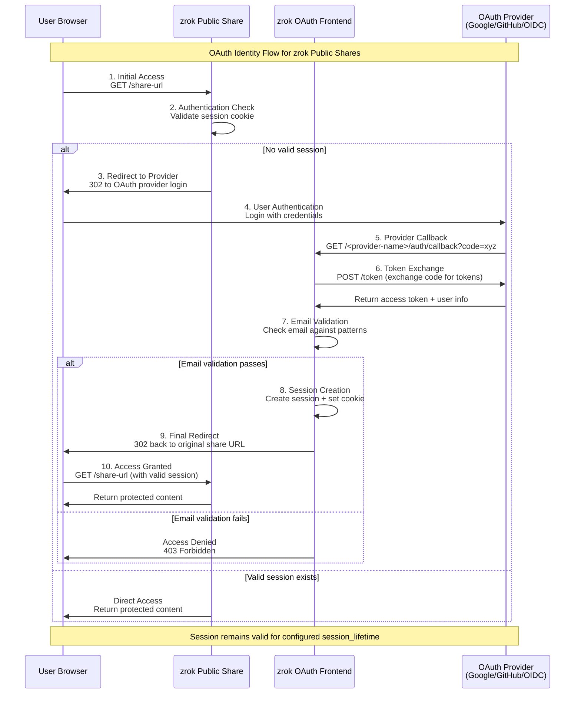

# OAuth Public Frontend Configuration

`zrok` includes OAuth integration for public frontends, allowing you to authenticate users through various OAuth providers before they can access your shared resources. You can configure multiple OAuth providers and restrict access based on email address patterns.

## Planning for the OAuth Frontend

The OAuth public frontend uses an HTTP listener with a stable name to handle redirects from OAuth providers. You'll need to configure a DNS name and port for this listener that is accessible by your end users.

The OAuth frontend address will be used as the "redirect URL" when configuring OAuth clients with your providers. Each provider will redirect authenticated users back to this address, which then forwards them to their original destination.

## Configuring your Public Frontend

Add an `oauth` section to your frontend configuration:

```yaml
oauth:
  bind_address:               "127.0.0.1:8181"
  endpoint_url:               "https://oauth.your-domain.com:8181"
  cookie_name:                "zrok-auth-session"
  cookie_domain:              "your-domain.com"
  session_lifetime:           "6h"
  intermediate_lifetime:      "5m"
  signing_key:                "your-unique-signing-key-32-chars"
  encryption_key:             "your-unique-encryption-key-24-chars"

  providers:
    - name:                   "google"
      type:                   "google"
      client_id:              "<google-client-id>"
      client_secret:          "<google-client-secret>"
      
    - name:                   "github"
      type:                   "github"
      client_id:              "<github-client-id>"
      client_secret:          "<github-client-secret>"
      
    - name:                   "custom-oidc"
      type:                   "oidc"
      client_id:              "<oidc-client-id>"
      client_secret:          "<oidc-client-secret>"
      scopes:                 ["openid", "email", "profile"]
      issuer:                 "https://your-oidc-provider.com"
      supports_pkce:          true
```

### Configuration Parameters

- **`bind_address`**: IP and port where the OAuth frontend will listen (format: `ip:port`)
- **`endpoint_url`**: Public base URL where OAuth redirects will be handled
- **`cookie_name`**: Name for authentication cookies (optional, defaults to `zrok-auth-session`)
- **`cookie_domain`**: Domain where authentication cookies should be stored
- **`session_lifetime`**: How long authentication sessions remain valid (e.g., `6h`, `24h`)
- **`intermediate_lifetime`**: Lifetime for intermediate OAuth tokens (e.g., `5m`)
- **`signing_key`**: Unique 32+ character string for securing authentication payloads
- **`encryption_key`**: Unique 24+ character string for encrypting session data

### OAuth Providers

The `providers` array supports multiple OAuth configurations. Each provider requires:

- **`name`**: Unique identifier for this provider configuration; the `name` becomes part of the OAuth URLs for this provider, for example the callback URL becomes `/<name>/auth/callback`
- **`type`**: Provider type (`google`, `github`, or `oidc`)
- **`client_id`** and **`client_secret`**: OAuth client credentials

For detailed setup instructions for each provider type, see:
- [Google OAuth Setup](integrations/google.md)
- [GitHub OAuth Setup](integrations/github.md)  
- [Generic OIDC Setup](integrations/oidc.md)

## OAuth Identity Flow

When a user accesses a zrok public share protected with OAuth, the following flow occurs:



### Flow Steps

1. **Initial Access**: User visits the zrok public share URL
2. **Authentication Check**: zrok checks for a valid authentication session cookie
3. **Redirect to Provider**: If no valid session exists, user is redirected to the configured OAuth provider's login page
4. **User Authentication**: User authenticates with their OAuth provider (Google, GitHub, etc.)
5. **Provider Callback**: OAuth provider redirects back to zrok's OAuth frontend at `/<provider-name>/auth/callback`
6. **Token Exchange**: zrok exchanges the authorization code for access tokens and retrieves user information
7. **Email Validation**: zrok validates the user's email address against any configured `--oauth-email-address-patterns`
8. **Session Creation**: If validation passes, zrok creates an authenticated session and sets a session cookie
9. **Final Redirect**: User is redirected back to the original zrok share URL
10. **Access Granted**: User can now access the protected resource

### Session Management

- **Session Duration**: Controlled by the `session_lifetime` configuration (default: 6h)
- **Re-authentication**: Users must re-authenticate when sessions expire or when `--oauth-check-interval` is reached
- **Cross-Domain**: Sessions work across all shares within the same `cookie_domain`

## Using OAuth with Public Shares

Once your public frontend is configured with OAuth providers, you can enable authentication on public shares using these command line options:

- **`--oauth-provider <name>`**: Enable OAuth using the specified provider name from your configuration
- **`--oauth-email-address-patterns <pattern>`**: Restrict access to email addresses matching the glob pattern (use multiple times for multiple patterns)
- **`--oauth-check-interval <duration>`**: How often to re-verify authentication (default: 3h)

### Example

```bash
zrok share public --backend-mode web \
  --oauth-provider google \
  --oauth-email-address-patterns '*@example.com' \
  --oauth-email-address-patterns 'admin@*' \
  ~/public
```

This creates a public share that requires Google OAuth authentication and only allows users with `@example.com` email addresses or any `admin@*` email address.
