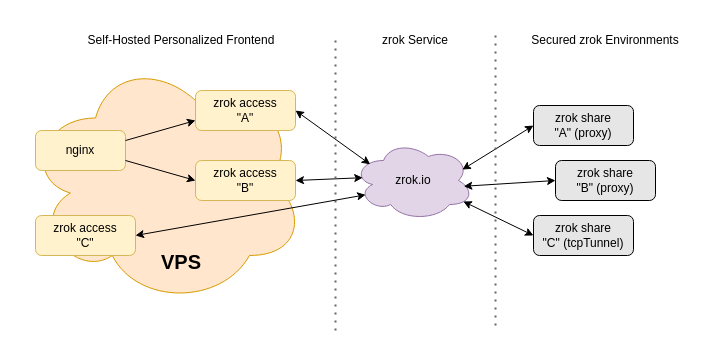

This guide describes an approach that enables a zrok user to use a hosted, shared instance (zrok.io) and configure their own personalized frontend, which enables custom DNS and TLS for their shares.

In order to accomplish this, the user will need to provide their own minimal VPS instance, or container hosting. The size and capacity of these resources will be entirely dependent on the workload that they will be used to service. But generally, for most modest workloads, the most inexpensive VPS option will suffice.

This approach gives you complete control over the way that your shares are exposed publicly. This approach works for HTTPS shares, and also for TCP and UDP ports, allowing you to put all of these things onto the public internet, while maintaining strong security for your protected resources.

This guide isn't a detailed _how to_ with specific steps to follow. This is more of a description of the overall concept. You'll want to figure out your own specific steps to implement this style of deployment in your own environment.

## Overview

Let's imagine a hypothetical scenario where you've got 3 different resources shared using zrok. We'll refer to these as `A`, `B`, and `C`. Both `A` and `B` are shares using the `proxy` backend mode, which are used to share private HTTPS resources. Share `C` uses the `tcpTunnel` backend to expose a listening port from a private server (like a game server, or a message queue).

We're using the shared zrok instance at zrok.io to provide our secure sharing infrastructure.

Our deployment will end up looking like this:



We're using `zrok reserve` to create the `A`, `B`, and `C` shares as reserved shares (using the `--unique-name` option to give them specific names). These shares could be located together in a single environment on a single host, or can be located at completely different spots on the planet on completely different hosts. You could want to use significantly more shares than 3, or less. The secure sharing fabric allows seamless secure connectivity for these shared resources. This implementation will scale up or down as needed (use multiple hosts behind a load balancer for really big workloads).

Because we're using `private` zrok shares, they'll need to be accessed using a corresponding `zrok access` private command. The `zrok access private` command binds a "network listener" where the share can be accessed on an address and port on the host where the command is executed. You can use `zrok access private` to bind a network listener for a share in as many places as you want (up to the limit configuration of the service).

:::note
When you use `zrok share public`, you are allowing your shared resources to be accessed using the shared, public frontend provided by the service instance (zrok.io). `zrok share private` (or `zrok reserve`/`zrok share reserved`) creates the same kind of share, but does not provision the shared public frontend, and you'll need to use `zrok access private` in order to _bind_ that share to a network address where it can be accessed.
:::

Imagine that we own the domain `example.com`. In our example, we want to expose our HTTPS shares `A` and `B` as `a.example.com` and `b.example.com`. And maybe our `C` share represents a gaming server that we want to expose as `gaming.example.com:25565`. 

We can accomplish this easily with cheap VPS instance. You could also do it with containers through a container hosting service. The VPS will need an IP address exposed to the internet. You'll also need to be able to create DNS entries for the `example.com` domain.

To accomplish this, we're going to run 3 separate `zrok access private` commands on our VPS (see the [frontdoor guide](../../frontdoor/), or [zrok-private-access Docker Compose guide](../../docker-share/docker_private_share_guide/#access-the-private-share) for details on an approach for setting this up). One command each for shares `A`, `B`, and `C`. The `zrok access private` command works like this:

```
$ zrok access private
Error: accepts 1 arg(s), received 0
Usage:
  zrok access private <shareToken> [flags]

Flags:
  -b, --bind string   The address to bind the private frontend (default "127.0.0.1:9191")
      --headless      Disable TUI and run headless
  -h, --help          help for private

Global Flags:
  -p, --panic     Panic instead of showing pretty errors
  -v, --verbose   Enable verbose logging
```

Notice the `--bind` flag. That flag is used to bind a network listener to a specific IP address and port on the host we're accessing the shares from. In this case, imagine our VPS node has a public IP address of `1.2.3.4` and a loopback (`127.0.0.1`).

To expose our HTTPS shares, we're going to use a reverse proxy like nginx. The reverse proxy will be exposed to the internet, terminating TLS and reverse proxying `a.example.com` and `b.example.com` to the network listeners for shares `A` and `B`.

So, we'll configure our VPS to persistently launch a `zrok access private` for both of these shares. We'll use the `--bind` flag to bind `A` to `127.0.0.1:9191` and `B` to `127.0.0.1:9192`.

We'll then configure nginx to have a virtual host for `a.example.com`, proxying that to `127.0.0.1:9191` and `b.example.com`, proxying that to `127.0.0.1:9192`.

Exposing our TCP port for `gaming.example.com` is simply a matter of running a third `zrok access private` with a `--bind` flag configured to point to `1.2.3.4:25565`.

Once you've created the appropriate DNS entries for `a.example.com`, `b.example.com`, and `gaming.example.com` and worked through the TLS configuration (letsencrypt is your friend here), you'll have a fully functional personalized frontend for your zrok shares that you control.

Your protected resources remain disconnected from the internet and are only reachable through your personalized endpoint.

## Privacy

When you use a public frontend (with a simple `zrok share public`) at a hosted zrok instance (like zrok.io), the operators of that service have some amount of visibility into what traffic you're sending to your shares. The load balancers in front of the public frontend maintain logs describing all of the URLs that were accessed, as well as other information (headers, etc.) that contain information about the resource you're sharing.

If you create private shares using `zrok share private` and then run your own `zrok access private` from some other location, the operators of the zrok service instance only know that some amount of data moved between the environment running the `zrok share private` and the `zrok access private`. There is no other information available.
