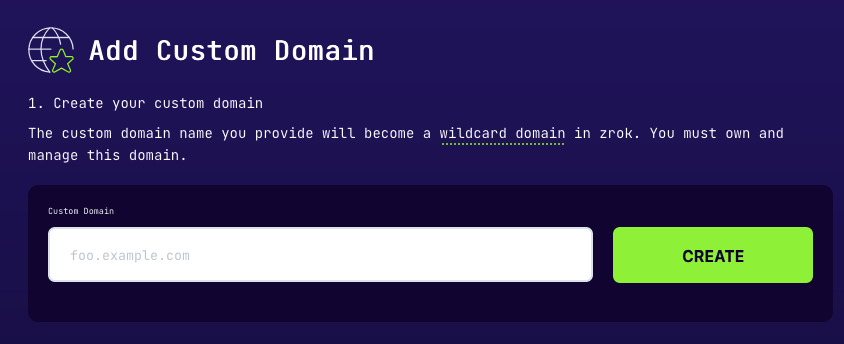
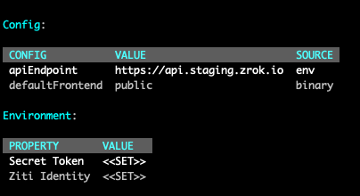

## Overview
[myzrok.io](https://myzrok.io) is a hosted zrok-as-a-service offering that provides a way for you bring a custom DNS name for zrok shares.
For example, let's say you own the domain `foo.example.io`, you can leverage zrok custom domains to
create ephemeral shares such as: `https://vw8jbg4ijz5g.foo.example.io`
or [reserved shares](/concepts/sharing-reserved.md) such as `https://myshare.foo.example.io`.

Custom domains require a Pro subscription with [myzrok.io](https://myzrok.io).
If you don't already have an account, you can sign up for one [here](https://myzrok.io).

[myzrok.io](https://myzrok.io) provides a guided setup with just a few easy steps!

1. Bring your own custom domain name
2. Create DNS records for certificate validation and traffic routing
3. Wait for zrok to validate your records and finalize configuration
4. Start sharing!

Detailed setup instructions are documented below.

### Prerequisites
:::note
In order to create a custom domain in zrok, **you must already own the domain you want to use.**
:::

During the setup process you will need to create DNS records to validate ownership and to allow a certificate to be issued
on behalf of your domain. Once you have your domain registered, you can begin the process of setting up your custom
domain with zrok.

### Create Your Custom Domain

Log into the myzrok console and access the domains page by clicking on the globe icon in the left navigation menu.


Click the CREATE button on the top right of the page to get started.
When you click the create button you’ll be presented with a form to allow you to enable your custom domain.
Enter your domain into the form field and click CREATE. This will begin the process for setting up your custom domain.
A new managed TLS certificate will be created to host traffic on your domain's behalf.



This may take a few minutes.
You may close the form at this time and come back when your domain is *pending validation.*
Once your certificate is ready, you’ll be presented with instructions on how to set up your DNS records.

### Creating DNS Records

zrok will host and manage a TLS certificate for the custom domain on your behalf.
This process requires a DNS validation record to be created in order to prove ownership of the domain.
Follow the prompts in the UI to create a CNAME DNS record with the name and value specified in the UI.


Next, create an A record to direct all DNS requests for your domain to a set of static IPs that are hosted by zrok.


After you’ve created your records, you can verify that they are configured properly using the instructions provided in the form.


If the `nslookup` command returns the IP addresses supplied for the A-record entry, then DNS for your domain is resolving properly.

```
nslookup test.foo.example.io
Server:		192.168.86.194
Address:	192.168.86.194#53

Non-authoritative answer:
Name:	test.foo.example.io
Address: 99.83.220.186
Name:	test.foo.example.io
Address: 52.223.6.108
```

Once you have created your DNS records, it will take zrok a few minutes to validate that they exist.
You can safely close the form until your certificate has been issued.

### Finalizing Your Custom Domain

After your records have been validated and your certificate has been issued, click the FINALIZE button within 72 hours to complete your custom domain setup.


From here, myzrok.io will complete the last few steps of creating your custom domain.
This should only take a minute, but if you need to close the form you can find the instructions on how to share your frontend when you return.

### Start Sharing!
Once the Finalize stage has completed, you can start sharing with your custom DNS.

In order to create shares that utilize your custom DNS, you will need to specify the `--frontend` flag when creating a share,
or update your environment configuration to use this new frontend by default.

```
zrok share public --frontend foo-example--goPIhgtJtz
```

You can set the custom frontend as the environment default by running:

```
zrok config set defaultFrontend foo-example--goPIhgtJtz
```

To validate which frontend is being used, use the `zrok status` command, which will identify the default frontend being used:


