# Getting Started with zrok v0.3

`zrok` is a next-generation sharing platform built on top of [Ziti][openziti], a programmable zero trust network overlay. `zrok` is a _Ziti Native Application_.

`zrok` facilitates sharing resources publicly and privately with an audience of your choosing.

As of version `v0.3.0`, `zrok` provides users the ability to publicly proxy local `http`/`https` endpoints (similar to other players in this space). Additionally, `zrok` provides the ability to:

* _privately_ share resources with other `zrok` users; in _private_ usage scenarios, your private resources are not exposed to any public endpoints, and all communication is securely and privately transported between `zrok` clients
* use `web` sharing; easily share files with others using a single `zrok` command

Let's take a look at how to get started with `zrok`.

## Downloading zrok

In order to use `zrok`, you will need a `zrok` executable. [Download][zrok-download] a binary executable package for your platform at https://zrok.io/download.

### Extract zrok Distribution

Move the downloaded `zrok` distribution into a directory on your system. In my case, I've placed it in my home directory:

```
$ l zrok*
-rwxr-xr-x 1 michael michael 12724747 Jan 17 12:57 zrok_0.3.0-rc1_linux_amd64.tar.gz*
```

Create a directory where the extracted distribution will sit:

```
$ mkdir zrok
$ cd zrok/
```

Extract the `zrok` distribution:

```
$ tar zxvf ../zrok_0.3.0-rc1_linux_amd64.tar.gz
CHANGELOG.md
README.md
zrok
```

Add `zrok` to your shell's environment.

For Linux or macos:

```
$ export PATH=`pwd`:$PATH
```

For Windows (using Command Prompt):

```
> set PATH=%CD%;%PATH%
```

For Windows (using PowerShell):

```
$env:path += ";"+$pwd.Path
```

With the `zrok` executable in your path, you can then execute the `zrok` command from your shell:

```
$ zrok version
               _    
 _____ __ ___ | | __
|_  / '__/ _ \| |/ /
 / /| | | (_) |   < 
/___|_|  \___/|_|\_\

v0.3.0-rc1 [0d43b55]
```

## Configure Your zrok Service

`zrok` is both an installable utility that you interact with from your local computer, and also a service that exists on the network. NetFoundry operates the service that is available at `api.zrok.io`, but because `zrok` is open source and self-hostable, you're free to create your own `zrok` service.

The `zrok` executable defaults to using the `zrok` service at `api.zrok.io`. Should you need to change the service endpoint, you can do that with the following command:

```
$ zrok config set apiEndpoint https://staging.zrok.io
[WARNING]: unable to open zrokdir metadata; ignoring

zrok configuration updated
```

> The `WARNING` about `zrokdir metadata` is ignorable. Running the `zrok config set` command writes a small piece of metadata into a `.zrok` folder inside your home directory. This allows `zrok` to identify the version of its settings, providing a mechanism to upgrade your installation as new versions are released.

You can use the `zrok status` command to inspect the state of your local shell. `zrok` refers to each shell where you install and `enable` a copy of `zrok` as as an "environment".

```
$ zrok status

Config:

 CONFIG       VALUE                    SOURCE 
 apiEndpoint  https://staging.zrok.io  config 

[WARNING]: Unable to load your local environment!

To create a local environment use the zrok enable command.
```

> The `WARNING` about being `unable to load your local environment` will go away once you've done a `zrok enable` for your shell (we'll get to that below). For now, this warning is ignorable.

The `zrok status` command shows the configured API service that your environment is using, as well as the "source" where the setting was retrieved. In this case, `config` means that the setting was set into the environment using the `zrok config` command.

## Generating an Invitation

In order to create an account with the `zrok` service, you will need to create an invitation. 

> Some environments take advantage of "invitation tokens", which limits who is able to request an invitation on the service instance. If your service uses invitation tokens, the administrator of your instance will include details about how to utilize your token to generate your invitation.

We generate an invitation with the `zrok invite` command:

```
$ zrok invite

enter and confirm your email address...

> michael.quigley@netfoundry.io 
> michael.quigley@netfoundry.io 

[ Submit ]

invitation sent to 'michael.quigley@netfoundry.io'!
```

The `zrok invite` command presents a form that allows you to enter (and then confirm) your email address. Tabbing to the `[ Submit ]` button will send the request to your configured `zrok` service.

Next, check the email where you sent the invite. You should receive a message asking you to click a link to create your `zrok` account. When you click that link, you will be brought to a web page that will allow you to set a password for your new account:

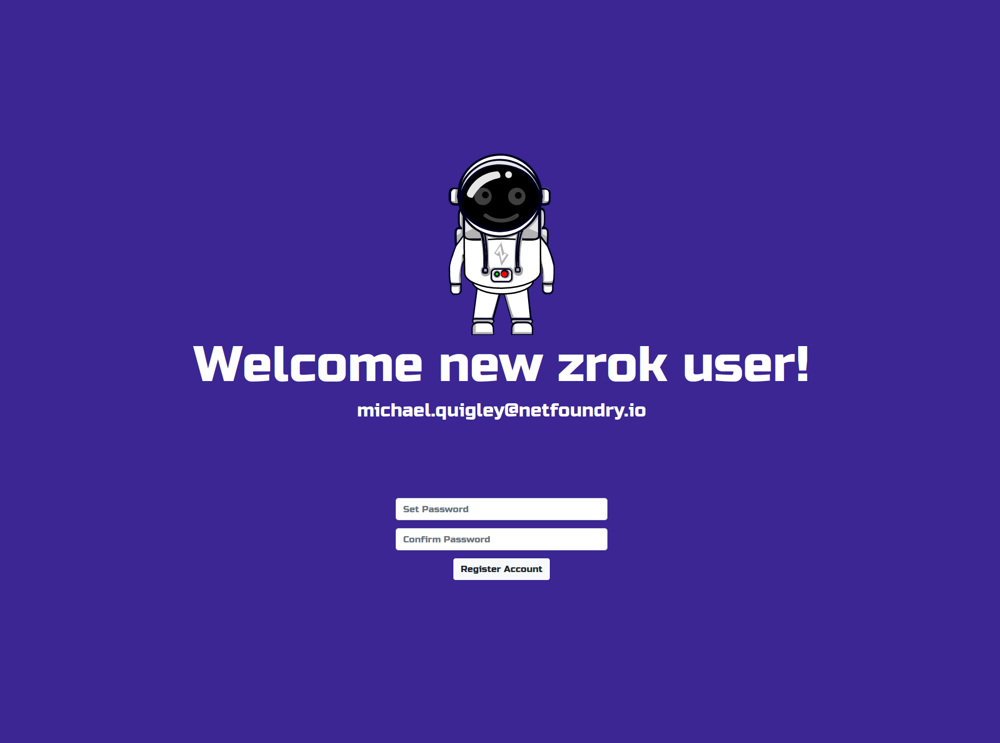

Enter a password and it's confirmation, and click the `Register Account` button. You'll see the following:

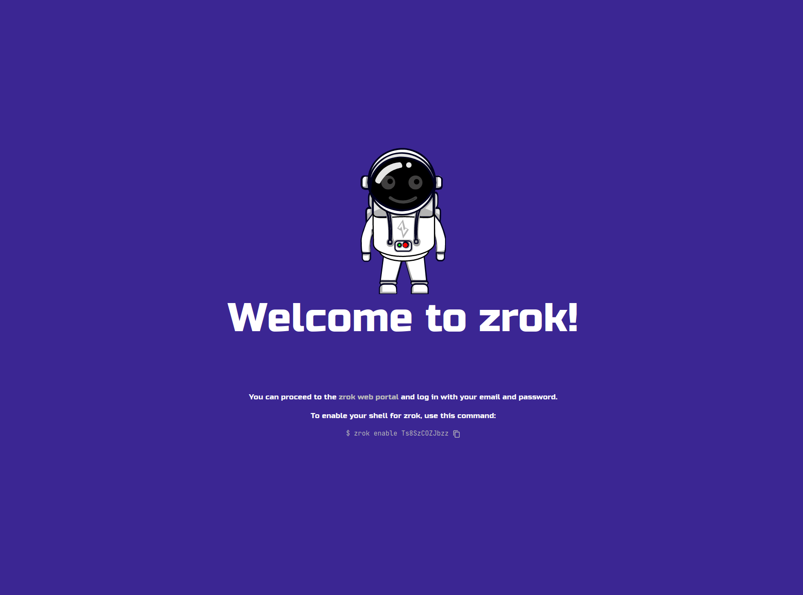

For now, we'll ignore the "enable your shell for zrok" section. Just click the `zrok web portal` link:

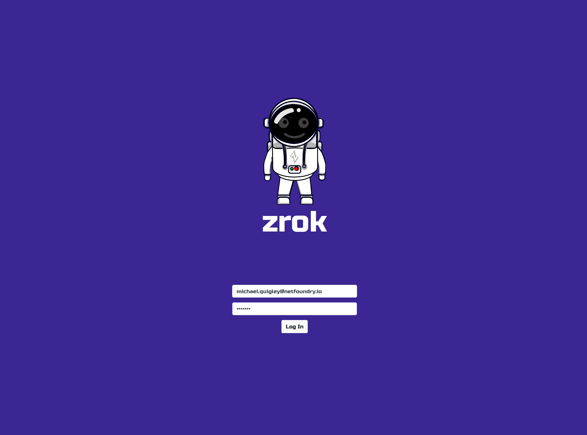

After clicking the `Log In` button, you'll be brought into the `zrok` Web Console:

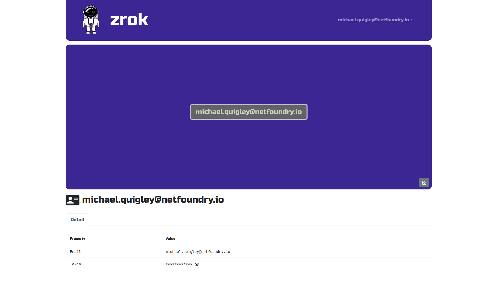

Congratulations! Your `zrok` account is ready to go!

## Enabling Your zrok Environment

When your `zrok` account was created, the service generated a "secret token" that identifies and authenticates in a single step. Protect your secret token as if it were a password, or an important account number; it's a _secret_, protect it.

When we left off you had downloaded, extracted, and configured your `zrok` environment. In order to use that environment with your account, you'll need to `enable` it. Enabling an environment generates a secure identity and the necessary underlying security policies with the Ziti network hosting the `zrok` service.

From the web UI, click on your email address in the upper right corner of the header. That drop down menu contains an `Enable Your Environment` link. Click that link and a modal dialog will be shown like this:

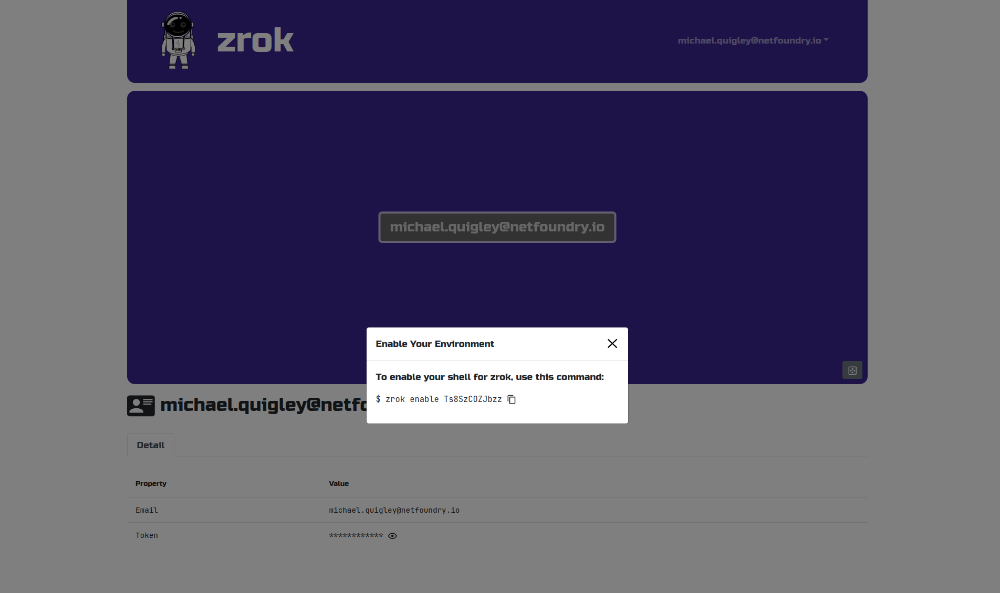

This dialog box shows you the `zrok enable` command that you can use to enable any shell to work with your `zrok` account with a single command.

Let's copy that command and paste it into your shell:

```
$ zrok enable Ts8SzCOZJbzz
⣻  contacting the zrok service...
```

After a few seconds, the message will change and indicate that the enable operation suceeded:

```
$ zrok enable Ts8SzCOZJbzz
⣻  the zrok environment was successfully enabled...
```

Now, if we run a `zrok status` command, you will see the details of your environment:

```
$ zrok status

Config:

 CONFIG       VALUE                    SOURCE 
 apiEndpoint  https://staging.zrok.io  env    

Environment:

 PROPERTY       VALUE        
 Secret Token   Ts8SzCOZJbzz 
 Ziti Identity  X1PJCfYK36   
```

Excellent... our environment is now fully enabled.

If we return to the web UI, we'll now see the new environment reflected in the explorer view:

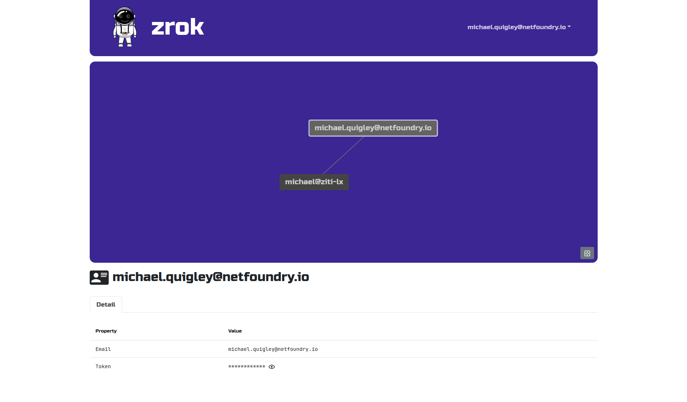

In my case, the environment is named `michael@ziti-li`, which is the username of my shell and the hostname of the system the shell is running on.

> Should you want to use a non-default name for your environment, you can pass the `-d` option to the `zrok enable` command. See `zrok enable --help` for details.

If you click on the environment node in the explorer in you web console, the details panel showed at the bottom of the page will change:

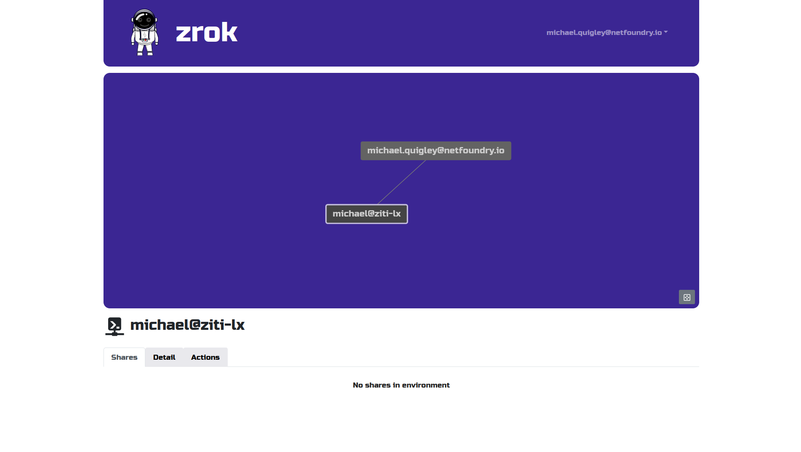

The explorer supports clicking, dragging, mouse wheel zooming, and selecting the nodes in the graph for more information (and available actions) for the selected node.

If we click on the `Details` tab for our environment, we'll see something like:

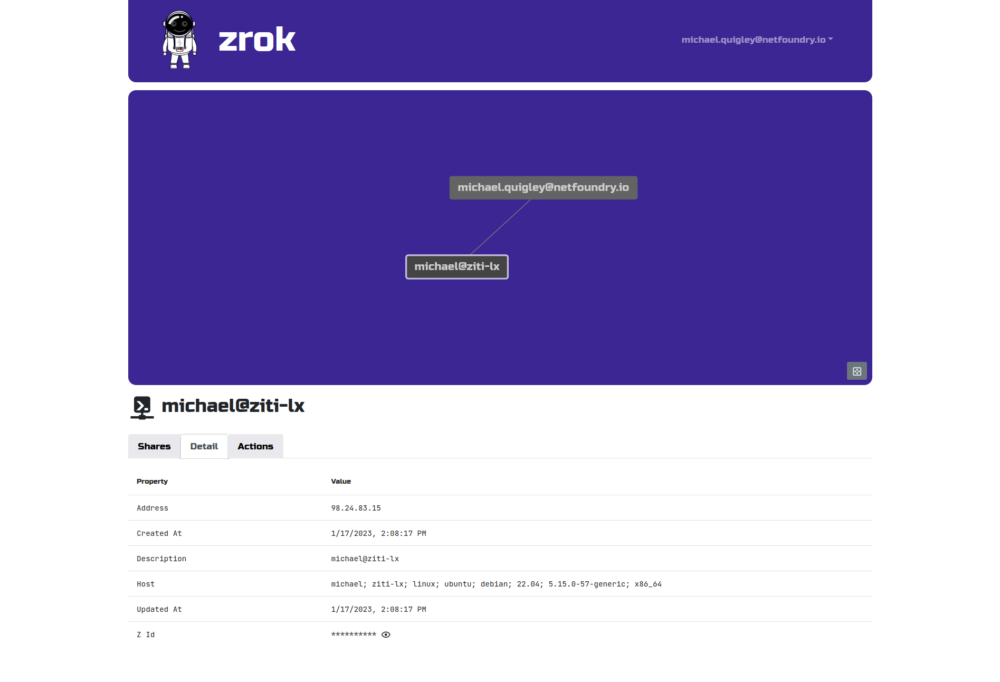

Your environment is fully ready to go. Now we can move on to the good stuff... various types of sharing.

## Sharing

`zrok` is designed to make sharing resources as effortless as possible, while providing a high degree of security and control.

### Ephemeral by Default

Shared resources are _ephemeral_ by default; as soon as you terminate the `zrok share` command, the entire share is removed and is no longer available to any users. Identifiers for shared resources are randomly allocated when the share is created.

### Public Shares and Frontends

Resources that are shared _publicly_ are exposed to any users on the internet who have access to the `zrok` service instance's "frontend".

A frontend is an HTTPS listener exposed to the internet, that lets any user with your ephemeral share token access your publicly shared resources.

For example, I might create a public share using the `zrok share public` command, which results in my `zrok` service instance exposing the following URL to access my resources:

https://59wepuo4tcd8.in.staging.zrok.io/

In this case my share was given the "share token" of `59wepuo4tcd8`. That URL can be given to any user, allowing them to immediately access the shared resources directly from my local environment, all without exposing any access to my private, secure environment. The physical network location of my environment is not exposed to anonymous consumers of my resources.

And as soon as I terminate the `zrok share` client, the resources are removed from the `zrok` environment.

### Private Shares

`zrok` also provides a powerful _private_ sharing model. If I execute the following command:

```
$ zrok share private --backend-mode web docs
```

The `zrok` service will respond with the following:
```
access your share with: zrok access private 3l6e6fuxmffr
```

Rather than allowing access to your service through a public frontend, a _private_ share is only exposed to the underlying Ziti network, and can only be accessed using the `zrok access` command.

The `zrok access private 3l6e6fuxmffr` command can be run by any `zrok` user, allowing them to create and bind a local HTTP listener, that allows for private access to your shared resources.

### Proxy Backend Mode

Without specifying a _backend mode_, the `zrok share` command will assume that you're trying to share a `proxy` resource. A `proxy` resource is usually some private HTTP/HTTPS endpoint (like a development server) running in your local environment. Usually such an endpoint would have no inbound connectivity except for however it is reachable from a physical network. It might be running on `localhost`, or only listening on a private LAN segment behind a firewall. 

For these services a `proxy` share will allow those endpoints to be reached, either _publicly_ or _privately_ through the `zrok` service.

### Web Backend Mode

The `zrok share` command accepts a `--backend-mode` option. Besides `proxy`, the current `v0.3` release (as of this writing) also supports a `web` mode. The `web` mode allows you to specify a local folder on your filesystem, and instantly turns your `zrok` client into a web server, exposing your share either _publicly_ or _privately_.

### Reserved Shares

`zrok` shares are _ephemeral_ unless you specifically create a "reserved" share.

A reserved share can be re-used multiple times; it will survive termination of the `zrok share` command, allowing for longer-lasting semi-permanent access to shared resources.

The first step is to create the reserved share:

```
$ zrok reserve public --backend-mode web docs
[   0.357]    INFO main.(*reserveCommand).run: your reserved share token is 'n3y7dxiawqf6'
[   0.357]    INFO main.(*reserveCommand).run: reserved frontend endpoint: https://n3y7dxiawqf6.in.staging.zrok.io/
```

I'm asking the `zrok` service to reserve a share with a `web` backend mode, pointing at my local `docs` folder.

You'll want to remember the share token (`n3y7dxiawqf6` in this case), and the frontend endpoint URL. If this were a _private_ reserved share, there would not be a frontend URL.

If we do nothing else, and then point a web browser at the frontend endpoint, we get:

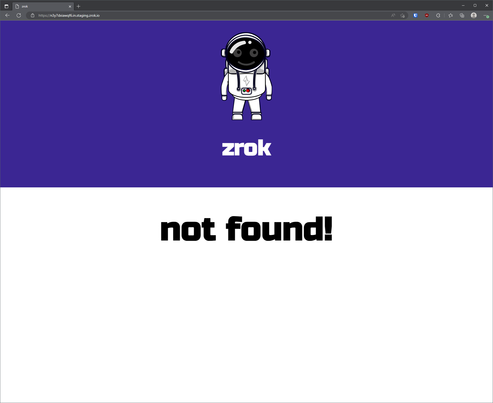

This is the `404` error message returned by the `zrok` frontend. We're getting this because we haven't yet started up a `zrok share` for the service. Let's do that:

This command:

```
$ zrok share reserved n3y7dxiawqf6
```

...results in a new share backend starting up and connecting to the existing reserved share:

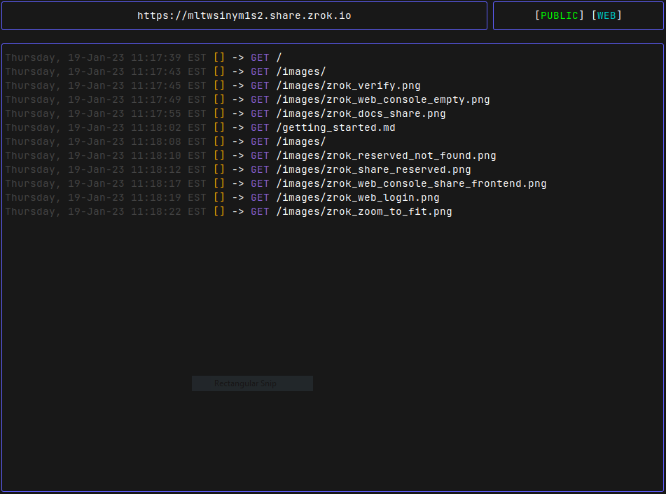

And now if we refresh the frontend endpoint URL in the web browser, we'll see an index of the `docs` directory:

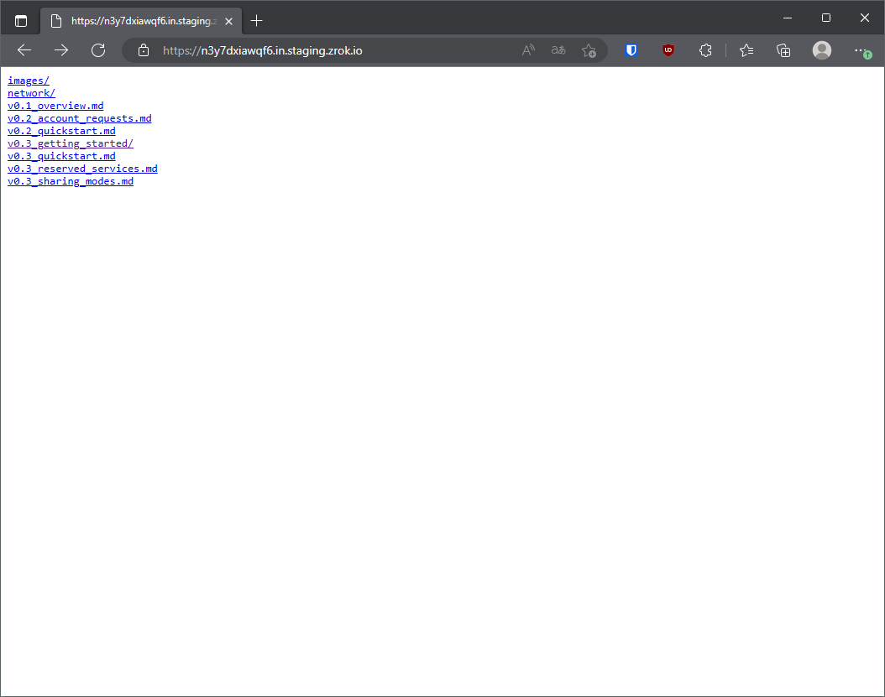

With the reserved share, we're free stop and restart the `zrok share reserved` command as many times as we want, without losing the token for our share.

When we're done with the reserved share, we can _release_ it using this command:

```
$ zrok release n3y7dxiawqf6
[   0.307]    INFO main.(*releaseCommand).run: reserved share 'n3y7dxiawqf6' released
```

## Concepts Review

In summary, `zrok` lets you easily and securely share resources with both general internet users (through _public_ sharing) and also with other `zrok` users (through _private_ sharing).

Here's a quick review of the `zrok` mental model and the vocabulary.

### Service Instance and Account

You create an _account_ with a `zrok` _service instance_. Your account is identified by a username and a password, which you use to log into the _web console_. Your account also has a _secret token_, which you will use to authenticate from the `zrok` command-line to interact with the _service instance_.

You create a new _account_ with a `zrok` _service instance_ through the `zrok invite` command.

### Environment

Using your _secret token_ you use the `zrok` command-line interface to create an _environment_. An _environment_ corresponds to a single command-line user on a specific _host system_. 

You create a new _environment_ by using the `zrok enable` command.

### Shares

Once you've enabled an _environment_, you then create one or more _shares_. Shares have either a _public_ or _private_ _sharing mode_. _Shares_ share a specific type of resource using a _backend mode_. As of this writing `zrok` supports a `proxy` _backend mode_ to share local HTTP resources as a _reverse proxy_. `zrok` also supports a `web` _backend mode_ to share local file and HTML resources by enabling a basic HTTP server.

Every _share_ is identified by a _share token_. _Public shares_ can be accessed through either a _frontend_ instance offered through the `zrok` _service instance_, or through the `zrok access` command. _Private shares_ can only be accessed through the `zrok access` command.

You use the `zrok share` command to create and enable _ephemeral shares_.

### Reserved Shares

`zrok` supports creating _shares_ that have a consistent _share token_ that survives restarts of the `zrok share` command. These are considered _non-ephemeral_, and is callled a _reserved share_.

You use the `zrok reserve` command to create _reserved shares_. Reserved shares last until you use the `zrok release` command to delete them.

[openziti]: https://docs.openziti.io/	"OpenZiti"
[ zrok-download]: https://zrok.io/download "Zrok Download"