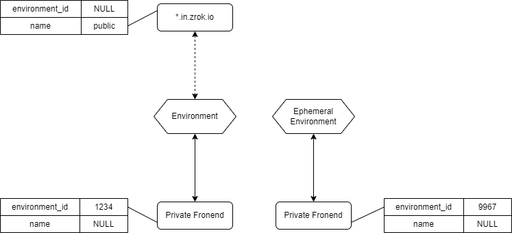

# v0.3 Public/Private Sharing

The `v0.3` series introduces new sharing modes, and new types of built-in services.

## Share Modes

_Note: In `v0.3`, the `tunnel` and `untunnel` concepts get renamed to `share` and `unshare`._

### Public Sharing

In `v0.2`, `zrok` only offered a "public" sharing mode. The public sharing mode will allow any configured `frontend` instances to send traffic to any `backend`. The policy and permission model was very simple and flat. A `v0.2` deployment considers any available `frontend` instance to be allowed to send traffic to configured services. The access for `frontend` instances is controlled by identity provisioning within the underlying Ziti network.

In `v0.3`, `zrok` will offer both a "public" and a "private" sharing mode. When `v0.3` configures the policies for a service, a publicly-shared service will have policies created that allow whichever selected public `frontend` instances to access the shared `backend`. A `v0.3` deployment will have a collection of multi-tenant, high-capacity `frontend` instances available to be selected from. The `zrok` CLI will default to selecting the `public` `frontend` instances.

### Private Sharing

`v0.3` introduces a "private" sharing mode. When provisioning a service for private sharing, `zrok` will not create any policies for the service, until a request for a `frontend` binding is created for the service (through the `v0.3` `zrok serve` command).

The `v0.3` `zrok` API will support creating `frontend` instances for both identified users (where the `zrok` user has a provisioned `environment`), as well as ephemeral users (the `zrok` controller will create an "ephemeral environment" for these `frontend` instances).

## Backend Modes

In `v0.2`, the only possible `backend` "mode" was used for reverse proxying HTTP traffic to a local endpoint. The `v0.3` `zrok` client will support several different `backend` modes, providing a number of built-in conveniences.

### Web Mode

A user has a collection of files on disk. Sharing with a `backend` mode of "web", will create a `backend` that shares a file tree as if it were a local web server. This effectively allows a user to bind a web-server backend to a document root with a single CLI command.

### DAV Mode

A user wants to operate a read/write repository of files accessible through either conventional WebDAV clients (through `public` `frontend` instances), or through the `zrok` CLI (a convenience wrapper, embedding WebDAV capabilities).

This allows users to create read/write repositories of files that can be shared with multiple users, and also allows for the creation of write-only "drop boxes" for receiving files from another user (often a tricky thing to do well and securely on the public internet).

### Proxy Mode

`v0.3` will retain the classic reverse proxy mode, as well. Will continue to allow a user to expose a local HTTP endpoint through `zrok`.

## Entities (SQL)

`v0.3` introduces a new `frontends` table to allow the `zrok` controller to track the frontend instances that are available to any account or environment.

The following illustration shows the possibilities available.

The `*.in.zrok.io` frontend is a "public" frontend, available to all `zrok` users. Most `zrok` installations will want to have at least one public, global frontend for all public, internet-facing ingress traffic for private backend instances. In the underlying data store, the public frontend will have a row in the `frontends` table with a `NULL` `environment_id`, and a `name` set to `public` (or some other representative name).

The other two "private" frontends are configured with an `environment_id` and no `name` label (the lack of a `name` label signifies that these are "private" frontends). The ephemeral environment is allocated when a `zrok` frontend request is made without an account on behalf of a private share.
