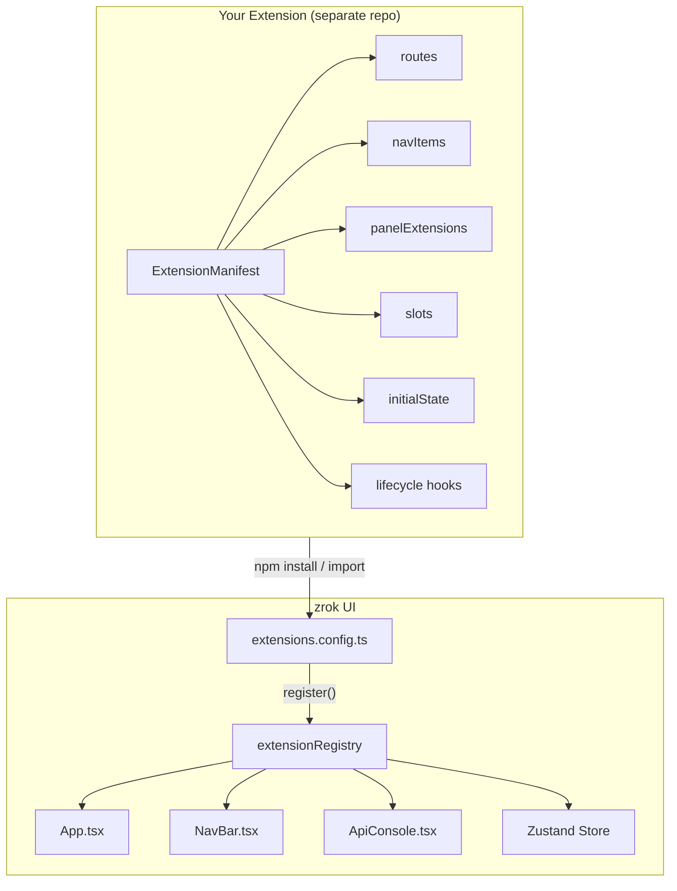
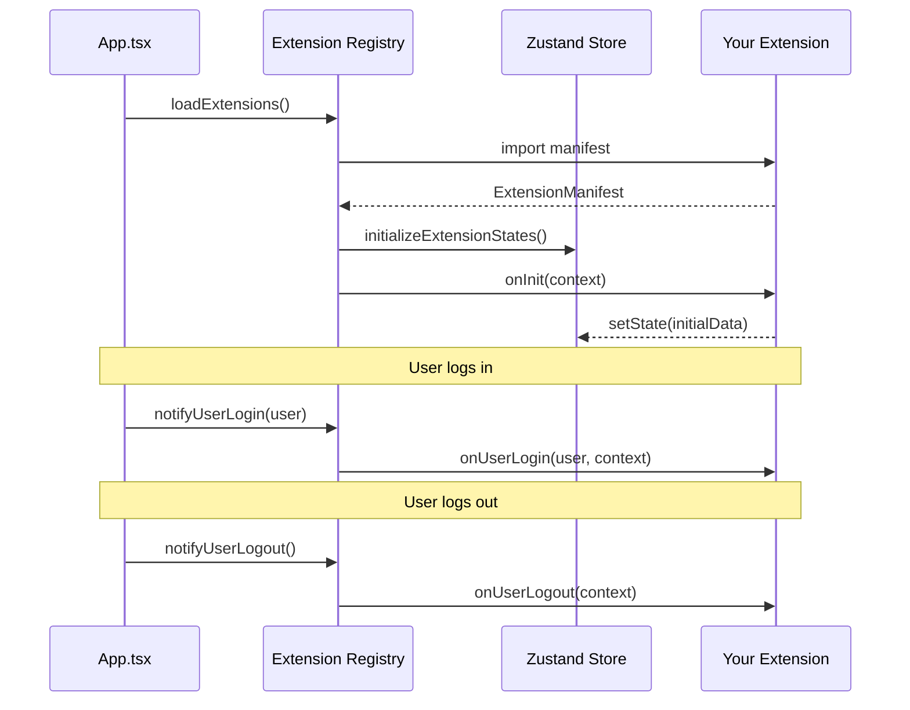
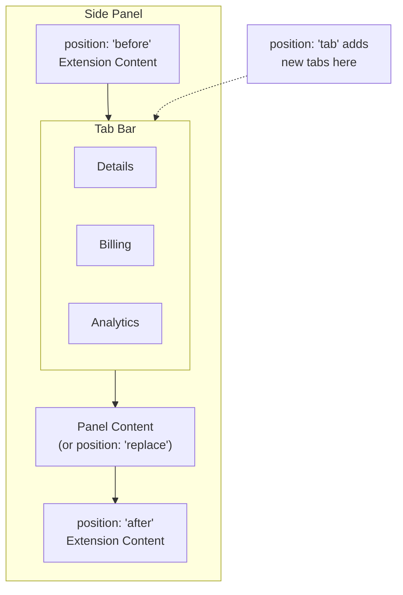
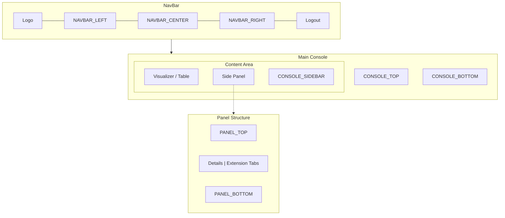
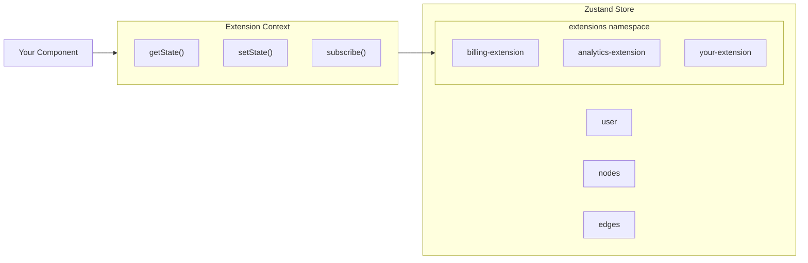
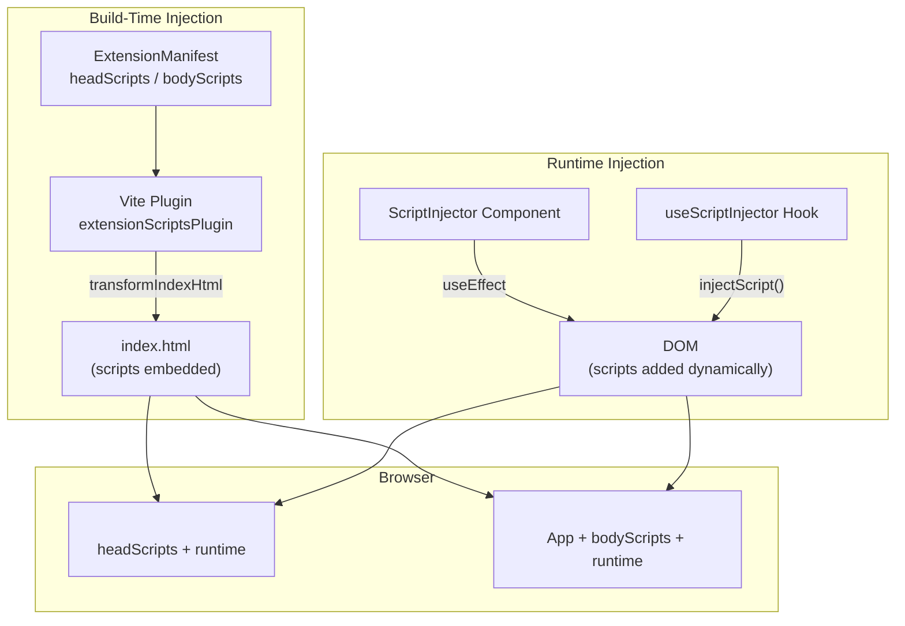
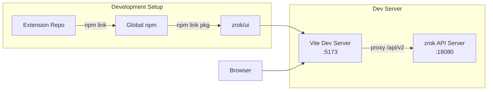
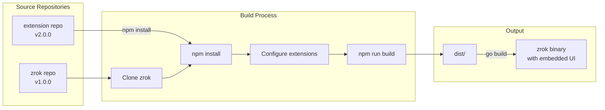

# zrok UI Extension Developer Guide

This guide explains how to create extensions for the zrok web UI. Extensions allow you to add custom functionality, pages, and UI components that integrate seamlessly with zrok.

## Table of Contents

1. [Overview](#overview)
2. [Quick Start](#quick-start)
3. [Extension Manifest](#extension-manifest)
4. [Routes](#routes)
5. [Navigation Items](#navigation-items)
6. [Panel Extensions](#panel-extensions)
7. [Slots](#slots)
8. [State Management](#state-management)
9. [Extension Context](#extension-context)
10. [Lifecycle Hooks](#lifecycle-hooks)
11. [Script Injection](#script-injection)
12. [Development Workflow](#development-workflow)
13. [Deployment](#deployment)
14. [API Reference](#api-reference)
15. [Best Practices](#best-practices)
16. [Troubleshooting](#troubleshooting)

---

## Overview

The zrok UI extension system allows third-party developers to:

- Add new pages and routes to the UI
- Add navigation items to the navbar
- Extend existing panels with tabs or additional content
- Inject UI components into predefined slots
- Manage extension-specific state
- React to user and application events

Extensions are TypeScript/React packages that export an `ExtensionManifest` object. At build time, extensions are bundled together with the zrok UI, resulting in a single, cohesive application.

### Architecture



### Extension Lifecycle



---

## Quick Start

### 1. Create Your Extension Package

```bash
mkdir my-zrok-extension
cd my-zrok-extension
npm init -y
```

### 2. Set Up TypeScript

Create `tsconfig.json`:

```json
{
  "compilerOptions": {
    "target": "ES2020",
    "lib": ["ES2020", "DOM", "DOM.Iterable"],
    "module": "ESNext",
    "moduleResolution": "bundler",
    "jsx": "react-jsx",
    "strict": true,
    "noEmit": true,
    "allowImportingTsExtensions": true
  },
  "include": ["src"]
}
```

### 3. Configure package.json

```json
{
  "name": "@myorg/zrok-my-extension",
  "version": "1.0.0",
  "main": "src/index.ts",
  "peerDependencies": {
    "react": "^18.0.0",
    "@mui/material": "^6.0.0",
    "@xyflow/react": "^12.0.0"
  }
}
```

### 4. Create Your Extension Manifest

Create `src/index.ts`:

```typescript
import { ExtensionManifest } from '@openziti/zrok-ui/extensions';
import MyPage from './MyPage';

const manifest: ExtensionManifest = {
  id: 'my-extension',
  name: 'My Extension',
  version: '1.0.0',

  routes: [
    {
      path: '/my-page',
      component: MyPage,
    },
  ],

  navItems: [
    {
      id: 'my-nav',
      label: 'My Page',
      path: '/my-page',
    },
  ],
};

export default manifest;
```

### 5. Create a Page Component

Create `src/MyPage.tsx`:

```typescript
import React from 'react';
import { Container, Typography } from '@mui/material';
import { ExtensionRouteProps } from '@openziti/zrok-ui/extensions';

const MyPage: React.FC<ExtensionRouteProps> = ({ user, context }) => {
  return (
    <Container>
      <Typography variant="h4">Hello from My Extension!</Typography>
      <Typography>Logged in as: {user?.email}</Typography>
    </Container>
  );
};

export default MyPage;
```

### 6. Enable Your Extension

In the zrok UI, edit `src/extensions.config.ts`:

```typescript
import { extensionRegistry } from './extensions/registry';
import myExtension from '@myorg/zrok-my-extension';

export function loadExtensions(): void {
  extensionRegistry.register(myExtension);
}
```

---

## Extension Manifest

The extension manifest is the main entry point for your extension. It describes what your extension provides and how it integrates with the zrok UI.

```typescript
interface ExtensionManifest {
  // Required fields
  id: string;        // Unique identifier (e.g., "acme-billing")
  name: string;      // Display name
  version: string;   // Semantic version

  // Optional description
  description?: string;

  // UI Extensions
  routes?: ExtensionRoute[];
  navItems?: ExtensionNavItem[];
  panelExtensions?: PanelExtension[];
  slots?: Record<string, ComponentType<SlotProps>>;

  // Graph extensions
  nodeTypes?: Record<string, ComponentType<any>>;
  edgeTypes?: Record<string, ComponentType<any>>;

  // State
  initialState?: Record<string, unknown>;

  // Lifecycle hooks
  onInit?: (context: ExtensionContext) => void | Promise<void>;
  onUserLogin?: (user: User, context: ExtensionContext) => void;
  onUserLogout?: (context: ExtensionContext) => void;
}
```

---

## Routes

Routes add new pages to the zrok UI. Each route maps a URL path to a React component.

### Basic Route

```typescript
routes: [
  {
    path: '/billing',
    component: BillingPage,
  },
],
```

### Route with Nested Paths

```typescript
routes: [
  { path: '/billing', component: BillingDashboard },
  { path: '/billing/invoices', component: InvoiceList },
  { path: '/billing/subscription', component: SubscriptionManager },
],
```

### Route Options

| Property | Type | Default | Description |
|----------|------|---------|-------------|
| `path` | `string` | required | URL path (must start with `/`) |
| `component` | `ComponentType` | required | React component to render |
| `exact` | `boolean` | `false` | Match exact path only |
| `requiresAuth` | `boolean` | `true` | Require user authentication |

### Route Component Props

Route components receive `ExtensionRouteProps`:

```typescript
interface ExtensionRouteProps {
  user: User | null;           // Current user
  context: ExtensionContext;   // Extension context
  logout: () => void;          // Logout function
}
```

### Example Route Component

```typescript
import React from 'react';
import { AppBar, Toolbar, Button, Container } from '@mui/material';
import { useNavigate } from 'react-router';
import { ExtensionRouteProps } from '@openziti/zrok-ui/extensions';

const BillingPage: React.FC<ExtensionRouteProps> = ({ user, context, logout }) => {
  const navigate = useNavigate();

  return (
    <>
      <AppBar position="static">
        <Toolbar>
          <Button onClick={() => navigate('/')}>Back</Button>
          <Button onClick={logout}>Logout</Button>
        </Toolbar>
      </AppBar>
      <Container>
        <h1>Billing</h1>
        <p>Welcome, {user?.email}</p>
      </Container>
    </>
  );
};
```

---

## Navigation Items

Navigation items add buttons or links to the navbar.

### Basic Nav Item

```typescript
navItems: [
  {
    id: 'billing-nav',
    label: 'Billing',
    path: '/billing',
  },
],
```

### Nav Item with Icon

```typescript
import PaymentIcon from '@mui/icons-material/Payment';

navItems: [
  {
    id: 'billing-nav',
    label: 'Billing',
    icon: PaymentIcon,
    path: '/billing',
    tooltip: 'Manage billing and subscription',
  },
],
```

### Nav Item with Click Handler

```typescript
navItems: [
  {
    id: 'refresh-nav',
    label: 'Refresh',
    icon: RefreshIcon,
    onClick: () => window.location.reload(),
  },
],
```

### Nav Item Options

| Property | Type | Default | Description |
|----------|------|---------|-------------|
| `id` | `string` | required | Unique identifier |
| `label` | `string` | required | Button label |
| `icon` | `ComponentType` | - | Icon component |
| `path` | `string` | - | Route to navigate to |
| `onClick` | `() => void` | - | Custom click handler |
| `position` | `'left' \| 'right'` | `'right'` | Position in navbar |
| `tooltip` | `string` | - | Tooltip text |
| `order` | `number` | `0` | Sort order |
| `visible` | `(user, state) => boolean` | - | Visibility function |

### Conditional Visibility

```typescript
navItems: [
  {
    id: 'admin-nav',
    label: 'Admin',
    path: '/admin',
    visible: (user, extensionState) => {
      return user?.email?.endsWith('@mycompany.com') ?? false;
    },
  },
],
```

---

## Panel Extensions

Panel extensions add content to the side panels (Account, Environment, Share, Access).

### Panel Extension Positions



### Adding a Tab

```typescript
panelExtensions: [
  {
    nodeTypes: ['account'],
    position: 'tab',
    tabLabel: 'Billing',
    component: AccountBillingTab,
  },
],
```

### Adding Content Before/After Panel

```typescript
panelExtensions: [
  {
    nodeTypes: ['share'],
    position: 'before',
    component: ShareWarningBanner,
  },
  {
    nodeTypes: ['share'],
    position: 'after',
    component: ShareAnalytics,
  },
],
```

### Replacing a Panel

```typescript
panelExtensions: [
  {
    nodeTypes: ['account'],
    position: 'replace',
    component: CustomAccountPanel,
  },
],
```

### Panel Extension Options

| Property | Type | Description |
|----------|------|-------------|
| `nodeTypes` | `string[]` | Node types to apply to (`['account']`, `['share']`, `['*']`) |
| `position` | `'before' \| 'after' \| 'tab' \| 'replace'` | Where to inject content |
| `component` | `ComponentType<PanelExtensionProps>` | Component to render |
| `tabLabel` | `string` | Tab label (required for `'tab'` position) |
| `tabIcon` | `ComponentType` | Tab icon (optional) |
| `order` | `number` | Sort order |

### Panel Extension Component Props

```typescript
interface PanelExtensionProps {
  node: Node;                  // Selected graph node
  user: User;                  // Current user
  context: ExtensionContext;   // Extension context
}
```

### Example Panel Extension

```typescript
import React from 'react';
import { Box, Typography, Button } from '@mui/material';
import { PanelExtensionProps } from '@openziti/zrok-ui/extensions';

const AccountBillingTab: React.FC<PanelExtensionProps> = ({ node, user, context }) => {
  const handleUpgrade = () => {
    context.navigate('/billing/upgrade');
  };

  return (
    <Box sx={{ p: 2 }}>
      <Typography variant="h6">Subscription</Typography>
      <Typography>Plan: Professional</Typography>
      <Typography>Status: Active</Typography>
      <Button variant="contained" onClick={handleUpgrade}>
        Upgrade Plan
      </Button>
    </Box>
  );
};
```

---

## Slots

Slots are predefined injection points in the UI where extensions can add content.

### Slot Layout



### Available Slots

| Slot Name | Location | Description |
|-----------|----------|-------------|
| `NAVBAR_LEFT` | Left side of navbar | After logo |
| `NAVBAR_CENTER` | Center of navbar | Between logo and controls |
| `NAVBAR_RIGHT` | Right side of navbar | Before help/logout buttons |
| `ACCOUNT_PANEL_TOP` | Top of account panel | Before panel content |
| `ACCOUNT_PANEL_BOTTOM` | Bottom of account panel | After panel content |
| `ACCOUNT_PANEL_ACTIONS` | Account panel actions | Near action buttons |
| `ENVIRONMENT_PANEL_TOP` | Top of environment panel | Before panel content |
| `ENVIRONMENT_PANEL_BOTTOM` | Bottom of environment panel | After panel content |
| `SHARE_PANEL_TOP` | Top of share panel | Before panel content |
| `SHARE_PANEL_BOTTOM` | Bottom of share panel | After panel content |
| `CONSOLE_TOP` | Top of main console | Above visualizer |
| `CONSOLE_BOTTOM` | Bottom of main console | Below visualizer |
| `CONSOLE_SIDEBAR` | Console sidebar | Additional sidebar content |
| `LOGIN_TOP` | Top of login page | Above login form |
| `LOGIN_BOTTOM` | Bottom of login page | Below login form |

### Using Slots

```typescript
import { SLOTS } from '@openziti/zrok-ui/extensions';

const manifest: ExtensionManifest = {
  // ...
  slots: {
    [SLOTS.NAVBAR_RIGHT]: NotificationBadge,
    [SLOTS.ACCOUNT_PANEL_BOTTOM]: AccountUsageStats,
  },
};
```

### Slot Component Props

```typescript
interface SlotProps {
  user?: User | null;
  selectedNode?: Node | null;
  context: ExtensionContext;
}
```

### Example Slot Component

```typescript
import React from 'react';
import { Badge, IconButton, Tooltip } from '@mui/material';
import NotificationsIcon from '@mui/icons-material/Notifications';
import { SlotProps } from '@openziti/zrok-ui/extensions';

const NotificationBadge: React.FC<SlotProps> = ({ user, context }) => {
  if (!user) return null;

  const state = context.getState<{ unreadCount: number }>();

  return (
    <Tooltip title="Notifications">
      <IconButton color="inherit">
        <Badge badgeContent={state?.unreadCount ?? 0} color="error">
          <NotificationsIcon />
        </Badge>
      </IconButton>
    </Tooltip>
  );
};
```

---

## State Management

Extensions can store state in the zrok UI's Zustand store. Each extension gets its own namespace.

### State Architecture



### Initial State

Define initial state in your manifest:

```typescript
interface MyExtensionState {
  counter: number;
  settings: {
    enabled: boolean;
  };
}

const manifest: ExtensionManifest = {
  // ...
  initialState: {
    counter: 0,
    settings: {
      enabled: true,
    },
  } satisfies MyExtensionState,
};
```

### Reading State

```typescript
// In a component
const MyComponent: React.FC<{ context: ExtensionContext }> = ({ context }) => {
  const state = context.getState<MyExtensionState>();
  return <div>Counter: {state?.counter ?? 0}</div>;
};
```

### Writing State

```typescript
// Update state (shallow merge)
context.setState<MyExtensionState>({ counter: 5 });

// Update nested state
context.setState<MyExtensionState>({
  settings: {
    ...state?.settings,
    enabled: false,
  },
});
```

### Subscribing to State Changes

```typescript
// In onInit or component useEffect
const unsubscribe = context.subscribe<MyExtensionState>(
  (state) => state.counter,
  (newValue, oldValue) => {
    console.log('Counter changed:', oldValue, '->', newValue);
  }
);

// Call unsubscribe when done
unsubscribe();
```

### Using React Hook

For React components, you can use the `useExtensionState` hook:

```typescript
import { useExtensionState } from '@openziti/zrok-ui/extensions';

const MyComponent: React.FC = () => {
  const { state, setState } = useExtensionState<MyExtensionState>('my-extension');

  return (
    <button onClick={() => setState({ counter: (state?.counter ?? 0) + 1 })}>
      Count: {state?.counter ?? 0}
    </button>
  );
};
```

---

## Extension Context

The extension context provides utilities for interacting with the zrok UI.

### Context API

```typescript
interface ExtensionContext {
  // Extension identity
  extensionId: string;

  // State management
  getState<T>(): T | undefined;
  setState<T>(state: Partial<T>): void;
  subscribe<T>(selector, callback): () => void;

  // User access
  getUser(): User | null;
  subscribeToUser(callback): () => void;

  // Node selection
  getSelectedNode(): Node | null;
  subscribeToSelectedNode(callback): () => void;

  // Navigation
  navigate(path: string): void;

  // Notifications
  notify(message: string, severity?: 'info' | 'success' | 'warning' | 'error'): void;
}
```

### Navigation

```typescript
// Navigate to a route
context.navigate('/billing');

// Navigate with the React Router hook (in components)
import { useNavigate } from 'react-router';
const navigate = useNavigate();
navigate('/billing');
```

### Notifications

```typescript
context.notify('Operation successful!', 'success');
context.notify('Something went wrong', 'error');
context.notify('Please check your input', 'warning');
context.notify('Did you know...', 'info');
```

---

## Lifecycle Hooks

Lifecycle hooks let you respond to application events.

### onInit

Called when the extension is first loaded (after store is ready):

```typescript
onInit: async (context) => {
  console.log('Extension initializing...');

  // Fetch initial data
  const data = await fetch('/api/my-data').then(r => r.json());
  context.setState({ data });

  // Set up subscriptions
  context.subscribeToUser((user) => {
    if (user) {
      // User logged in
    }
  });

  console.log('Extension initialized');
},
```

### onUserLogin

Called when a user logs in:

```typescript
onUserLogin: (user, context) => {
  console.log('User logged in:', user.email);
  context.notify(`Welcome, ${user.email}!`, 'success');

  // Fetch user-specific data
  fetchUserBillingData(user.token).then(data => {
    context.setState({ billing: data });
  });
},
```

### onUserLogout

Called when a user logs out:

```typescript
onUserLogout: (context) => {
  console.log('User logged out');

  // Clear sensitive data
  context.setState({
    billing: null,
    preferences: null,
  });
},
```

---

## Script Injection

Extensions can inject scripts into the zrok UI using two approaches:

1. **Build-time injection** - Scripts are added to index.html during the Vite build
2. **Runtime injection** - Scripts are dynamically added via React components or hooks

### When to Use Each Approach

| Approach | Best For |
|----------|----------|
| Build-time | Analytics, tracking pixels, third-party SDKs that need to load early |
| Runtime | Scripts that depend on user state, conditional loading, scripts that should be removed on unmount |

### Build-Time Script Injection

Add scripts to your manifest's `headScripts` (loads in `<head>`) or `bodyScripts` (loads before `</body>`):

```typescript
import { ExtensionManifest, ScriptDefinition } from '@openziti/zrok-ui/extensions';

const headScripts: ScriptDefinition[] = [
  // Inline script for early initialization
  {
    id: 'analytics-init',
    content: `
      window.analytics = window.analytics || [];
      window.analytics.push(['init', { key: 'abc123' }]);
    `,
  },
  // External script
  {
    id: 'analytics-sdk',
    src: 'https://cdn.example.com/analytics.js',
    async: true,
  },
];

const bodyScripts: ScriptDefinition[] = [
  // Deferred script that runs after page loads
  {
    id: 'tracking',
    content: `
      document.addEventListener('DOMContentLoaded', function() {
        console.log('Page loaded, initializing tracking');
      });
    `,
  },
];

const manifest: ExtensionManifest = {
  id: 'my-extension',
  name: 'My Extension',
  version: '1.0.0',

  headScripts,
  bodyScripts,
};

export default manifest;
```

#### Enabling the Vite Plugin

To enable build-time injection, update `vite.config.ts`:

```typescript
import { defineConfig } from 'vite';
import react from '@vitejs/plugin-react';
import { extensionScriptsPlugin } from './vite-plugin-extension-scripts';
import myExtension from '@myorg/my-extension';

export default defineConfig({
  plugins: [
    react(),
    extensionScriptsPlugin({
      extensions: [myExtension],
      verbose: true, // Enable to see injection logs during build
    }),
  ],
});
```

#### ScriptDefinition Options

| Property | Type | Description |
|----------|------|-------------|
| `src` | `string` | External script URL (mutually exclusive with `content`) |
| `content` | `string` | Inline script code (mutually exclusive with `src`) |
| `async` | `boolean` | Load script asynchronously |
| `defer` | `boolean` | Defer execution until document is parsed |
| `type` | `string` | Script type (default: `text/javascript`) |
| `id` | `string` | Script ID for identification and deduplication |
| `attributes` | `Record<string, string>` | Additional HTML attributes |

### Runtime Script Injection

For dynamic script loading, use the `ScriptInjector` component or `useScriptInjector` hook.

#### ScriptInjector Component (Declarative)

Use when you want script lifecycle tied to component lifecycle:

```typescript
import React from 'react';
import { ScriptInjector } from '@openziti/zrok-ui/extensions';

const MyComponent: React.FC = () => {
  const [loaded, setLoaded] = React.useState(false);

  return (
    <div>
      <ScriptInjector
        id="my-runtime-script"
        src="https://cdn.example.com/widget.js"
        async
        onLoad={() => {
          setLoaded(true);
          console.log('Widget script loaded!');
        }}
        onError={(error) => console.error('Failed to load:', error)}
        removeOnUnmount={true} // Removes script when component unmounts
      />
      {loaded && <div>Widget loaded!</div>}
    </div>
  );
};
```

#### ScriptInjector Props

| Prop | Type | Default | Description |
|------|------|---------|-------------|
| `src` | `string` | - | External script URL |
| `content` | `string` | - | Inline script content |
| `async` | `boolean` | `false` | Load asynchronously |
| `defer` | `boolean` | `false` | Defer execution |
| `type` | `string` | - | Script type |
| `id` | `string` | - | Script ID |
| `attributes` | `Record<string, string>` | - | Additional attributes |
| `target` | `'head' \| 'body'` | `'body'` | Where to inject |
| `onLoad` | `() => void` | - | Called when script loads |
| `onError` | `(error: Error) => void` | - | Called on load error |
| `removeOnUnmount` | `boolean` | `true` | Remove script on unmount |

#### useScriptInjector Hook (Imperative)

Use when you need programmatic control over script injection:

```typescript
import React, { useEffect } from 'react';
import { useScriptInjector } from '@openziti/zrok-ui/extensions';

const MyComponent: React.FC = () => {
  const { injectScript, removeScript, isLoaded } = useScriptInjector();

  const handleLoadWidget = async () => {
    try {
      await injectScript({
        id: 'payment-widget',
        src: 'https://cdn.example.com/payment.js',
        async: true,
      });
      console.log('Payment widget loaded!');
    } catch (error) {
      console.error('Failed to load payment widget:', error);
    }
  };

  const handleRemoveWidget = () => {
    const removed = removeScript('payment-widget');
    console.log('Widget removed:', removed);
  };

  return (
    <div>
      <button onClick={handleLoadWidget} disabled={isLoaded('payment-widget')}>
        Load Payment Widget
      </button>
      <button onClick={handleRemoveWidget}>Remove Widget</button>
    </div>
  );
};
```

#### useScriptInjector API

```typescript
interface UseScriptInjectorReturn {
  // Inject a script, returns Promise that resolves on load
  injectScript: (options: InjectScriptOptions) => Promise<void>;

  // Remove a script by ID, returns true if found and removed
  removeScript: (id: string) => boolean;

  // Remove a script by src URL
  removeScriptBySrc: (src: string) => boolean;

  // Check if a script with the given ID is in the DOM
  isLoaded: (id: string) => boolean;

  // Check if a script with the given src is in the DOM
  isLoadedBySrc: (src: string) => boolean;
}
```

### Script Injection Flow



---

## Development Workflow



### Local Development with npm link

1. In your extension directory:

   ```bash
   cd my-extension
   npm install
   npm link
   ```

2. In the zrok UI directory:

   ```bash
   cd zrok/ui
   npm link @myorg/zrok-my-extension
   ```

3. Enable the extension in `src/extensions.config.ts`:

   ```typescript
   import myExtension from '@myorg/zrok-my-extension';
   extensionRegistry.register(myExtension);
   ```

4. Start the dev server:

   ```bash
   npm run dev
   ```

### Using Local Path Import

For quicker iteration, import directly from the filesystem:

```typescript
// In extensions.config.ts
import myExtension from '../../my-extension/src';
extensionRegistry.register(myExtension);
```

### Environment Variables

Use Vite environment variables to conditionally load extensions:

```typescript
// In extensions.config.ts
if (import.meta.env.VITE_ENABLE_BILLING === 'true') {
  import('@acme/billing-extension').then(({ default: ext }) => {
    extensionRegistry.register(ext);
  });
}
```

Run with:

```bash
VITE_ENABLE_BILLING=true npm run dev
```

---

## Deployment



### Option 1: Build Script

Create a build script that combines zrok and your extension:

```bash
#!/bin/bash
# build-with-extensions.sh

ZROK_VERSION="${1:-main}"
EXTENSION_VERSION="${2:-latest}"

# Clone zrok
git clone --depth 1 --branch "$ZROK_VERSION" https://github.com/openziti/zrok
cd zrok/ui

# Install dependencies
npm install

# Install your extension
npm install @myorg/zrok-my-extension@$EXTENSION_VERSION

# Configure extensions
cat > src/extensions.config.ts << 'EOF'
import { extensionRegistry } from './extensions/registry';
import myExtension from '@myorg/zrok-my-extension';

export function loadExtensions(): void {
  extensionRegistry.register(myExtension);
}

export { extensionRegistry };
EOF

# Build
npm run build

# The built UI is in dist/
```

### Option 2: Docker Build

```dockerfile
FROM node:20 AS ui-builder

# Clone zrok
WORKDIR /build
RUN git clone --depth 1 --branch v1.0.0 https://github.com/openziti/zrok

# Install dependencies
WORKDIR /build/zrok/ui
RUN npm install

# Install extension
RUN npm install @myorg/zrok-my-extension@1.0.0

# Configure extensions
COPY extensions.config.ts src/extensions.config.ts

# Build UI
RUN npm run build

# Continue with Go build...
FROM golang:1.21 AS go-builder
# ...
```

### Option 3: Fork and Modify

For maximum control, fork the zrok repository and add your extension directly:

1. Fork github.com/openziti/zrok
2. Add your extension to `ui/src/extensions.config.ts`
3. Maintain your fork with periodic merges from upstream

---

## API Reference

### Types

```typescript
// Main manifest
interface ExtensionManifest {
  id: string;
  name: string;
  version: string;
  description?: string;
  routes?: ExtensionRoute[];
  navItems?: ExtensionNavItem[];
  panelExtensions?: PanelExtension[];
  slots?: Record<string, ComponentType<SlotProps>>;
  nodeTypes?: Record<string, ComponentType<any>>;
  edgeTypes?: Record<string, ComponentType<any>>;
  initialState?: Record<string, unknown>;
  headScripts?: ScriptDefinition[];  // Build-time <head> scripts
  bodyScripts?: ScriptDefinition[];  // Build-time </body> scripts
  onInit?: (context: ExtensionContext) => void | Promise<void>;
  onUserLogin?: (user: User, context: ExtensionContext) => void;
  onUserLogout?: (context: ExtensionContext) => void;
}

// Script definition for build-time and runtime injection
interface ScriptDefinition {
  src?: string;                      // External script URL
  content?: string;                  // Inline script content
  async?: boolean;                   // Async loading
  defer?: boolean;                   // Defer execution
  type?: string;                     // Script type
  id?: string;                       // Script ID
  attributes?: Record<string, string>; // Additional attributes
}

// Route definition
interface ExtensionRoute {
  path: string;
  component: ComponentType<ExtensionRouteProps>;
  exact?: boolean;
  requiresAuth?: boolean;
}

// Route component props
interface ExtensionRouteProps {
  user: User | null;
  context: ExtensionContext;
  logout: () => void;
}

// Navigation item
interface ExtensionNavItem {
  id: string;
  label: string;
  icon?: ComponentType<{ fontSize?: 'small' | 'medium' | 'large' }>;
  path?: string;
  onClick?: () => void;
  position?: 'left' | 'right';
  tooltip?: string;
  order?: number;
  visible?: (user: User | null, extensionState: Record<string, unknown>) => boolean;
}

// Panel extension
interface PanelExtension {
  nodeTypes: string[];
  position: 'before' | 'after' | 'tab' | 'replace';
  component: ComponentType<PanelExtensionProps>;
  tabLabel?: string;
  tabIcon?: ComponentType;
  order?: number;
}

// Panel extension component props
interface PanelExtensionProps {
  node: Node;
  user: User;
  context: ExtensionContext;
}

// Slot component props
interface SlotProps {
  user?: User | null;
  selectedNode?: Node | null;
  context: ExtensionContext;
  [key: string]: unknown;
}

// Extension context
interface ExtensionContext {
  extensionId: string;
  getState<T>(): T | undefined;
  setState<T>(state: Partial<T>): void;
  subscribe<T>(selector: (state: T) => unknown, callback: (value: unknown, prev: unknown) => void): () => void;
  getUser(): User | null;
  subscribeToUser(callback: (user: User | null) => void): () => void;
  getSelectedNode(): Node | null;
  subscribeToSelectedNode(callback: (node: Node | null) => void): () => void;
  navigate(path: string): void;
  notify(message: string, severity?: 'info' | 'success' | 'warning' | 'error'): void;
}
```

### Slot Constants

```typescript
import { SLOTS } from '@openziti/zrok-ui/extensions';

SLOTS.NAVBAR_LEFT
SLOTS.NAVBAR_CENTER
SLOTS.NAVBAR_RIGHT
SLOTS.ACCOUNT_PANEL_TOP
SLOTS.ACCOUNT_PANEL_BOTTOM
SLOTS.ACCOUNT_PANEL_ACTIONS
SLOTS.ENVIRONMENT_PANEL_TOP
SLOTS.ENVIRONMENT_PANEL_BOTTOM
SLOTS.SHARE_PANEL_TOP
SLOTS.SHARE_PANEL_BOTTOM
SLOTS.CONSOLE_TOP
SLOTS.CONSOLE_BOTTOM
SLOTS.CONSOLE_SIDEBAR
SLOTS.LOGIN_TOP
SLOTS.LOGIN_BOTTOM
```

---

## Best Practices

### 1. Use TypeScript

Always define typed interfaces for your extension state:

```typescript
interface MyExtensionState {
  data: MyData | null;
  loading: boolean;
  error: string | null;
}
```

### 2. Handle Errors Gracefully

Wrap async operations in try/catch:

```typescript
onInit: async (context) => {
  try {
    const data = await fetchData();
    context.setState({ data, error: null });
  } catch (error) {
    context.setState({ error: error.message });
    context.notify('Failed to load data', 'error');
  }
},
```

### 3. Clean Up Subscriptions

Always unsubscribe when appropriate:

```typescript
onInit: (context) => {
  const unsubscribe = context.subscribeToUser((user) => {
    // ...
  });

  // Store unsubscribe for later cleanup if needed
  context.setState({ _cleanup: unsubscribe });
},
```

### 4. Use Semantic Versioning

Follow semver for your extension versions to help users manage updates.

### 5. Document Your Extension

Include a README with:
- Installation instructions
- Configuration options
- Available features
- Screenshots/examples

### 6. Test Your Extension

Test with different zrok versions and user scenarios:
- Fresh user (no data)
- User with existing data
- Admin vs regular user
- Error conditions

---

## Troubleshooting

### Extension Not Loading

1. Check that the extension is registered in `extensions.config.ts`
2. Check the browser console for errors
3. Verify the manifest has required fields (`id`, `name`, `version`)

### Routes Not Working

1. Ensure paths start with `/`
2. Check for route conflicts with built-in routes
3. Verify `requiresAuth` is set correctly

### State Not Persisting

1. State is not automatically persisted to localStorage
2. Use `onUserLogin` to restore state if needed
3. Check that `setState` is called with the correct extension ID

### Panel Tab Not Showing

1. Verify `tabLabel` is set for tab position
2. Check that `nodeTypes` matches the selected node
3. Ensure the component doesn't throw errors

### Nav Item Not Visible

1. Check the `visible` function if defined
2. Verify `position` is correct
3. Check for console errors

### TypeScript Errors

1. Ensure path mappings are correct in `tsconfig.json`
2. Install peer dependencies
3. Use `@openziti/zrok-ui/*` import paths

---

## Example Extensions

See the `examples/demo-extension` directory in the zrok repository for a complete working example that demonstrates all extension features.

---

## Support

For questions and issues:
- GitHub Issues: https://github.com/openziti/zrok/issues
- Documentation: https://docs.zrok.io
