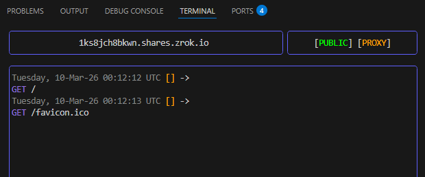

# HTTP shares

zrok shares HTTP and HTTPS resources natively using the `proxy` backend mode. The `proxy` mode is the default, so you
don't need to specify `--backend-mode` explicitly unless you're switching to a different mode.

When you run `zrok2 share public` in the foreground, zrok assigns a public URL and opens a full-screen terminal display
showing the URL, share type, and a live feed of incoming requests:

The share is active as long as the command is running. Press `Ctrl+C` or `q` to exit and tear down the share.

To create and manage public shares, see [Manage shares with the agent](../../how-tos/agent/manage-shares.mdx).
