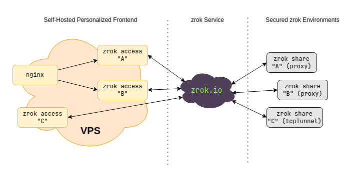

This page describes an approach that enables you to use a hosted, shared zrok instance (zrok.io) with your own
personalized frontend, giving you custom DNS and TLS for your shares.

To do this, you need a minimal VPS instance or container hosting. The size depends on your workload, but for most
modest use cases the cheapest VPS option is sufficient.

This approach gives you complete control over how your shares are exposed publicly. It works for HTTPS shares and also
for TCP and UDP ports, letting you put all of these things on the public internet while maintaining strong security for
your protected resources.

This isn't a step-by-step how-to—it's a description of the overall concept. Figure out the specific steps to implement
this style of deployment in your own environment.

## Overview

Imagine you have 3 different resources shared using zrok: `A`, `B`, and `C`. Both `A` and `B` use the `proxy` backend
mode to share private HTTPS resources. Share `C` uses the `tcpTunnel` backend to expose a listening port from a private
server (like a game server or a message queue).

You're using the shared zrok instance at zrok.io to provide your secure sharing infrastructure.

Your deployment looks like this:



You're creating reserved names in a namespace for the `A`, `B`, and `C` shares. These shares can be in a single
environment on a single host, or spread across completely different hosts anywhere in the world. You could use
significantly more than 3 shares, or fewer. The secure sharing fabric provides seamless, secure connectivity for all
of them. This implementation scales up or down as needed—use multiple hosts behind a load balancer for large workloads.

Because you're using `private` zrok shares, they need to be accessed using `zrok2 access private`. That command binds
a network listener where the share can be accessed on an address and port on the host where it runs. You can run
`zrok2 access private` to bind a listener for a share in as many places as you want (up to the service limit
configuration).

:::note
When you use `zrok2 share public`, your shared resources are accessible using the shared public frontend provided by
the service instance (zrok.io). `zrok2 share private` creates a private share that does not use the shared public
frontend—you need `zrok2 access private` to bind that share to a network address where it can be accessed.

In v2.0, you can create persistent private shares using the `--share-token` flag, which works similarly to reserved
names for public shares.
:::

Say you own the domain `example.com` and you want to expose your HTTPS shares `A` and `B` as `a.example.com` and
`b.example.com`. Your `C` share is a game server you want to expose as `gaming.example.com:25565`.

You can accomplish this with a cheap VPS (or container hosting). The VPS needs a public IP address and you need to
create DNS entries for `example.com`.

To do this, run 3 separate `zrok2 access private` commands on your VPS (see the
[Agent guide](../how-tos/agent/index.mdx) and the [Linux Agent Service](../how-tos/agent/setup-linux-service.mdx) for
details on setting this up). One command each for shares `A`, `B`, and `C`. The command works like this:

```text
$ zrok2 access private
Error: accepts 1 arg(s), received 0
Usage:
  zrok2 access private <shareToken> [flags]

Flags:
  -b, --bind string   The address to bind the private frontend (default "127.0.0.1:9191")
      --headless      Disable TUI and run headless
  -h, --help          help for private

Global Flags:
  -p, --panic     Panic instead of showing pretty errors
  -v, --verbose   Enable verbose logging
```

The `--bind` flag binds a network listener to a specific IP address and port on the host. Say your VPS has a public IP
of `1.2.3.4` and a loopback (`127.0.0.1`).

To expose your HTTPS shares, use a reverse proxy like nginx. The reverse proxy terminates TLS and reverse proxies
`a.example.com` and `b.example.com` to the network listeners for shares `A` and `B`.

Configure your VPS to persistently launch `zrok2 access private` for both shares. Use `--bind` to bind `A` to
`127.0.0.1:9191` and `B` to `127.0.0.1:9192`. Then configure nginx with a virtual host for `a.example.com` proxying
to `127.0.0.1:9191` and `b.example.com` proxying to `127.0.0.1:9192`.

Exposing the TCP port for `gaming.example.com` is simply a matter of running a third `zrok2 access private` with
`--bind 1.2.3.4:25565`.

Once you've created the appropriate DNS entries and worked through TLS configuration (Let's Encrypt is your friend),
you'll have a fully functional personalized frontend for your zrok shares that you control.

Your protected resources remain disconnected from the internet and are only reachable through your personalized
endpoint.

## Privacy

When you use a public frontend (with `zrok2 share public`) at a hosted zrok instance like zrok.io, the operators of
that service have some visibility into your traffic. The load balancers in front of the public frontend maintain logs
describing all URLs accessed, plus headers and other information about the resource you're sharing.

When you create private shares using `zrok2 share private` and run your own `zrok2 access private` from another
location, the operators of the zrok service instance only know that some amount of data moved between the environment
running `zrok2 share private` and the `zrok2 access private`. No other information is available.
