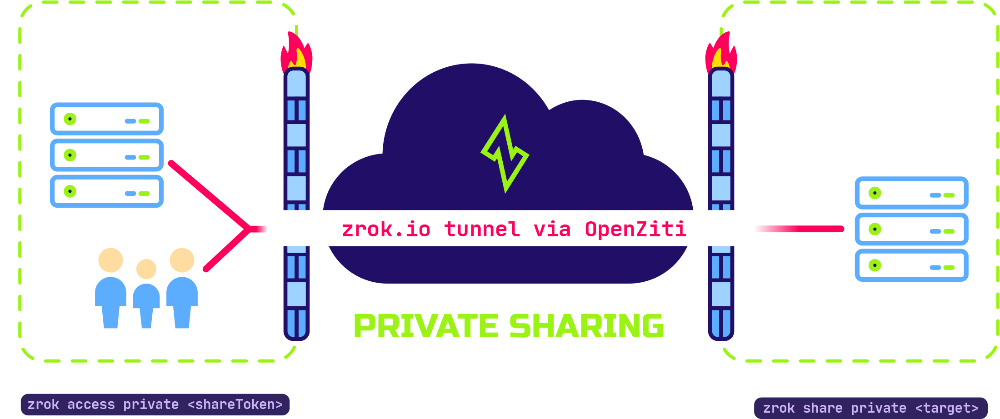

# Private shares

zrok was built to share and access digital resources. A private share allows a resource to be accessed on another user's
system as if it were local to them. Only another zrok user who has your share token can access it. You're in control of
who can access your private shares by sharing the share token.

Peer-to-peer private resource sharing is one of the things that makes zrok unique.

zrok also provides public sharing of resources with non-zrok users. Public resource sharing is limited to resources
accessible over HTTP or HTTPS. Private sharing works with all resource types that zrok supports.

## Peer-to-peer



Private shares are accessed using the `zrok2 access` command, and require the accessing user to have an account on the
same service instance that they've already enabled with `zrok2 enable`.

The private share is identified by a _share token_. The accessing user uses the share token with the `zrok2 access`
command to create a local endpoint on their system, letting them use the shared resource as if it were local.

zrok doesn't require you to open any firewall ports or otherwise compromise the security of your local system — no
attack surface is exposed to the public internet. As soon as you terminate the `zrok2 share` process, you immediately
terminate any possible access to your shared resource.

The shared resource can be a development web server, a webhook from a cloud server, or low-level TCP and UDP network
connections using the `tunnel` backend. What matters is that access is private and can only be used by other zrok users
who have your share token.

The peer-to-peer capabilities of zrok are an important property of the underlying
[OpenZiti](@openzitidocs/learn/introduction) network that zrok uses to provide connectivity between
users and resources.

To create and manage private shares, see [Manage shares with the agent](@zrokdocs/how-tos/agent/manage-shares).

## Backend modes

Private shares support all backend modes. Public shares are limited to HTTP-based modes only. The modes exclusive to
private shares are:

- `tcpTunnel`: Forwards raw TCP traffic to a target server
- `udpTunnel`: Forwards raw UDP traffic to a target server
- `socks`: Provides a SOCKS5 proxy, tunneling TCP traffic to its destination through the share

The default mode is `proxy`, which forwards requests to any HTTP or HTTPS URL reachable from your machine:

```bash title="proxy example"
zrok2 share private 80
```

See [Backend modes](./backend-modes/index.mdx) for the full list.
