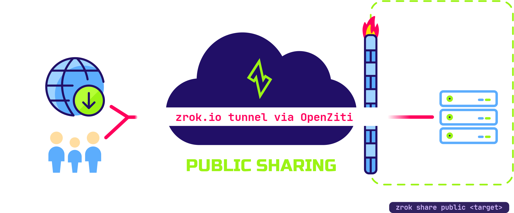

import BackendHttp from './_backend_http.mdx'

# Public shares

zrok supports public sharing for web-based (HTTP and HTTPS) resources. These resources are easily shared with the
general internet through public access points.

## Peer-to-public



Public sharing is most useful when the person or service accessing your resources doesn't have zrok running locally
and can't make use of the private sharing mode. Many users share development web servers, webhooks, and other
HTTP/HTTPS resources.

As with private sharing, public sharing doesn't require you to open any firewall ports or otherwise compromise the
security of your local environment. A public share goes away as soon as you terminate the `zrok2 share` command.

To create and manage public shares, see [Manage shares with the agent](../how-tos/agent/manage-shares.mdx). For
persistent public shares with a stable URL, see [Reserved names and namespaces](./sharing-reserved.md).

## Public backend modes

The default backend mode is `proxy`, which targets an HTTP URL that must be reachable by the backend.

```bash title="proxy example"
zrok2 share public 80
```

<BackendHttp/>
