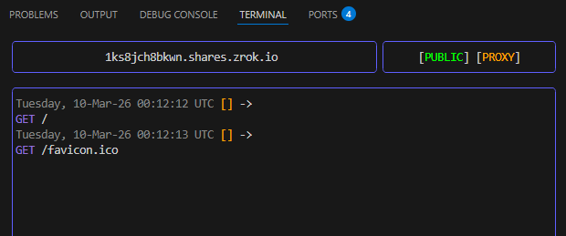
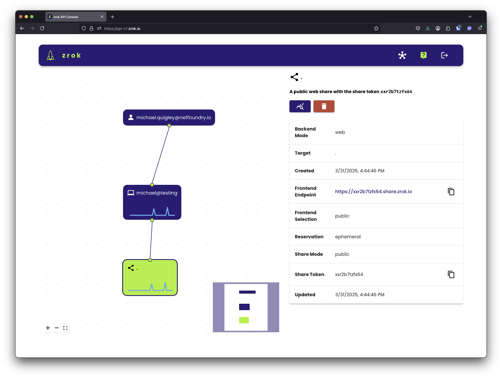

# Step 4: Create your first share

In this step, you'll create a public share that exposes a local HTTP service to the internet. You'll see exactly how
the share works and what its limitations are before you move on to the agent.

1. In one terminal, start zrok's built-in test endpoint:

    ```bash
    zrok2 test endpoint
    ```

    This starts a simple HTTP listener on port 9090—just a throwaway server to give zrok something to share.

1. In another terminal, run:

    ```bash
    zrok2 share public 9090
    ```

    zrok assigns a public URL and displays it along with the share type and a live feed of incoming requests:

    

1. Open that URL in a browser, or pass it to someone else—anyone with the link can reach your local service.

## How shares work

`zrok2 share public` runs in the foreground. The share is active as long as the command is running. If you open the
[API console](https://api-v2.zrok.io/), you'll see the share appear in the visualizer with sparkline graphs showing
live activity as the share is accessed:



## When a share fails to start

If `zrok2 share public` (or `share private`, or `access private`) cannot start, it prints why and exits with a status
that says whether trying again can help. This matters when the command runs under a process supervisor such as systemd:

| Exit status | Meaning |
|-------------|---------|
| `0` | The command finished normally. |
| `1` | A later retry may succeed: the zrok service could not be reached, was busy (it answers when to retry, for example `the zrok service is busy, retry in 5 seconds`), or failed. Also used for any failure that is not an answer from the zrok service. |
| `2` | The zrok service refused the request (for example, the name is already held by another share, or the account token is not valid). Retrying will not change the answer. |

A supervisor should not restart the command on status 2; for example, a systemd unit can set
`RestartPreventExitStatus=2`. To have shares retried for you with backoff, run them through the
[agent](./set-up-agent.md) instead.

For more detail on a failure, add `--verbose` (`-v`) to print debug output. Debug output appears in headless mode
(`--headless`) only; the interactive display shows info-level output whether or not `--verbose` is given.

If the backend fails to start after the share was created (for example, a missing Caddyfile), the share is deleted
before the command exits, so the next attempt starts clean.

## Stop the share

Press `Ctrl+C` or close the terminal. The share is torn down and the URL stops working. This is by design—zrok
shares are ephemeral by default.

This is a good way to understand how zrok works, but it's not the right approach for services you need to keep
running. That's what the agent is for.
