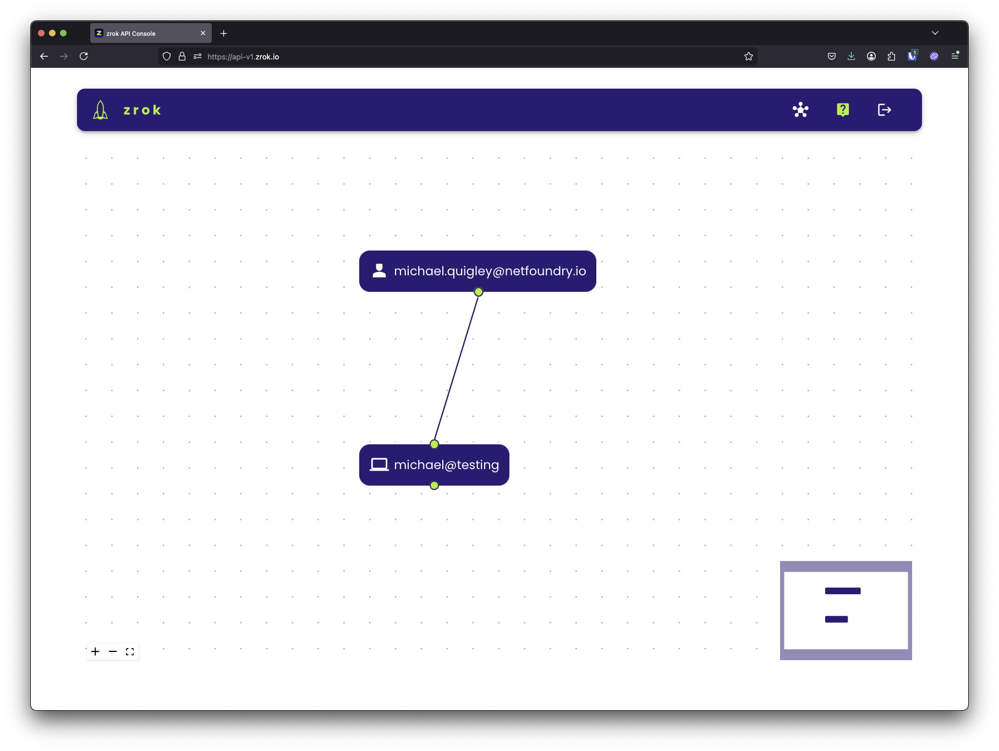
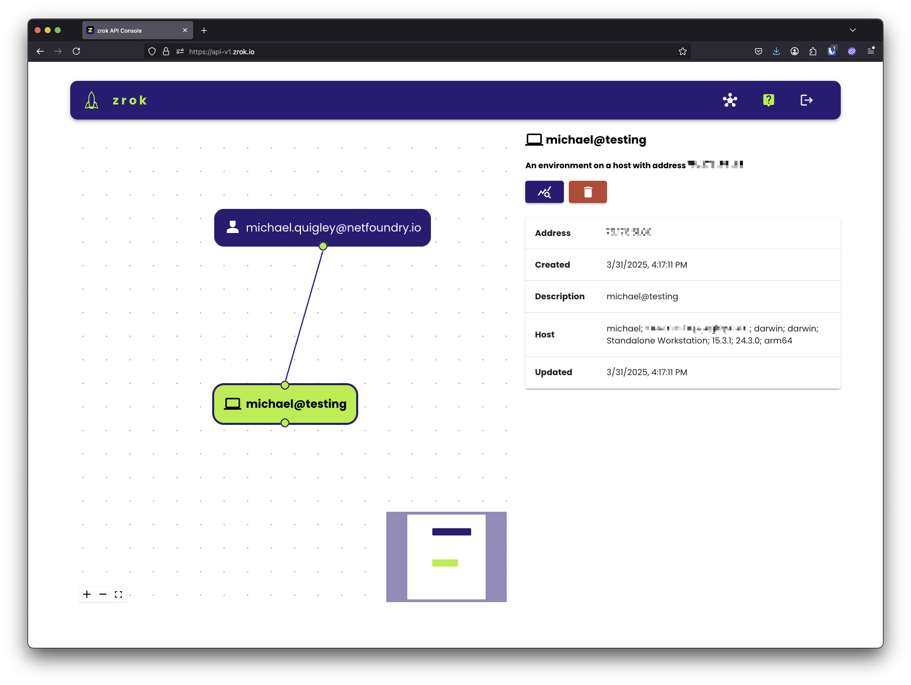

# Step 3: Enable your environment

In this step, you'll enable a zrok environment on your machine using your account token. Enabling creates a secure
identity tied to your device so you can start creating shares.

## Self-hosted: set your API endpoint first

If you're using a self-hosted zrok instance, configure your API endpoint before enabling:

```bash
zrok2 config set apiEndpoint https://your-zrok-instance.example.com
```

Skip this step if you're using myzrok.io.

## Enable your environment

Run the following command with your account token from Step 1:

```bash
zrok2 enable <your_account_token>
```

After a few seconds you'll see:

```
⣻  the zrok environment was successfully enabled...
```

## Verify the environment

Confirm everything is set up correctly:

```bash
zrok2 status
```

You should see output like this:

```
Config:

 CONFIG           VALUE                   SOURCE
 apiEndpoint      https://api-v2.zrok.io  env
 defaultFrontend  public                  binary
 headless         false                   binary

Environment:

 PROPERTY       VALUE
 Account Token  <<SET>>
 Ziti Identity  <<SET>>
```

Both `Account Token` and `Ziti Identity` should show `<<SET>>`. Your environment is ready.

If you open the [API console](https://api-v2.zrok.io/), you'll see your new environment reflected in the visualizer:



The environment is named after your shell username and hostname. Click on the environment node in the explorer to
see its details in the panel at the bottom of the page:



The visualizer supports clicking, dragging, and mouse wheel zooming. If you get lost, click the zoom-to-fit icon in
the lower right corner of the explorer to reset the view.

:::note
You can enable multiple environments with the same account—one per device. Use `zrok2 enable -d <name>` to give an
environment a custom name.
:::

<div style={{marginBottom: '2rem'}} />
