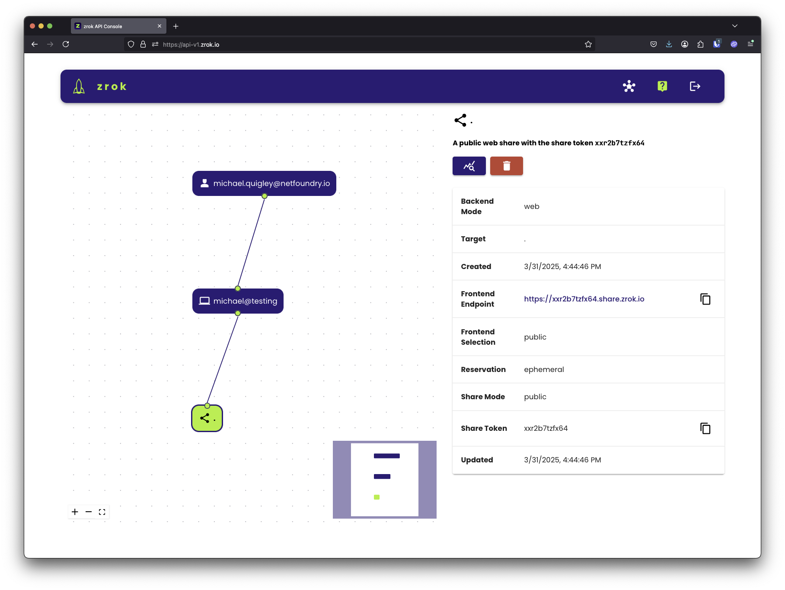
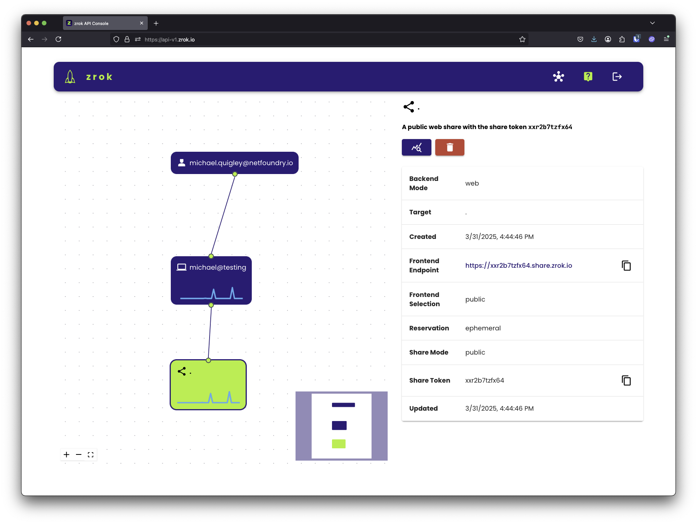
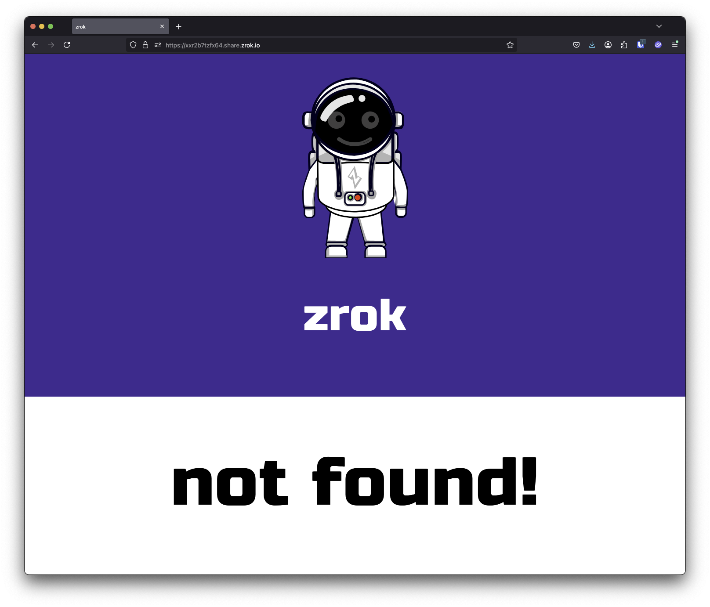

# Step 4: Create your first share

In this step, you'll create a public share that exposes a local HTTP service to the internet. You'll see exactly how
the share works and what its limitations are before you move on to the agent.

## What you need

A service listening on a local port. If you don't have one handy, start a quick test server on port 8080:

```bash
# Python 3
python3 -m http.server 8080
```

## Create the share

In another terminal, run:

```bash
zrok2 share public 8080
```

zrok assigns a public URL and prints it to the terminal:

```
access your zrok share at the following endpoints: https://abc123def456.share.zrok.io
```

Open that URL in a browser, or pass it to someone else—anyone with the link can reach your local service.

## What's happening

`zrok2 share public` runs in the foreground. The share is active as long as the command is running. If you open the
[API console](https://api-v2.zrok.io/), you'll see the share appear in the visualizer:



Notice the sparkline graphs showing live activity as the share is accessed:



When you press `Ctrl+C` or close the terminal, the share is torn down and the URL stops working:



This is by design—zrok shares are ephemeral by default.

This is a good way to understand how zrok works, but it's not the right approach for services you need to keep
running. That's what the agent is for.

<div style={{marginBottom: '2rem'}} />
