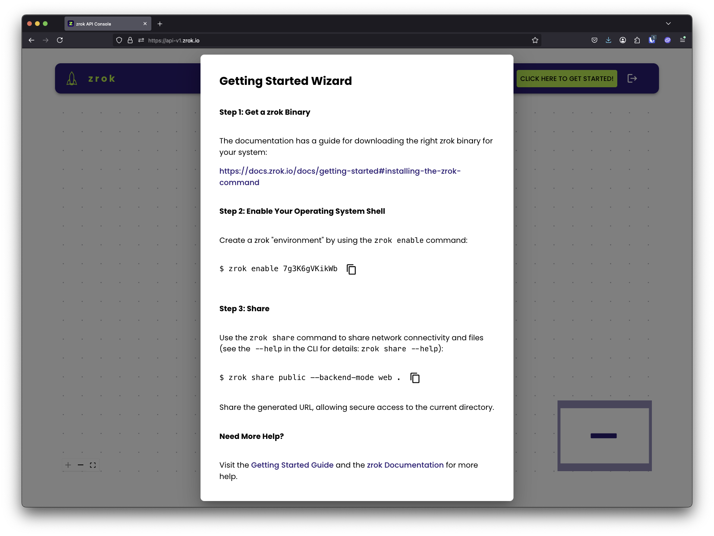

# Step 1: Get an account token

In this step, you'll create a zrok account and get the account token you need to enable your environment.

## myzrok.io (hosted)

1. Go to [myzrok.io](https://myzrok.io) and sign up for a free account.
2. After signing in, click the **zrok** icon in the left sidebar to open the [API console](https://api-v2.zrok.io/).

3. Click the green **CLICK HERE TO GET STARTED!** button. The getting started wizard opens:

    

4. Under step 2 of the wizard, copy and save your account token (a short alphanumeric string like `7g3K6gVKikWb`).
   Treat it like a password: it authenticates your device to the zrok service.

## Self-hosted instance

If you've deployed your own zrok instance, there are two ways to create an account:

- **Self-service** — If your instance has invitations enabled, run `zrok2 invite` and follow the prompts to register
  with your email address. See [Invitations](../self-hosting/self-service-invite.mdx) for details.
- **Admin** — An administrator can create an account directly:

    ```bash
    zrok2 admin create account <username> <password>
    ```

Either way, the result is an account token. Copy it for use in [Step 3: Enable your environment](./enable-env.md).
