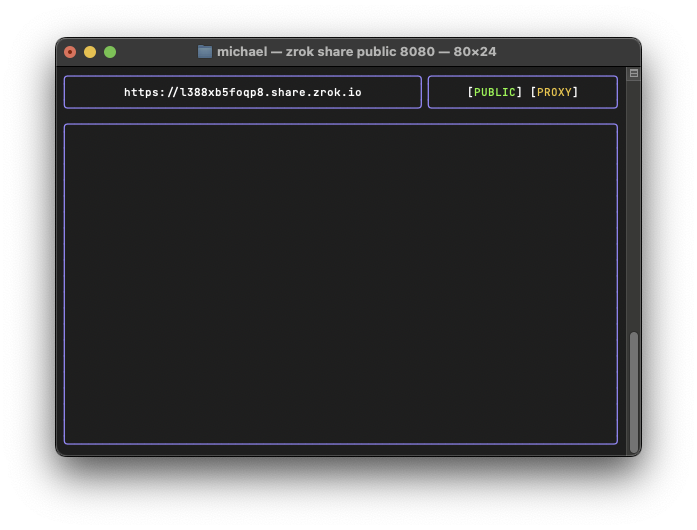
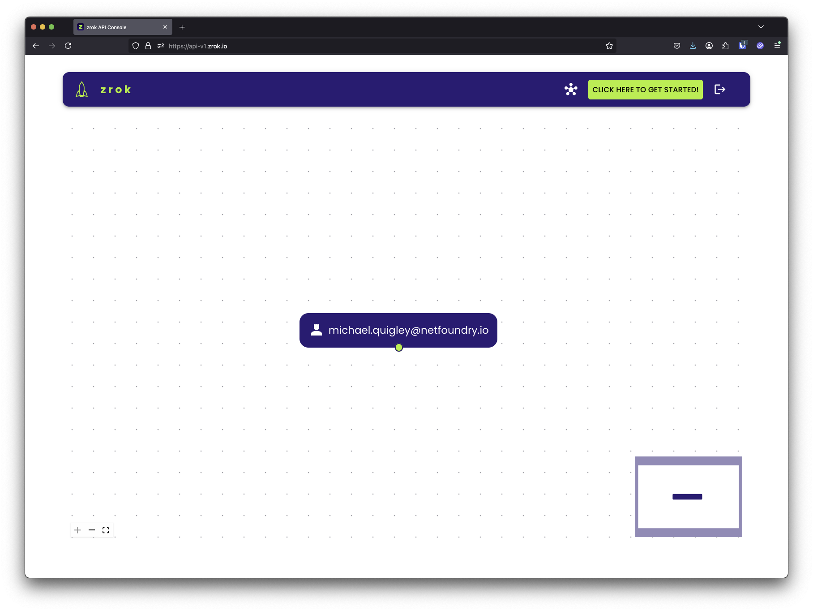
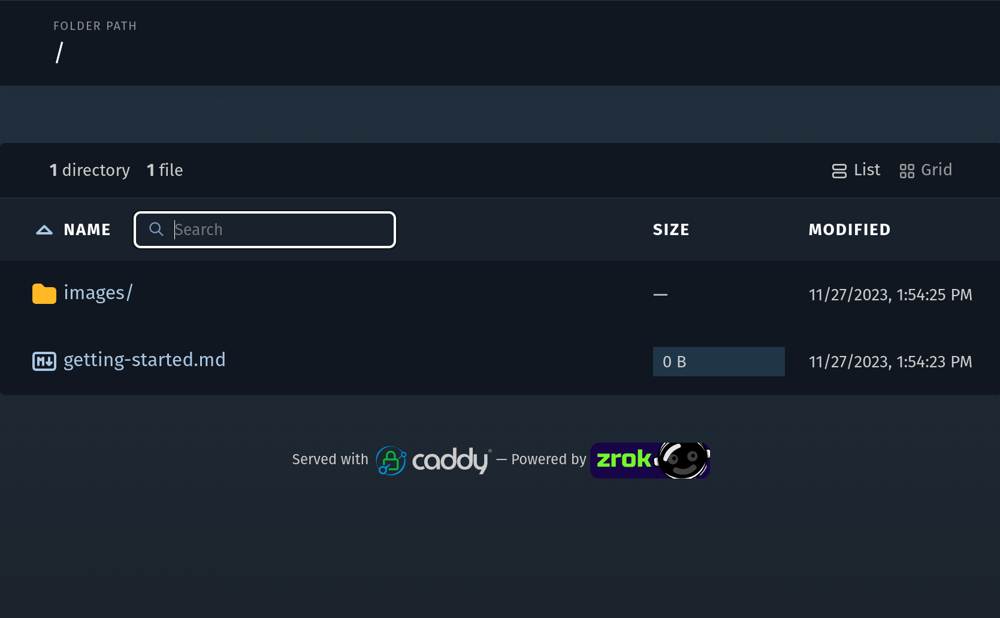

import { AssetsProvider } from '@zrokroot/src/components/assets-context';
import DownloadCard from '@zrokroot/src/components/download-card.jsx';
import DownloadCardStyles from '@zrokroot/src/css/download-card.module.css';
import InstallCards from '@zrokroot/docs/how-tos/install/_install_cards.mdx';
import useBaseUrl from '@docusaurus/useBaseUrl';

# Get started with zrok

## Your secure internet sharing perimeter

zrok (*/ziːɹɒk/ ZEE-rock*) is a secure, open-source, self-hostable sharing platform that simplifies shielding and
sharing network services or files. zrok is built and maintained [by NetFoundry](https://netfoundry.io) and is available as a hardened "zrok-as-a-service"
at [myzrok.io](https://myzrok.io) with a generous free tier.

## What's it for?

Use zrok to share a running service, like a web server or a network socket, or to share a directory of static files. zrok goes beyond simple tunneling to provide sharing solutions for a variety of network and storage use cases.

When using zrok to [share publicly](../concepts/sharing-public.mdx), you can reserve a public hostname, enable authentication options, or both. Public shares proxy HTTPS to your service or files.

If [sharing privately](../concepts/sharing-private.mdx), only users with the share token (and the appropriate permission grants) can access your share. In addition to what you can share publicly, private shares can include TCP and UDP services.

Here's a quick overview of what's involved in getting started with zrok:

### Your first share

1. Get an account token
<Columns className='text--center getting-started-cards' style={{marginLeft: 1}}>
    <Column style={{paddingBottom: 20}}>
        <Card shadow='tl'>
            <CardHeader>
                <h3>Hosted zrok</h3>
            </CardHeader>
            <CardBody>
                Use NetFoundry's public zrok instance.
            </CardBody>
            <CardFooter>
                <a href="https://myzrok.io/">
                    <button className='button button--secondary button--block'>Get an Account</button>
                </a>
            </CardFooter>
        </Card>
    </Column>
    <Column style={{paddingBottom: 20}}>
        <Card shadow='tl'>
            <CardHeader>
               <h3>Self-Hosted zrok</h3>
            </CardHeader>
            <CardBody>
                Run a zrok instance on Linux, Docker, or Kubernetes.
            </CardBody>
            <CardFooter>
                <a href={"@zrokdocs/category/self-hosting/"}>
                    <button className='button button--secondary button--block'>Guides</button>
                </a>
            </CardFooter>
        </Card>
    </Column>
</Columns>

2. [Download the zrok2 binary](#installing-the-zrok-command)
3. Enable zrok for your [environment](#enabling-your-zrok-environment)

    ```bash
    zrok2 enable <your_account_token>
    ```

4. Share `http://localhost:8080`

    ```bash
    zrok2 share public 8080
    ```

5. Visit the public URL displayed in your terminal

    

## A deeper look at getting started

Here's a deeper, more thorough look at getting started with zrok:

## Install the zrok command

<InstallCards />

## Enable your zrok environment

After you have [an account](#your-first-share), you can enable your zrok environment.

A zrok environment usually refers to an enabled device where shares and accesses can be created, .e.g., `~/.zrok2` on a Unix machine. It can be a specific user's environment or a system-wide agent's environment owned by the administrator.

When your zrok account was created, the service generated an *account token* that identifies and authenticates in a single step. Protect your account token as if it were a password, or an important account number; it's a *secret*, protect it.

When we left off you had downloaded, extracted, and configured your zrok software. In order to use that environment with your account, you'll need to `enable` an *environment* on your system. Enabling an environment generates a secure identity and the necessary underlying security policies with the OpenZiti network hosting the zrok service so that you can begin sharing.

Log into the API console at:

[https://api-v2.zrok.io/](https://api-v2.zrok.io/)

When you first log into your account on the API console, your interface will look like this:



In the toolbar, there is a big green button that says "CLICK HERE TO GET STARTED!". If you click that button, you'll see the getting started wizard, which looks like this:


This wizard is broken into multiple steps. The first step we've already covered, which gets the zrok software installed onto your system.

Below "step 2" is a command: `zrok2 enable 7g3K6gVKikWb` (your account will have a different account token, other than `7g3K6gVKikWb`). You'll want to copy this command into your shell and execute it:

```txt
$ zrok2 enable 7g3K6gVKikWb
⣻  contacting the zrok service...
```

After a few seconds, the message will change and indicate that the enable operation succeeded:

```txt
$ zrok2 enable 7g3K6gVKikWb
⣻  the zrok environment was successfully enabled...
```

Now, if we run a `zrok2 status` command, you will see the details of your environment:

```txt
$ zrok2 status

Config:

 CONFIG           VALUE                   SOURCE
 apiEndpoint      https://api-v2.zrok.io  env
 defaultFrontend  public                  binary
 headless         false                   binary

Environment:

 PROPERTY       VALUE
 Account Token  <<SET>>
 Ziti Identity  <<SET>>
```

Excellent... our environment is now fully enabled.

If we return to the *API console*, we'll now see the new environment reflected in the API console visualizer:


In my case, the environment is named `michael@testing`, which is the username of my shell and the hostname of the system the shell is running on.

:::note
Should you want to use a non-default name for your environment, you can pass the `-d` option to the `zrok2 enable` command. See `zrok2 enable --help` for details.
:::

If you click on the environment node in the explorer in the *web console*, the details panel shown at the bottom of the page will change:


The visualizer supports clicking, dragging, mouse wheel zooming, and selecting the nodes in the graph for more information (and available actions) for the selected node. If you ever get lost in the visualizer, click the  *zoom to fit* icon in the lower right corner of the explorer.

:::note
With your zrok account you can `zrok2 enable` multiple environments. This will allow you to share (and access your shares) from multiple environments simultaneously.
:::

Your environment is fully ready to go. Now we can move on to the fun stuff...

## Sharing

zrok is designed to make sharing resources as effortless as possible, while providing a high degree of security and control.

### Ephemeral by default

Shared resources are *ephemeral* by default; as soon as you terminate the `zrok2 share` command, the entire share is removed and is no longer available to any users. Identifiers for shared resources are randomly allocated when the share is created.

### Public shares and frontends

Resources that are shared *publicly* are exposed to any users on the internet who have access to the zrok instance's "frontend".

A frontend is an HTTPS listener exposed to the internet, that lets any user with your ephemeral share token access your publicly shared resources.

For example, I might create a public share using the `zrok2 share public` command, which results in my zrok instance exposing a URL like `https://xxr2b7tzfx64.shares.zrok.io` to access my resources.

```
$ zrok2 share public --backend-mode web .
```

In this case, my share was given the "share token" of `xxr2b7tzfx64`. That URL can be given to any user, allowing them to immediately access the shared resources directly from my local environment, all without exposing any access to my private, secure environment. The physical network location of my environment is not exposed to anonymous consumers of my resources.

If we return to the web console, we see our share in the explorer:


If we click on the *frontend endpoint* a new browser tab opens and we see the content of our share:


When we start accessing our share, notice the *sparkline* graphs showing the activity:


And as soon as I terminate the `zrok2 share` client, the resources are removed from the zrok environment.

If we try to reload the frontend endpoint in our web browser, we'll see:


[More about public shares](../concepts/sharing-public.mdx)

### Private shares

zrok also provides a powerful *private* sharing model. If I execute the following command:

```buttonless
$ zrok2 share private http://localhost:8080
```

The zrok service will respond with the following:

```buttonless title="Output"
access your share with: zrok2 access private wvszln4dyz9q
```

Rather than allowing access to your service through a public frontend, a *private* share is only exposed to the underlying OpenZiti network, and can only be accessed using the `zrok2 access` command.

The `zrok2 access private wvszln4dyz9q` command can be run by any zrok user, allowing them to create and bind a local HTTP listener, that allows for private access to your shared resources.

[More about private shares](/concepts/sharing-private.mdx)

### Proxy backend mode

Without specifying a *backend mode*, the `zrok2 share` command will assume that you're trying to share a `proxy` resource. A `proxy` resource is usually some private HTTP/HTTPS endpoint (like a development server, or a private application) running in your local environment. Usually such an endpoint would have no inbound connectivity except for however it is reachable from your local environment. It might be running on `localhost`, or only listening on a private LAN segment behind a firewall.

For these services a `proxy` share will allow those endpoints to be reached, either *publicly* or *privately* through the zrok service.

### Web backend mode

The `zrok2 share` command accepts a `--backend-mode` option. Besides `proxy`, the current `v0.3` release (as of this writing) also supports a `web` mode. The `web` mode allows you to specify a local folder on your filesystem, and instantly turns your zrok client into a web server, exposing your web content either *publicly* or *privately* without having to a configure a web server.

### Persistent private shares

zrok shares are *ephemeral* unless you specifically create a "persistent" share.

A persistent share can be re-used multiple times; it will survive termination of the `zrok2 share` command, allowing for longer-lasting semi-permanent access to shared resources.

In zrok v2, persistent sharing uses the `zrok2 create share` and `zrok2 share private --share-token` workflow. This allows you to create a share token that persists across restarts.

The first step is to create the persistent share:

```txt
$ zrok2 create share --backend-mode web --share-token my-docs-share
[   0.275]    INFO main.(*createShareCommand).run: your share token is 'my-docs-share'
```

I'm asking the zrok service to create a share with a `web` backend mode and a specific share token.

You'll want to remember the share token (`my-docs-share` in this case).

Once the share is created, you can start sharing using that token:

```txt
$ zrok2 share private v0.3_getting_started --share-token my-docs-share
```

...results in a new share backend starting up and connecting to the existing persistent share:


Other zrok users can access your persistent private share using the `zrok2 access private` command with your share token.

With a persistent share, we're free to stop and restart the `zrok2 share private --share-token` command as many times as we want, without losing the token for our share.

When we're done with the persistent share, we can delete it using this command:

```txt
$ zrok2 delete share my-docs-share
[   0.230]    INFO main.(*deleteShareCommand).run: share 'my-docs-share' deleted
```

[More about persistent shares](/concepts/sharing-reserved.md)

## Concepts review

In summary, zrok lets you easily and securely share resources with both general internet users (through *public* sharing) and also with other zrok users (through *private* sharing).

Here's a quick review of the zrok mental model and the vocabulary.

### Instance and account

You create an account with a zrok *instance*. Your account is identified by a username and a password, which you use to log into the *web console*. Your account also has a *secret token*, which you will use to authenticate from the zrok command-line to interact with the *instance*.

You create a new account with NetFoundry's zrok *instance* by subscribing in [myzrok.io](https://myzrok.io) or in a self-hosted zrok *instance* by running [the `zrok2 invite` command](../self-hosting/self-service-invite.mdx) or the `zrok2 admin create account` command.

### Environment

Using your *secret token* you use the zrok command-line interface to create an *environment*. An *environment* corresponds to a single command-line user on a specific *host system*.

You create a new *environment* by using the `zrok2 enable` command.

### Shares

Once you've enabled an *environment*, you then create one or more *shares*. Shares have either a *public* or *private* *sharing mode*. *Shares* share a specific type of resource using a *backend mode*. As of this writing zrok supports a `proxy` *backend mode* to share local HTTP resources as a *reverse proxy*. zrok also supports a `web` *backend mode* to share local file and HTML resources by enabling a basic HTTP server.

Every *share* is identified by a *share token*. *Public shares* can be accessed through either a *frontend* instance offered through the zrok *instance*, or through the `zrok2 access` command. *Private shares* can only be accessed through the `zrok2 access` command.

You use the `zrok2 share` command to create and enable *ephemeral shares*.

### Persistent shares

zrok supports creating *shares* that have a consistent *share token* that survives restarts of the `zrok2 share` command. These are considered *non-ephemeral*, and are called *persistent shares*.

You use the `zrok2 create share` command to create persistent shares with a specific share token. Then use `zrok2 share private --share-token` to activate the share. Persistent shares last until you use the `zrok2 delete share` command to delete them.

## Self-hosting an instance

Interested in self-hosting your own zrok instance? See the [self-hosting guides](@zrokdocs/category/self-hosting/)!

## Resources

- Learn about [OpenZiti](https://openziti.io/)
