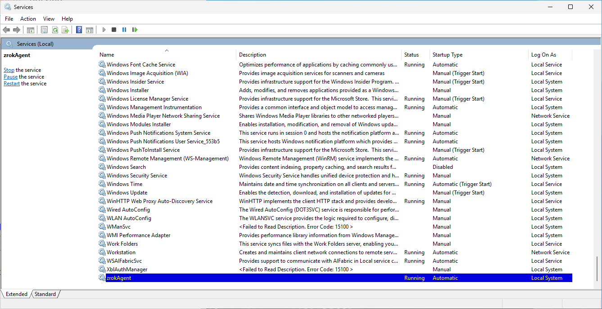

In Windows environments, it can be useful to run the zrok Agent as a service, allowing it to automatically restart with your system.

Support for running the zrok Agent as a Windows service is handled through a third party utility, `nssm`, which is available here:

[https://nssm.cc/download](https://nssm.cc/download)

Give the `nssm` documentation a quick review, here:

[https://nssm.cc/usage](https://nssm.cc/usage)

You'll want to install both the `zrok.exe` and `nssm.exe` in a convenient, protected location. In this example, we'll put them in `C:\Program Files\zrok`, as `C:\Program Files\zrok\zrok.exe` and `C:\Program Files\zrok\nssm.exe`.


We're going to use a command prompt to install and configure our Agent service. Open a new command prompt and `cd "\Program Files\zrok"`:


## Enabling the Service Environment

On Windows, the `USERPROFILE` environment variable controls the "home" where zrok will look for the enabled environment. When running as a service on Windows, the process will be running as the `Local System` user, which uses the directory `C:\Windows\System32\config\systemprofile` directory as the user's "home" directory.

We're going to want to enable a zrok environment for our new Agent service in this directory. First, we'll run:

```cmd
C:\Program Files\zrok>set USERPROFILE=c:\Windows\System32\config\systemprofile
```

And with that environment variable set, we'll use the `zrok enable` command to enable an environment for our new Agent service:

```cmd
C:\Program Files\zrok>zrok enable <accountToken>
```


Now we've got a new, enabled environment to use with our Agent running as a Windows service.

## Installing the Service

In the `C:\Program Files\zrok` directory, execute this command to invoke `nssm` to create the new Windows service for our zrok Agent:

```cmd
C:\Program Files\zrok>nssm install zrokAgent
```

Windows might ask you for elevated Administrator privileges and will then show the main `nssm` installation dialog, which we'll use to configure the new Windows service:


We'll set "Path" to `C:\Program Files\zrok\zrok.exe` (the zrok executable). We'll set the "Startup directory" to `C:\Windows\System32\config\systemprofile` (the "home" directory for the `Local System` user). The "Arguments" are the command-line parameters that will get added to the command-line when starting the service, in this case, we want the service to start with the command `zrok agent start`.

We'll set the "Service name" to `zrokAgent`.

Next, scroll over to the "I/O" tab in the `nssm` installer:


Set the "Output (stdout)" to log the standard output from the `zrok agent start` process to the file `C:\Windows\System32\config\systemprofile\.zrok\agent-stdout.log`.

Set the "Error (stderr)" to log the standard error to the file `C:\Windows\System32\config\systemprofile\.zrok\agent-stderr.log`.

Setting the I/O redirection in this way will produce logs from the `zrok agent start` process that could be useful for future troubleshooting.

`nssm` also provides options for automatically rotating these log files:


We'll leave these unset in this example, but if your configuration needs this kind of log file rotation `nssm` makes it available.

Finally, click the `Install service` button to create the service.

If we open the "Services" utility in Windows, we can see our new `zrokAgent` service:


If we click the start button in the toolbar, or right-click on the service and select "start", our new zrok Agent service will start:



If we open a Windows Explorer in the folder `C:\Windows\System32\config\systemprofile\.zrok` we can see our logs, and the `agent.socket` which is used by the zrok command-line to interact with our Agent service:


This zrok Agent service is now available for use. Whenever a Windows Command Prompt wants to interact with this environment, it is important that the `USERPROFILE` environment variable is properly set to `C:\Windows\System32\config\systemprofile`, otherwise the zrok commands will attempt to interact with the environment that would be created in the user's default profile directory.

We can access the Agent console using this command:

```cmd
C:\Program Files\zrok>zrok agent console
```

And this will open a web interface which allows the Agent to be managed:


The Agent console can be used to directly create shares and accesses, and the zrok command-line can also be used.

## Non-interactive Service Installation

`nssm` provides a command-line that can do this configuration without interacting with the `nssm` GUI. We would create our service like this:

```cmd
C:\Program Files\zrok>nssm install zrokAgent "C:\Program Files\zrok\zrok.exe" agent start
```
```cmd
C:\Program Files\zrok>nssm set zrokAgent AppDirectory C:\Windows\System32\config\systemprofile
```
```cmd
C:\Program Files\zrok>nssm set zrokAgent AppStdout C:\Windows\System32\config\systemprofile\.zrok\agent-stdout.log
```
```cmd
C:\Program Files\zrok>nssm set zrokAgent AppStderr C:\Windows\System32\config\systemprofile\.zrok\agent-stderr.log
```

And we can start our new service using the standard Windows service control utility, `sc`:
```cmd
C:\Program Files\zrok>sc start zrokAgent
```


## Removing the zrok Agent Service

The following commands (in a Command Prompt running as Administrator) can be used to remove the service from your system:

```cmd
C:\>sc stop zrokAgent
```
```cmd
C:\>sc delete zrokAgent
```

And if you have your `USERPROFILE` environment variable properly set to `C:\Windows\System32\config\systemprofile`, you can use this command to remove the environment from your system and from the zrok service:

```cmd
C:\Program Files\zrok>zrok disable
```

