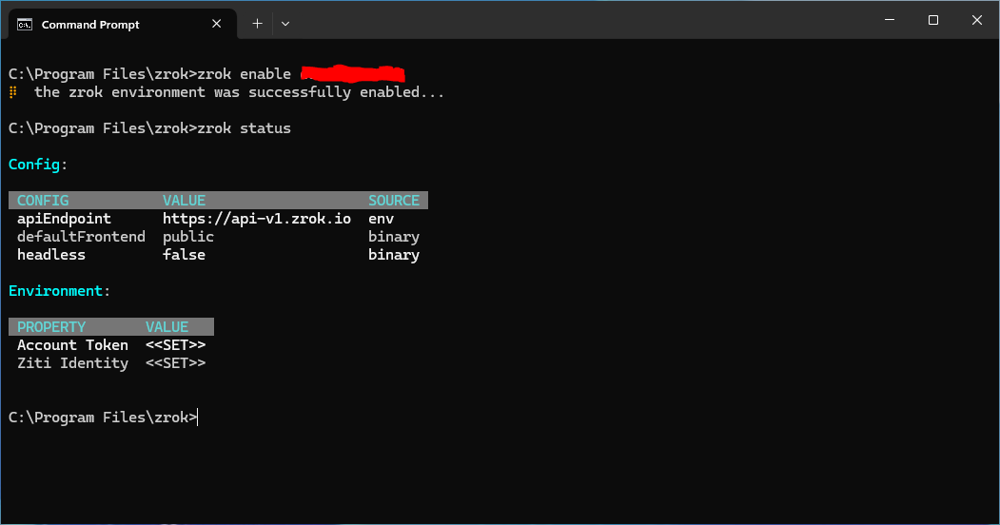
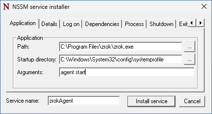
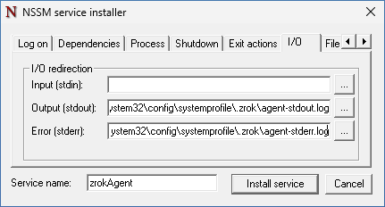
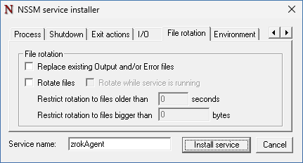
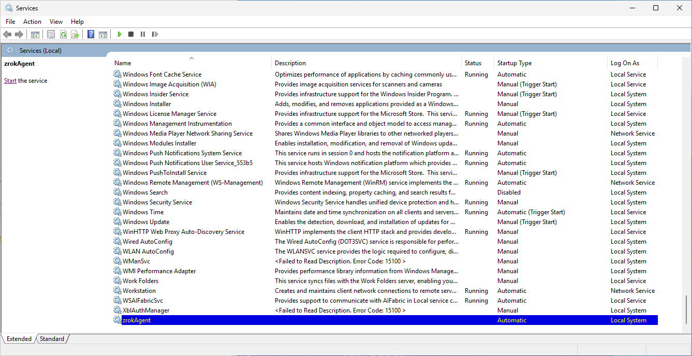
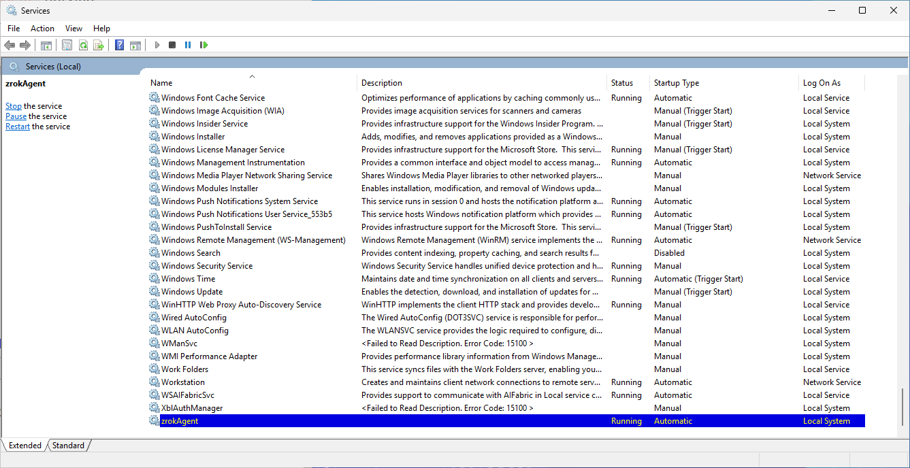
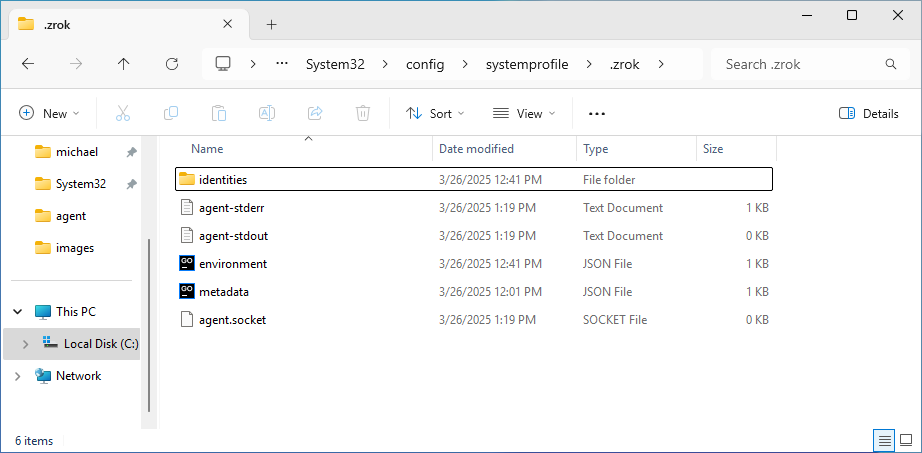
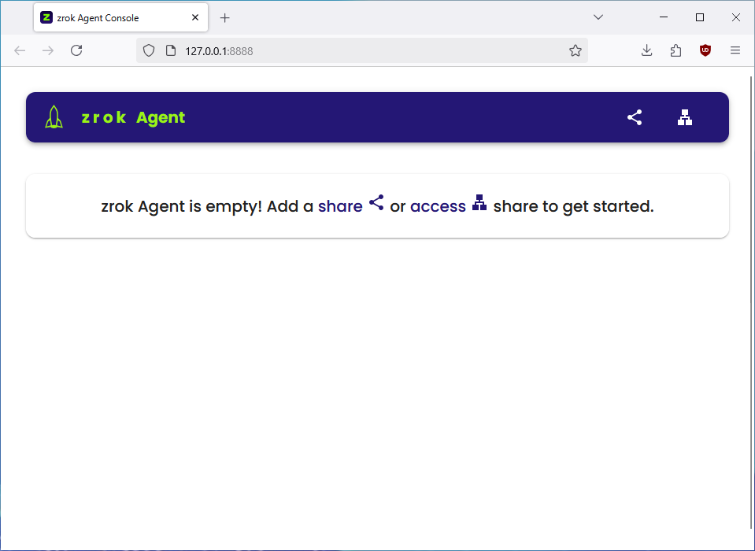
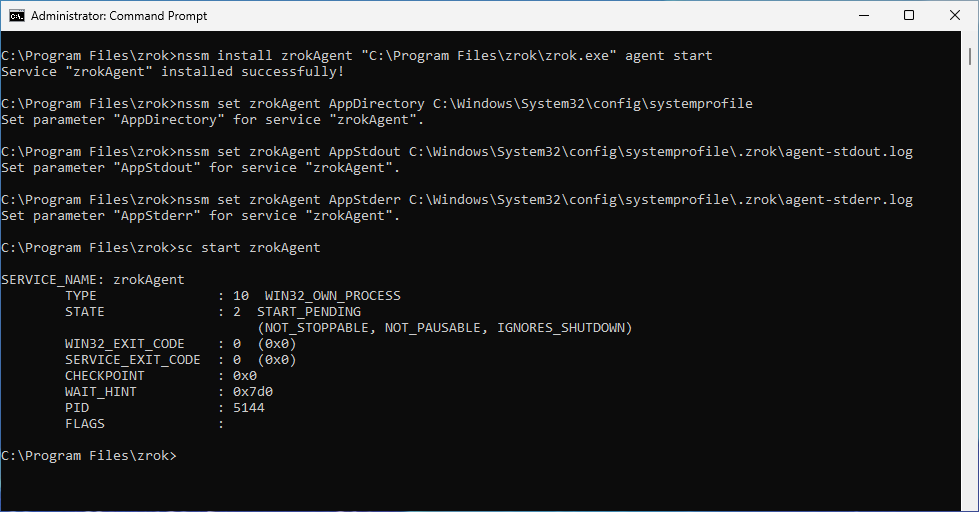

# Set up the Windows agent service

Run the zrok agent as a Windows service so it starts automatically with your system. Service management is handled
through [nssm](https://nssm.cc/download) (Non-Sucking Service Manager), a third-party utility. Review the [nssm
documentation](https://nssm.cc/usage) before proceeding.

## Prerequisites

- A zrok account token.
- `zrok2.exe` and `nssm.exe` installed in a protected location. This guide uses `C:\Program Files\zrok2\`.

- A Command Prompt open in `C:\Program Files\zrok2\`:

    ```cmd
    cd "\Program Files\zrok2"
    ```


## Enable the service environment

The Windows service runs as the `Local System` user, whose home directory is `C:\Windows\System32\config\systemprofile`.
You need to enable a zrok environment there.

1. Set `USERPROFILE` to the `Local System` home directory:

    ```cmd
    C:\Program Files\zrok2>set USERPROFILE=c:\Windows\System32\config\systemprofile
    ```

2. Enable a zrok environment for the service:

    ```cmd
    C:\Program Files\zrok2>zrok2 enable <accountToken>
    ```

    

## Install the service

1. Run `nssm install` to open the configuration dialog:

    ```cmd
    C:\Program Files\zrok2>nssm install zrokAgent
    ```

    Windows may prompt for elevated Administrator privileges before showing the `nssm` installation dialog.

    

2. On the **Application** tab, configure the following fields:

    - **Path**: `C:\Program Files\zrok2\zrok2.exe`
    - **Startup directory**: `C:\Windows\System32\config\systemprofile`
    - **Arguments**: `agent start`
    - **Service name**: `zrokAgent`

3. Click the **I/O** tab and configure log output:

    

    - **Output (stdout)**: `C:\Windows\System32\config\systemprofile\.zrok2\agent-stdout.log`
    - **Error (stderr)**: `C:\Windows\System32\config\systemprofile\.zrok2\agent-stderr.log`

    Setting up I/O redirection produces logs from the `zrok2 agent start` process that are useful for troubleshooting.
    Optionally, configure log rotation on the **File rotation** tab if your setup requires it:

    

4. Click **Install service**.

5. Open the Windows **Services** utility. You should see the new `zrokAgent` service:

    

6. Start the service by clicking the start button in the toolbar, or right-clicking the service and selecting **Start**:

    

7. Verify the service is working by opening a Windows Explorer window at
   `C:\Windows\System32\config\systemprofile\.zrok2`. You should see the log files and the `agent.socket` file used by
   the zrok CLI:

    

8. Open the agent console:

    ```cmd
    C:\Program Files\zrok2>zrok2 agent console
    ```

    This opens a web interface for managing the agent. You can create shares and accesses from the console, or continue
    using the zrok CLI.

    

:::note
Whenever you interact with this service environment from a Command Prompt, set `USERPROFILE` to
`C:\Windows\System32\config\systemprofile` first. Otherwise, zrok commands will use your default user profile directory
instead.
:::

## Non-interactive service installation

`nssm` supports a command-line interface that bypasses the GUI. Run these commands from an Administrator Command Prompt:

1. Create the service:

    ```cmd
    C:\Program Files\zrok2>nssm install zrokAgent "C:\Program Files\zrok2\zrok2.exe" agent start
    ```

2. Set the working directory:

    ```cmd
    C:\Program Files\zrok2>nssm set zrokAgent AppDirectory C:\Windows\System32\config\systemprofile
    ```

3. Configure log output:

    ```cmd
    C:\Program Files\zrok2>nssm set zrokAgent AppStdout C:\Windows\System32\config\systemprofile\.zrok2\agent-stdout.log
    ```

    ```cmd
    C:\Program Files\zrok2>nssm set zrokAgent AppStderr C:\Windows\System32\config\systemprofile\.zrok2\agent-stderr.log
    ```

4. Start the service:

    ```cmd
    C:\Program Files\zrok2>sc start zrokAgent
    ```

    

## Remove the zrok agent service

Run the following commands from an Administrator Command Prompt:

1. Stop the service:

    ```cmd
    C:\>sc stop zrokAgent
    ```

2. Delete the service:

    ```cmd
    C:\>sc delete zrokAgent
    ```

3. With `USERPROFILE` set to `C:\Windows\System32\config\systemprofile`, remove the zrok environment from your system
   and from the zrok service:

    ```cmd
    C:\Program Files\zrok2>zrok2 disable
    ```
