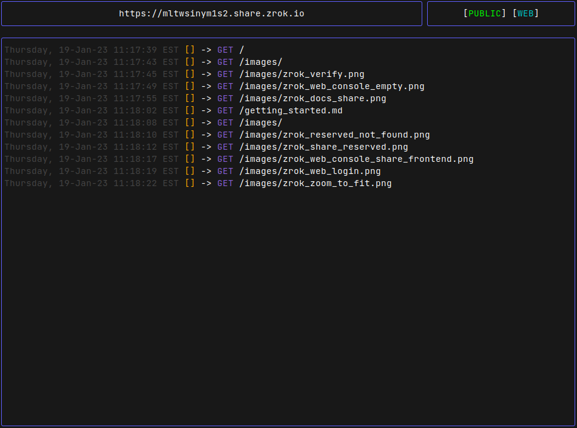

# Manage reserved names

Reserved [names](../concepts/namespaces.md) give your shares a persistent, human-readable identifier that survives
across share sessions. [Namespaces](../concepts/namespaces.md) are the containers that organize names. This how-to
covers the full lifecycle: creating names, using them with shares, managing them, and configuring a default namespace.

## Create a reserved name

Use `zrok2 create name` to reserve a name in a namespace:

```bash
zrok2 create name myapp
```

To create a name in a specific namespace, use the `-n` flag:

```bash
zrok2 create name -n public myapp
```

To create a name in a custom namespace:

```bash
zrok2 create name -n <namespaceToken> api
```

Once created, the name persists even when your share isn't running and can be reused across share sessions.

## Use names with shares

### Public shares

Use the `-n` flag to attach a name to a public share:

```bash
zrok2 share public localhost:8080 -n public:myapp
```

To use a name in a specific namespace:

```bash
zrok2 share public localhost:8080 -n <namespaceToken>:api
```

The name can be either reserved (created with `zrok2 create name`) or ephemeral (created on-the-fly when the share
starts). See [Reserved names and namespaces](../concepts/namespaces.md) for a full explanation of the difference.

### Private shares with custom tokens

For private shares, use the `--share-token` flag to specify a persistent vanity token:

```bash
zrok2 share private localhost:8080 --share-token myapi-prod
```

Access it from another environment:

```bash
zrok2 access private myapi-prod
```



When using the zrok agent, shares with `--share-token` automatically restart after abnormal exit or agent restart.
See [zrok agent overview](../concepts/agent.md) for more details.

### Multiple names on one share

You can specify multiple names for a single share:

```bash
zrok2 create name -n public myapp
zrok2 create name -n public myapp-staging
```

```bash
zrok2 share public localhost:3000 \
  -n public:myapp \
  -n public:myapp-staging
```

Both URLs point to the same backend target, letting you use different names for the same service.

## Manage names

### List your names

See all your names across all namespaces:

```bash
zrok2 list names
```

This shows a table with:
- URL (the full public URL if applicable)
- Name
- Namespace
- Share token (if being shared)
- Reserved status
- Creation timestamp

### Modify name status

Toggle the reserved status of a name:

```bash
zrok2 modify name -n public myapp -r
```

To make a name ephemeral (deleted when the share ends):

```bash
zrok2 modify name -n public myapp -r=false
```

### Delete a name

Remove a name when you no longer need it:

```bash
zrok2 delete name myapp
```

To delete a name from a specific namespace:

```bash
zrok2 delete name -n <namespaceToken> api
```

## Configure a default namespace

Set a default namespace to avoid specifying `-n` on every command:

```bash
zrok2 config set defaultNamespace public
```

Or set it via environment variable:

```bash
export ZROK2_DEFAULT_NAMESPACE=public
```

Once configured, commands use this namespace by default. These two commands become equivalent:

```bash
zrok2 create name myapp
zrok2 create name -n public myapp
```
