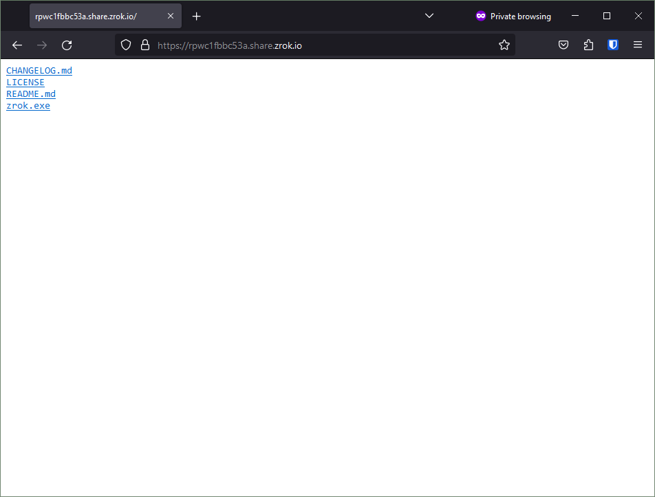
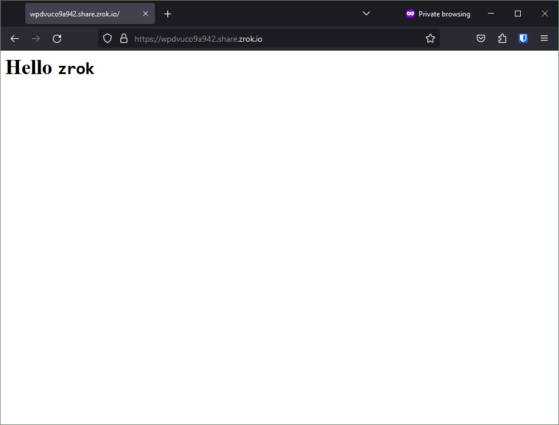

The `web` backend mode lets you share a local directory over HTTP. Depending on the contents of the directory, zrok
serves it either as a browsable file index or as a static website.

## Share a directory as a file index

If your directory contains files without an `index.html`, zrok serves a browsable file tree. For example:

```shell
-rw-r--r--+ 1 Michael None     7090 Apr 17 12:53 CHANGELOG.md
-rw-r--r--+ 1 Michael None    11346 Apr 17 12:53 LICENSE
-rw-r--r--+ 1 Michael None     2885 Apr 17 12:53 README.md
-rwxr-xr-x+ 1 Michael None 44250624 Apr 17 13:00 zrok.exe*
```

1. Open a terminal and navigate to the directory you want to share.

2. Run:

    ```shell
    zrok2 share public --backend-mode web .
    ```

3. Access the share. zrok provides a browsable file index where visitors can navigate the file tree and download files.

    

## Share a static website

If your directory contains an `index.html`, zrok serves it as a static website instead of a file index. For example:

```shell
-rw-rw-r--+ 1 Michael None 56 Jun 26 13:23 index.html
```

Where `index.html` contains valid HTML:

```html
<html>
<body>
        <h1>Hello <code>zrok</code></h1>
</html>
```

1. Open a terminal and navigate to the directory containing your `index.html`.

2. Run:

    ```shell
    zrok2 share public --backend-mode web .
    ```

3. Access the share. zrok renders the HTML directly in the browser:

    
