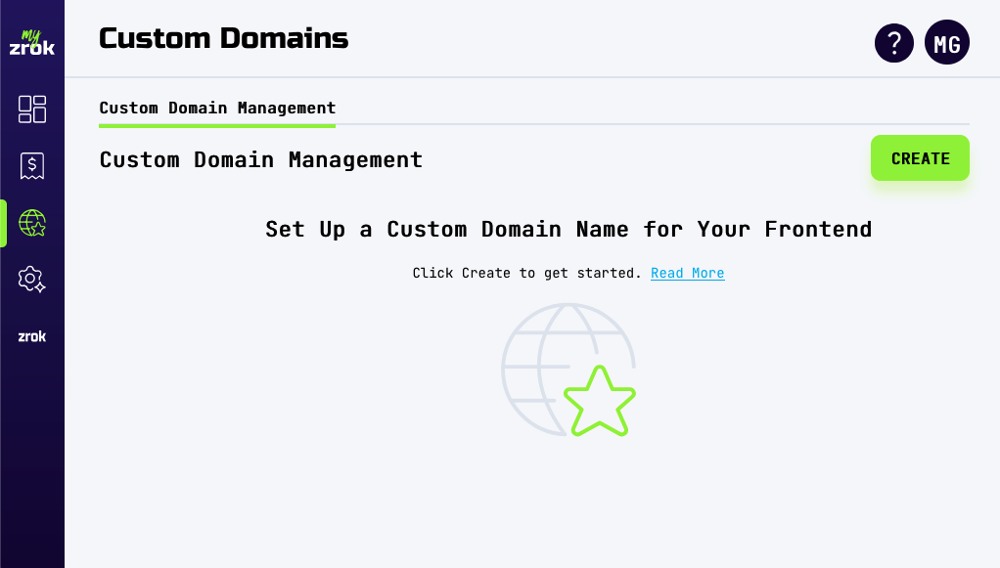
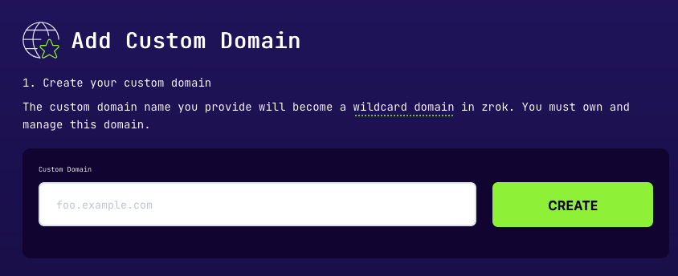
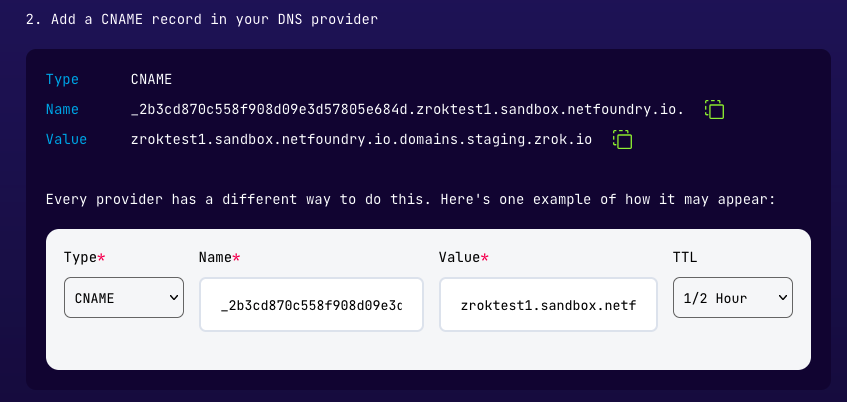
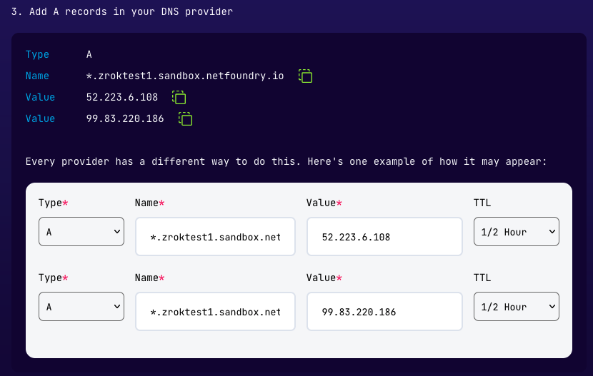
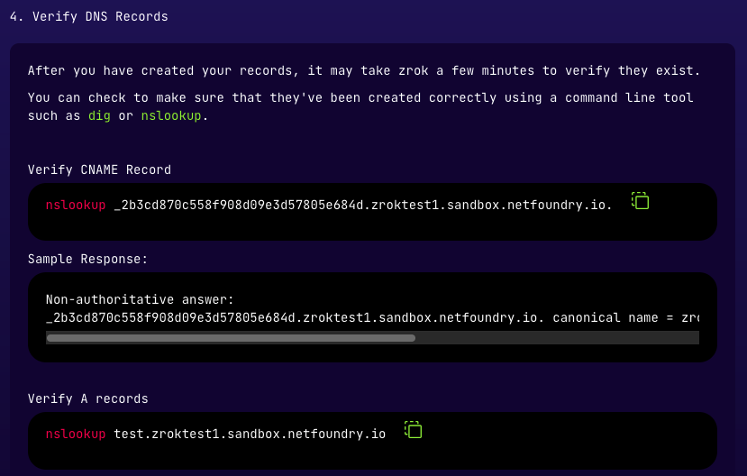
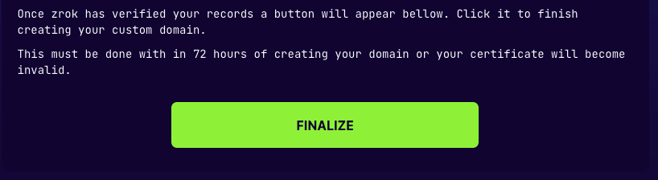
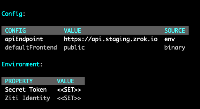

[myzrok.io](https://myzrok.io) lets you use your own DNS name for zrok shares. For example, if you own `foo.example.io`,
you can create ephemeral shares like `https://vw8jbg4ijz5g.foo.example.io` or
[reserved shares](../concepts/namespaces.md) like `https://toaster.foo.example.io`.

## Prerequisites

- You must own the domain you want to use and have access to its DNS settings.
- Custom domains require a Pro subscription with [myzrok.io](https://myzrok.io).

## Add your domain

1. Sign in to the myzrok console and click the globe icon in the left navigation to open the **Custom Domains** page:

   

2. Click **Create** in the top right corner.

3. Enter your domain name and click **Create**. zrok begins issuing a managed TLS certificate for your domain:

   

4. Close the form. Return when your domain status changes to *pending validation*—this usually takes a few minutes.

## Create DNS records

zrok needs two DNS records: a CNAME to validate domain ownership for certificate issuance, and an A record to route traffic.

1. Create a CNAME record with the name and value shown in the form:

   

2. Create an A record pointing your domain to the static IPs provided:

   

3. Verify your records resolve correctly using the `nslookup` command shown in the form:

   

   ```text
   nslookup test.foo.example.io
   Server:		192.168.86.194
   Address:	192.168.86.194#53

   Non-authoritative answer:
   Name:	test.foo.example.io
   Address: 99.83.220.186
   Name:	test.foo.example.io
   Address: 52.223.6.108
   ```

   If the command returns the A-record IPs, DNS is resolving correctly.

4. Close the form. zrok validates your records and issues the certificate within a few minutes.

## Finalize your domain

Within 72 hours of certificate issuance, click **Finalize** to complete setup:



myzrok.io will finish the final steps automatically—this takes about a minute.

## Start sharing

To create shares that use your custom domain, specify the `--frontend` flag:

```bash
zrok2 share public --frontend foo-example--goPIhgtJtz
```

To set it as the default for your environment:

```bash
zrok2 config set defaultNamespace foo-example--goPIhgtJtz
```

To confirm the active frontend, run `zrok2 status`:


