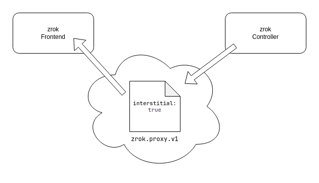

# Interstitial pages

On large zrok installations that support open registration and shared public frontends, abuse can become an issue. To
mitigate phishing and other similar forms of abuse, zrok offers an interstitial page that announces to visitors that
the share is hosted through zrok and probably isn't their financial institution.

Interstitial pages can be enabled on a per-frontend basis. This allows you to enable the interstitial on open public
frontends but not closed ones (which require a grant to use).

You can also override the interstitial page requirement on a per-account basis, allowing shares created by specific
accounts to bypass the interstitial on frontends that enable it. This facilitates building infrastructure that grants
trusted users additional privileges.

By default, if you don't enable interstitial pages on a public frontend, your self-hosted instance won't offer them.

The following diagram shows how the interstitial mechanism works—the share configuration rendezvous between the
controller and a frontend:



Every zrok share has a _config_ recorded in the underlying OpenZiti network. The config is of type `zrok.proxy.v1`.
The frontend uses the information in this config to understand the disposition of the share. The config can contain an
`interstitial: true` setting. If the config has this setting and the frontend is configured to enable interstitial
pages, end users accessing the share will receive the interstitial page on first visit.

By default, the zrok controller will record `interstitial: true` in the share config _unless_ a row is present in the
`skip_interstitial_grants` table in the underlying database for the account creating the share. The
`skip_interstitial_grants` table is a basic SQL structure with one row per account:

```sql
create table skip_interstitial_grants (
    id          serial         primary key,

    account_id  integer        references accounts (id) not null,

    created_at  timestamptz    not null default(current_timestamp),
    updated_at  timestamptz    not null default(current_timestamp),
    deleted     boolean        not null default(false)
);
```

If an account has a row in this table when creating a share, the controller will write `interstitial: false` into the
config for the share, bypassing the interstitial regardless of frontend configuration. The `skip_interstitial_grants`
table controls what the zrok controller stores in the share config when creating the share.

The frontend configuration controls what the frontend does with the share config it finds in OpenZiti. Add an
`interstitial` stanza to your frontend config to enable it:

```yaml
interstitial:
  enabled: true
```

To limit which user agents receive the interstitial, add a `user_agent_prefixes` list:

```yaml
interstitial:
  enabled: true
  user_agent_prefixes:
    - "Mozilla/5.0"
```

User agents that match a prefix in the list receive the interstitial; others don't. If `user_agent_prefixes` is
omitted, all user agents receive the interstitial page.

## Bypass the interstitial

The interstitial page is presented unless the client has a `zrok_interstitial` cookie (depending on
`user_agent_prefixes` configuration). When the user reaches the interstitial page, a button sets the necessary cookie
and lets them through to the share. The cookie expires after one week.

Typically, the `user_agent_prefixes` list contains `Mozilla/5.0`, which matches all modern mobile and desktop
browsers. Setting a non-standard `User-Agent` in an interactive browser bypasses the interstitial for frontends
configured with the usual `Mozilla/5.0` prefix.

End users can send a `skip_zrok_interstitial` HTTP header set to any value to bypass the interstitial page. Setting
this header means the user most likely understands what a zrok share is and hopefully won't fall for a phishing attack.

The `skip_zrok_interstitial` header is especially useful for API clients (like `curl`) and other types of
non-interactive clients.

The `drive` backend mode doesn't currently support `GET` requests and can't be accessed with a conventional web
browser, so it bypasses the interstitial page requirement.
