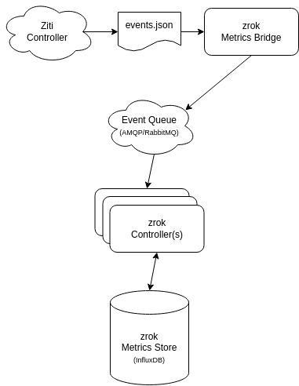
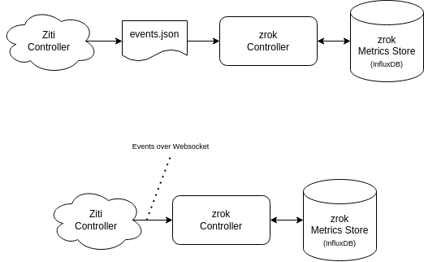

import DocCardList from '@theme/DocCardList';

# Metrics and limits

Metrics and limits are two complementary systems for operating a self-hosted zrok instance at scale.

**Metrics** give you visibility into usage across your service instance. zrok builds on top of the `fabric.usage` event type from OpenZiti, routing usage events through a metrics bridge and into InfluxDB, where they power the activity graphs in the zrok web console.

**Limits** let you control how much of that usage any single account can consume—both in terms of resource counts (environments, shares, names) and data transfer bandwidth. When an account exceeds a threshold, the limits agent can warn the user or disable their shares until usage falls back within bounds.

## Metrics architecture

A fully configured, production-scale zrok service instance looks like this:

The OpenZiti controller has a number of ways to emit events. The zrok controller has several ways to consume `fabric.usage` events. Smaller installations could be configured in these ways:

Environments that horizontally scale the zrok control plane with multiple controllers should use an AMQP-based queue to "fan out" the metrics workload across the entire control plane. Simpler installations that use a single zrok controller can collect `fabric.usage` events from the OpenZiti controller by "tailing" the events log file, or collecting them from the OpenZiti controller's websocket implementation.

## In this section

<DocCardList />
