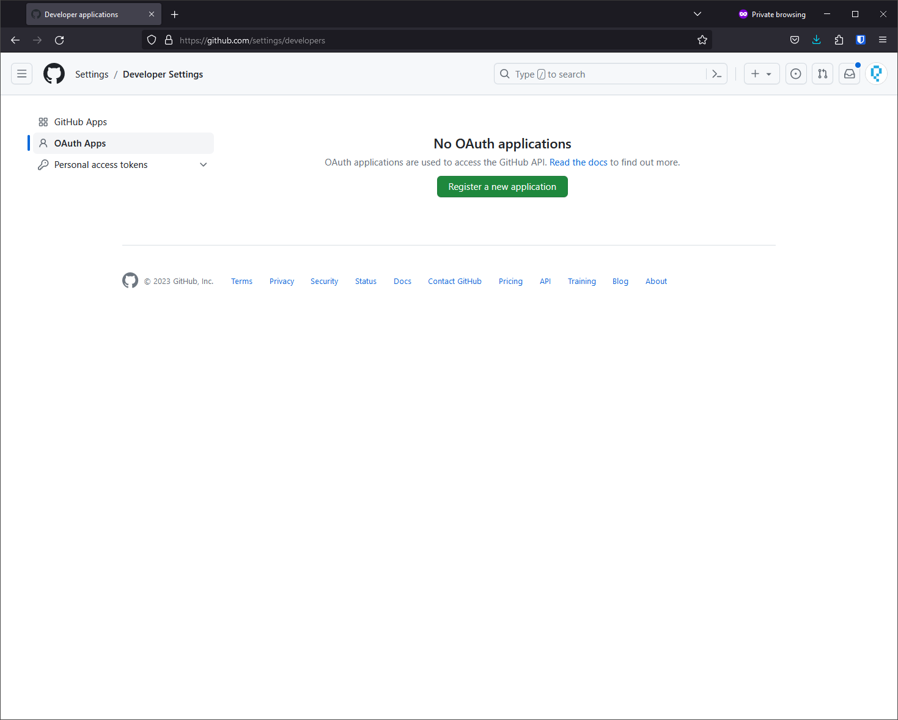
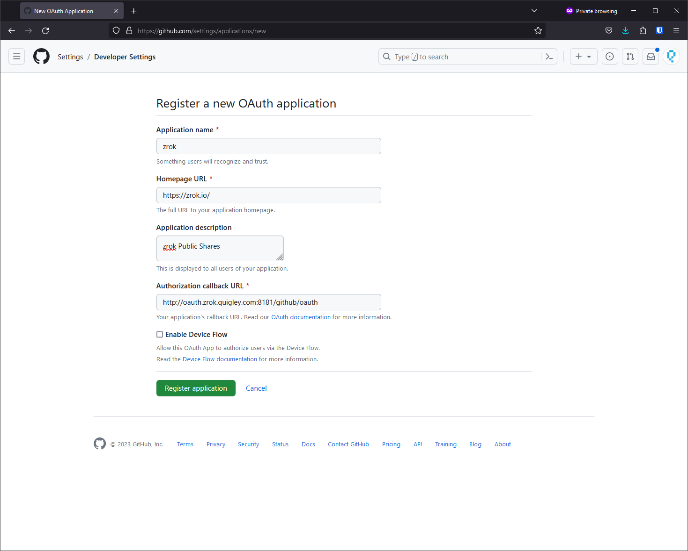
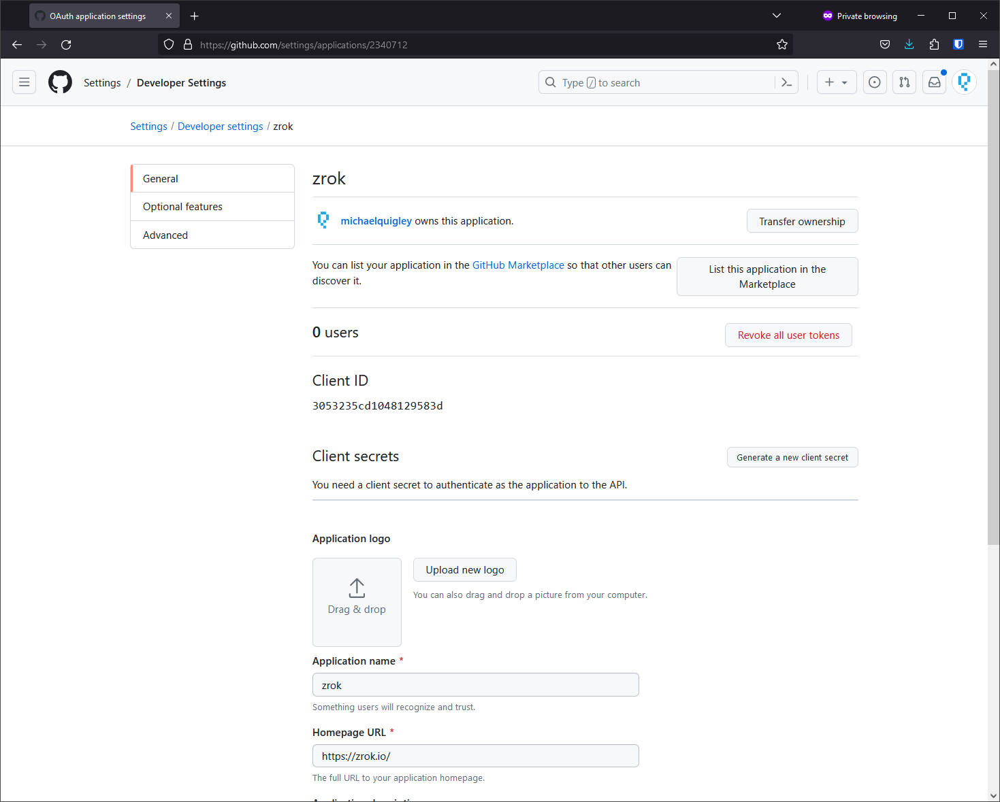
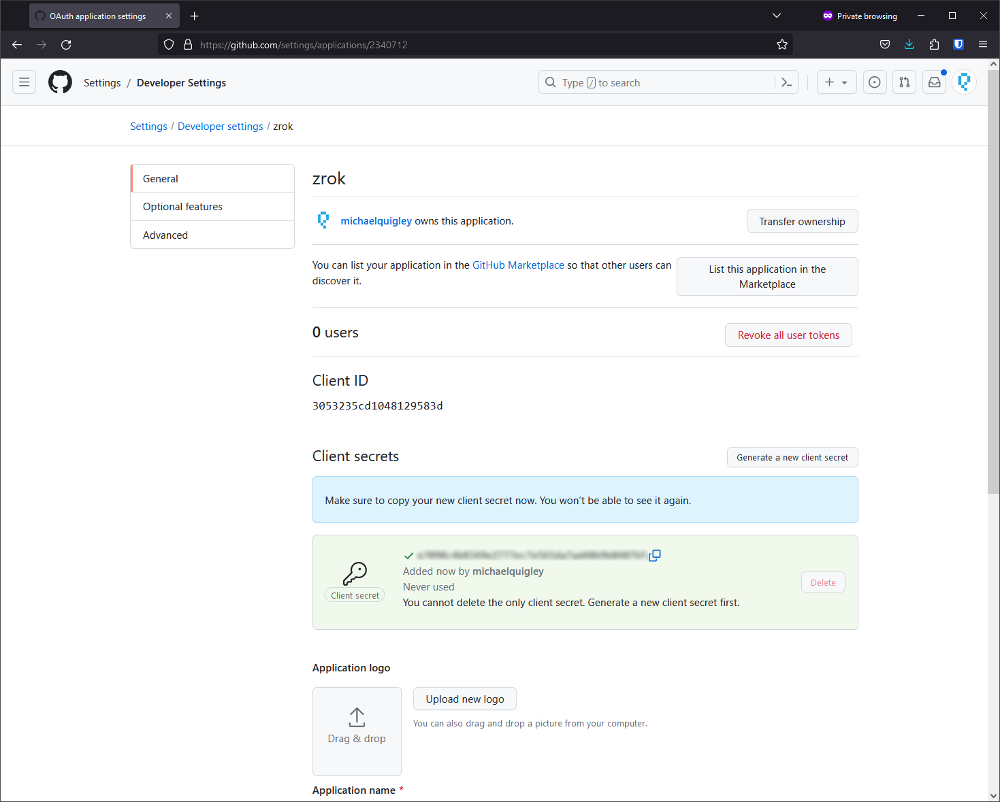

# Set up GitHub OAuth

Configure GitHub OAuth as an authentication provider for your zrok public frontend.

## Register OAuth application

1. Go to **Settings > Developer Settings > OAuth Apps** and click **Register a new application**.

   

2. Fill in the application details, setting the **Authorization callback URL** to match your OAuth frontend address with
   `/<provider-name>/auth/callback` appended, then click **Register application**.

   

3. On the settings page, click **Generate a new client secret**.

   

4. Save the client ID and client secret for your frontend configuration.

   

## Add GitHub to your frontend configuration

Add the GitHub provider to your `frontend.yml`:

```yaml
oauth:
  providers:
    - name: "github"
      type: "github"
      client_id: "<your-github-client-id>"
      client_secret: "<your-github-client-secret>"
```

## Redirect URL format

For GitHub OAuth with the provider name `"github"`, the redirect URL should be:

```text
https://your-oauth-frontend-domain:port/github/auth/callback
```

If you use a different provider name (e.g., `"gh-enterprise"`), the URL would be:

```text
https://your-oauth-frontend-domain:port/gh-enterprise/auth/callback
```
