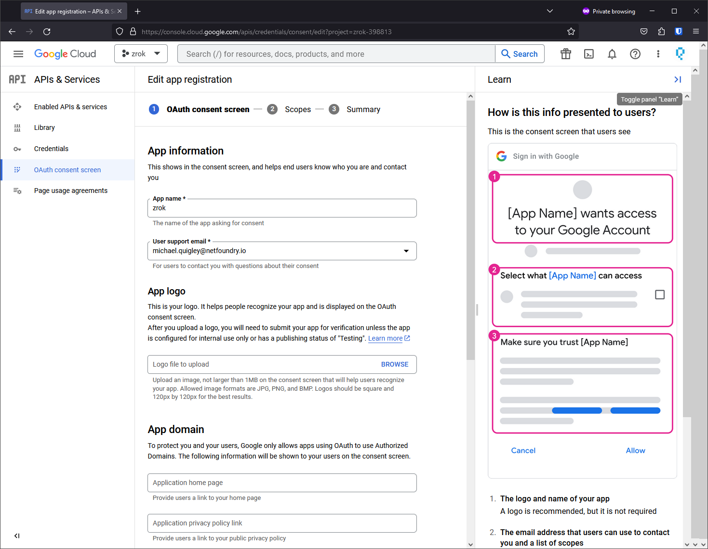
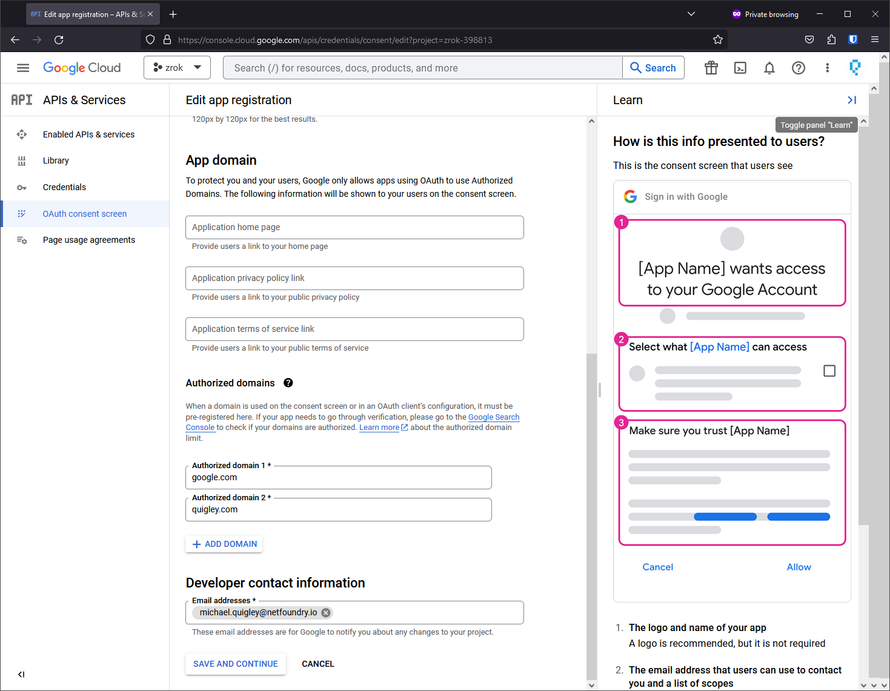
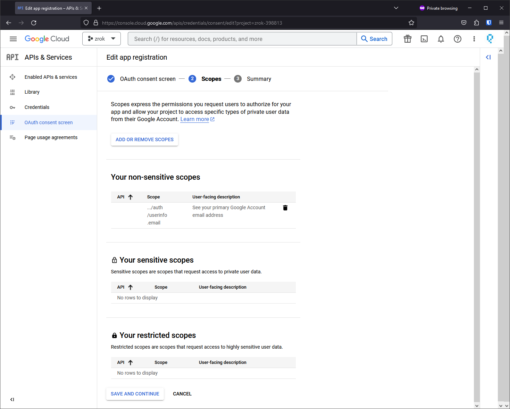
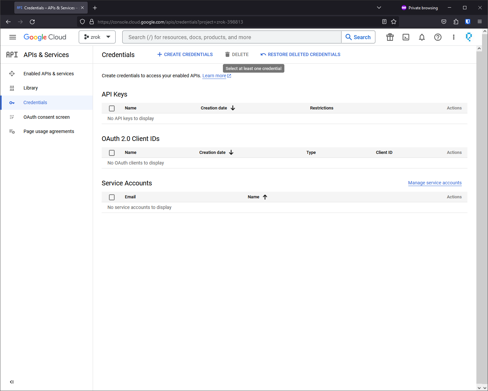
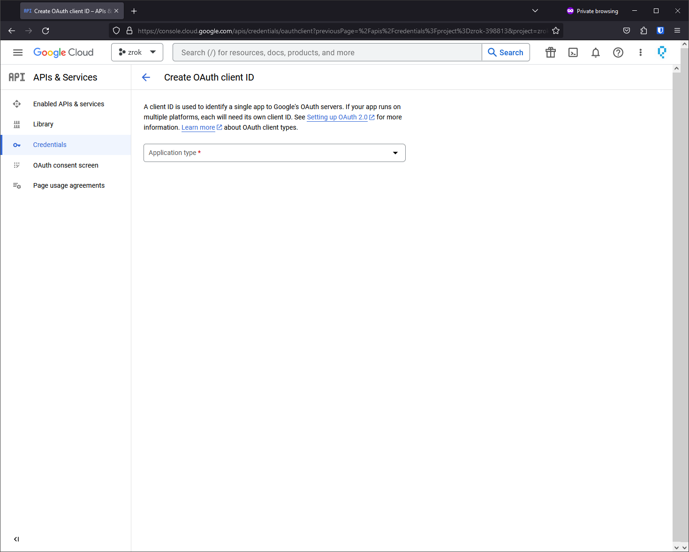
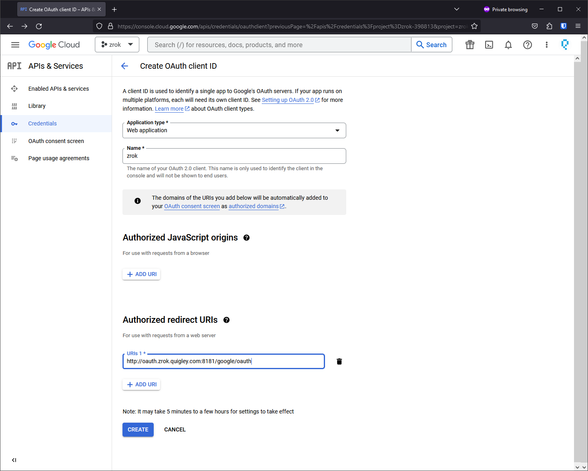
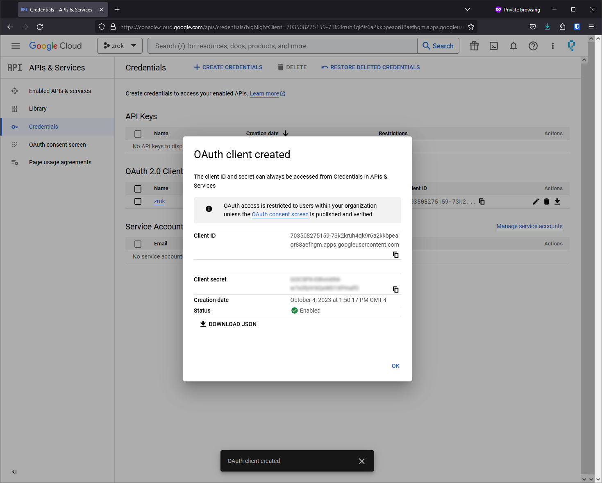

# Set up Google OAuth

Configure Google OAuth as an authentication provider for your zrok public frontend.

## Configure the OAuth consent screen

Before creating an OAuth client ID, you must configure the OAuth consent screen in the Google Cloud Console.

1. Go to **APIs & Services > Credentials > OAuth consent screen**.

2. Configure your zrok public frontend's identity and branding.

   

3. Add authorized domains and contact information.

   

4. Add the `../auth/userinfo.email` scope (required for zrok to receive user email addresses).

   

## Create an OAuth 2.0 client ID

1. Go to **APIs & Services > Credentials > + Create Credentials**.

   

2. Select **OAuth client ID**.

   

3. Choose **Web Application** and configure the **Authorized redirect URIs** to match your OAuth frontend address with `/<provider-name>/auth/callback` appended.

   

4. Click **Create** and save the client ID and client secret for your frontend configuration.

   

## Add Google to your frontend configuration

Add the Google provider to your `frontend.yml`:

```yaml
oauth:
  providers:
    - name: "google"
      type: "google"
      client_id: "<your-google-client-id>"
      client_secret: "<your-google-client-secret>"
```

## Redirect URL format

For Google OAuth with the provider name `"google"`, the redirect URL should be:

```
https://your-oauth-frontend-domain:port/google/auth/callback
```

If you use a different provider name (e.g., `"google-corp"`), the URL would be:

```
https://your-oauth-frontend-domain:port/google-corp/auth/callback
```
