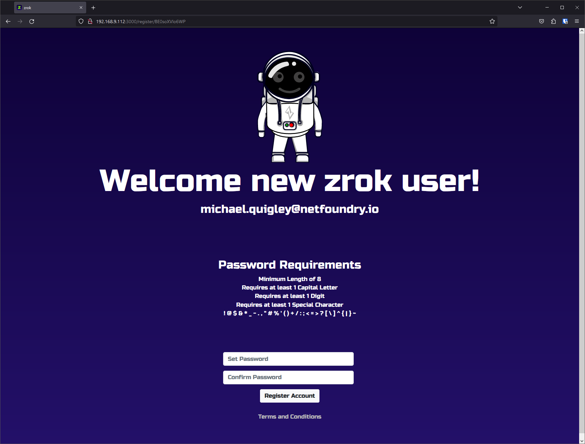
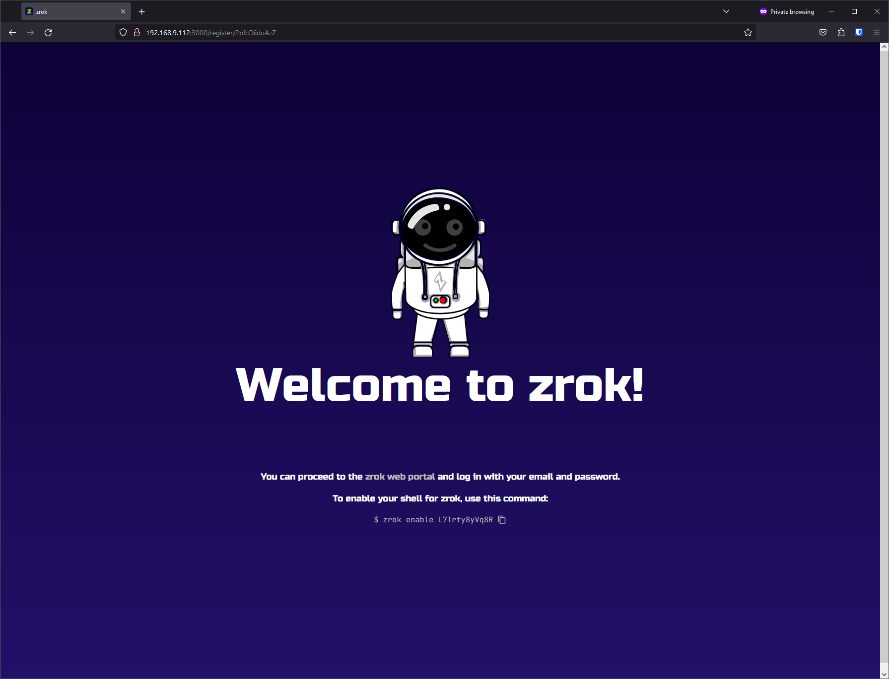
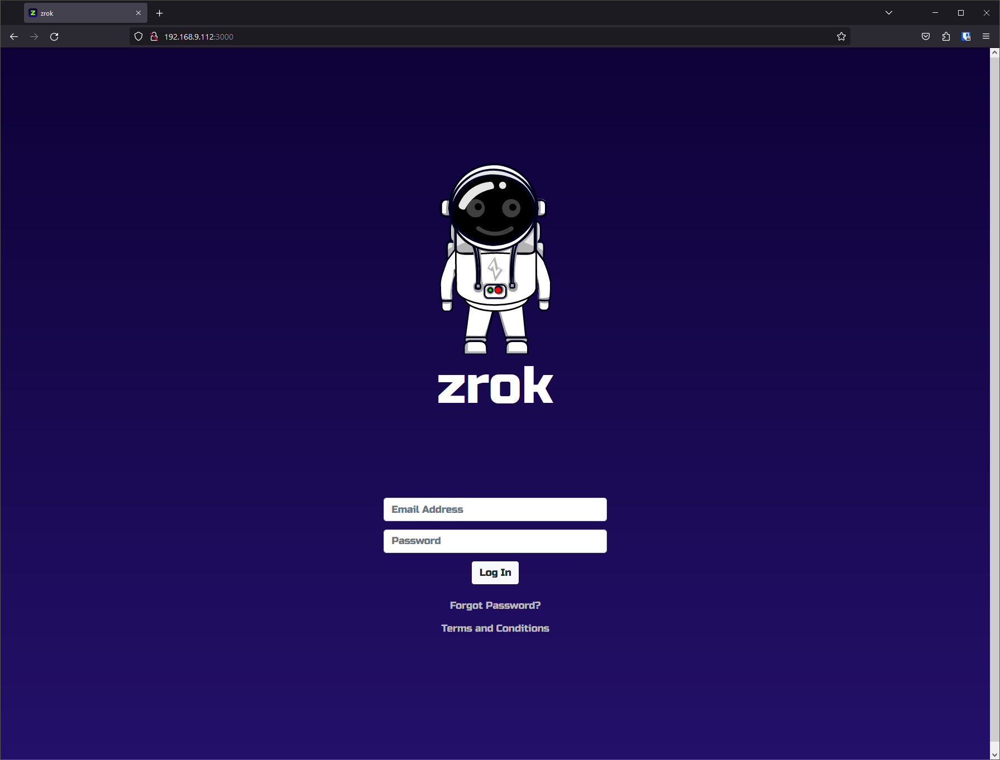
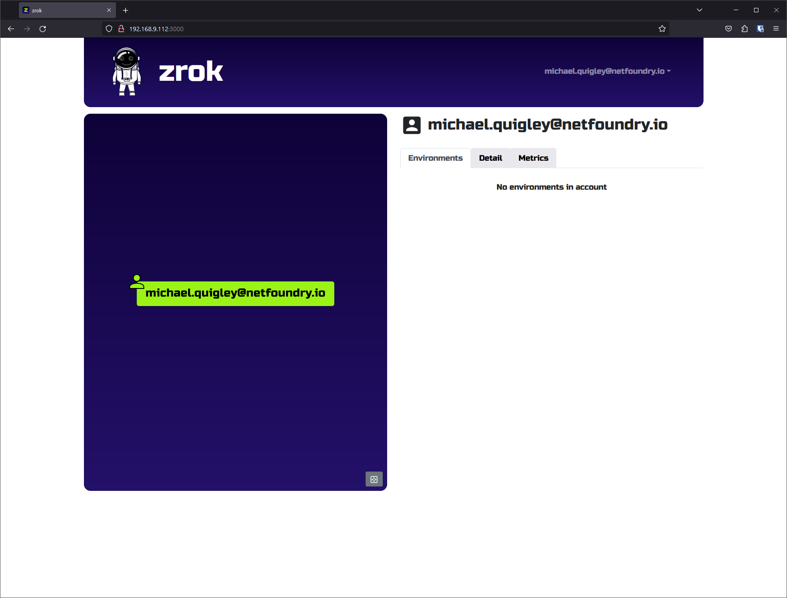

# Self-service invitations

Use self-service invitations to let users create their own accounts on your self-hosted zrok instance.

- You can create user accounts directly with `zrok2 admin create account` via CLI or API instead of sending invitations.
- You can let users invite themselves via email.
- To enable self-service invitations, you must configure the controller to send email.
- You can require an invitation token to restrict self-service.

## The self-service user experience

Your users run this command:

```bash
zrok2 invite
```

```buttonless title="Output"
enter and confirm your email address...

> user@domain.com
> user@domain.com

[ Submit ]

invitation sent to 'user@domain.com'!
```

## How it works

The `zrok2 invite` command walks users through these steps:

1. Enter and confirm your email address in the form, then tab to **[ Submit ]**.

2. Check the email you provided. Click the link in the message to set a password for your new account.

    

3. Enter a password, confirm it, and click **Register Account**.

    

    You can ignore the "enable your shell for zrok" section for now.

4. Click the **zrok web portal** link.

    

5. Click **Log In** to enter the zrok web console.

    

Congratulations! Your zrok account is ready to go!
