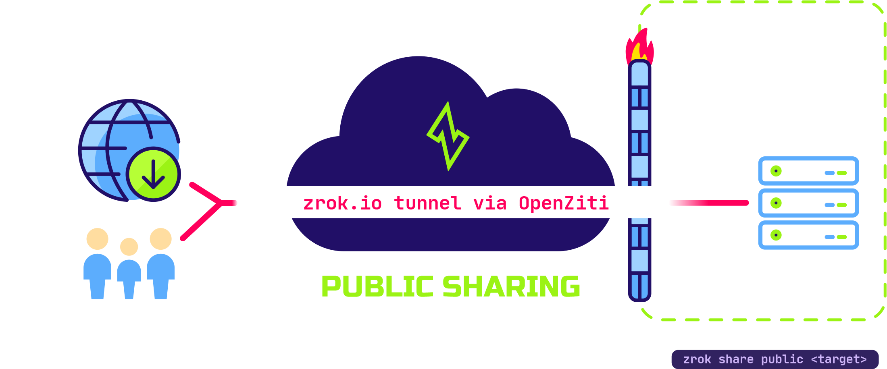

import BackendHttp from '/../docs/concepts/_backend_http.mdx'

# Public Shares

`zrok` supports `public` sharing for web-based (HTTP and HTTPS) resources. These resources are easily shared with the general internet through public access points.

## Peer to Public



`public` sharing is most useful when the person or service accessing your resources does not have `zrok` running locally and cannot make use of the `private` sharing mode built into `zrok`. Many users share development web servers, webhooks, and other HTTP/HTTPS resources.

As with `private` sharing, `public` sharing does not require you to open any firewall ports or otherwise compromise the security of your local environments. A `public` share goes away as soon as you terminate the `zrok share` command.

Using `public` shares is easy and is accomplished using the `zrok share public` command. Run `zrok share public` to see the command-line help and to learn how to use `public` shares.

## Public Backend Modes

The default backend mode is `proxy` which targets an HTTP URL that must be reachable by the backend.

```bash title="proxy example"
zrok share public 80
```

<BackendHttp/>
