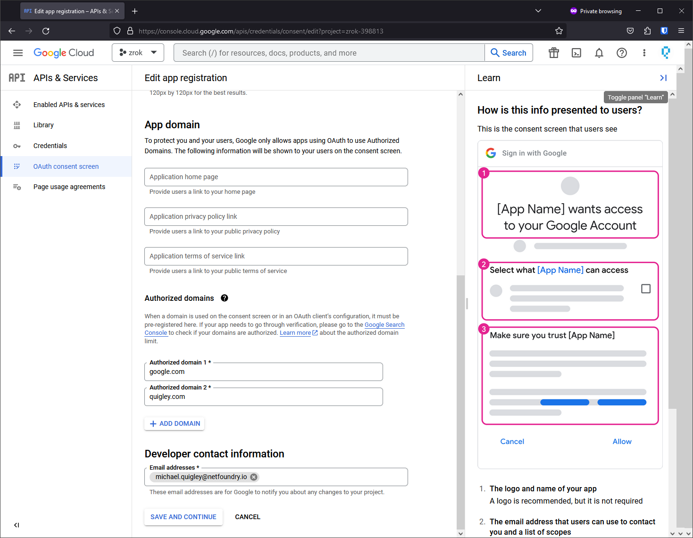
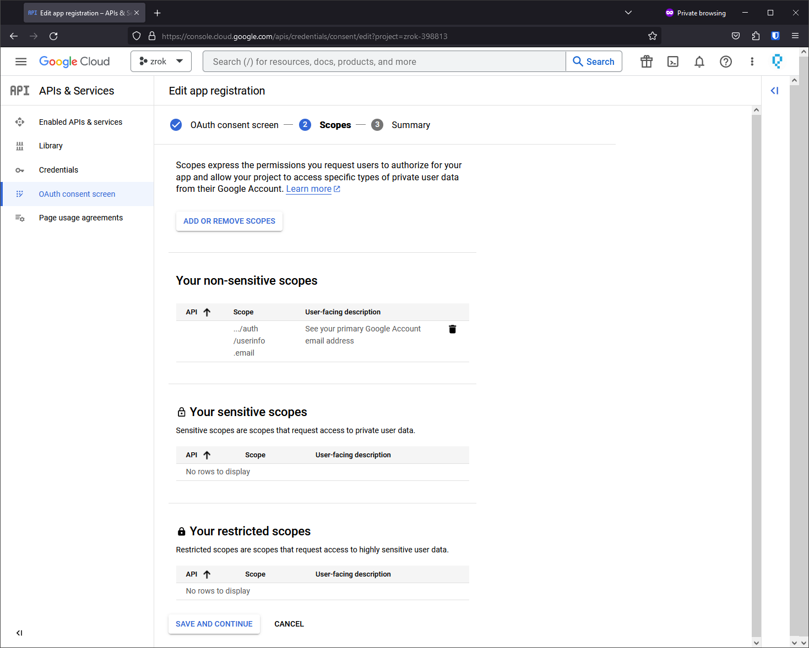

# Google OAuth Setup

This guide covers setting up Google OAuth for your zrok public frontend.

## OAuth Consent Screen

Before configuring an OAuth Client ID, you must configure the "OAuth consent screen" in the Google Cloud Console.

Navigate to: **APIs & Services > Credentials > OAuth consent screen**


Configure your zrok public frontend's identity and branding:



Add authorized domains and contact information:



Add the `../auth/userinfo.email` scope (required for zrok to receive user email addresses):


## Create OAuth 2.0 Client ID

Navigate to: **APIs & Services > Credentials > + Create Credentials**


Select **OAuth client ID**:


Choose **Web Application**:


Configure the **Authorized redirect URIs** to match your OAuth frontend address with `/<provider-name>/auth/callback` appended:


Save the client ID and client secret for your frontend configuration.

## Frontend Configuration

Add the Google provider to your `frontend.yml`:

```yaml
oauth:
  providers:
    - name: "google"
      type: "google"
      client_id: "<your-google-client-id>"
      client_secret: "<your-google-client-secret>"
```

## Redirect URL Format

For Google OAuth with the provider name `"google"`, the redirect URL should be:
```
https://your-oauth-frontend-domain:port/google/auth/callback
```

If you use a different provider name (e.g., `"google-corp"`), the URL would be:
```
https://your-oauth-frontend-domain:port/google-corp/auth/callback
```
